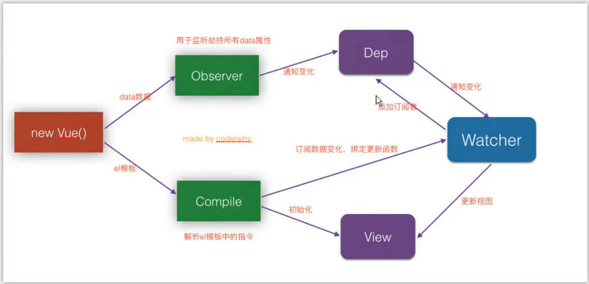

# 面试中的Vue

Vue (读音 /vjuː/，类似于 view) 是一套用于构建用户界面的**渐进式框架**。与其它大型框架不同的是，Vue 被设计为可以自底向上逐层应用。Vue 的核心库只关注视图层，不仅易于上手，还便于与第三方库或既有项目整合。另一方面，当与现代化的工具链以及各种支持类库结合使用时，Vue 也完全能够为复杂的单页应用提供驱动。

## Vue

### MVVM

MVVM 是 Model-View-ViewModel 的缩写 ：

- Model代表数据模型，也可以在Model中定义数据修改和操作的业务逻辑
- View 代表UI 组件，它负责将数据模型转化成UI 展现出来
- ViewModel 监听模型数据的改变和控制视图行为、处理用户交互，简单理解就是一个同步View 和 Model的对象，连接Model和View。

在MVVM架构下，View 和 Model 之间并没有直接的联系，而是通过ViewModel进行交互，Model 和 ViewModel 之间的交互是双向的， 因此View 数据的变化会同步到Model中，而Model 数据的变化也会立即反应到View 上。ViewModel 通过双向数据绑定把 View 层和 Model 层连接了起来，而View 和 Model 之间的同步工作完全是自动的，无需人为干涉，因此开发者只需关注业务逻辑，不需要手动操作DOM, 不需要关注数据状态的同步问题，复杂的数据状态维护完全由 MVVM 来统一管理。

### 生命周期


Vue生命周期：Vue 实例从创建到销毁的过程，从开始创建、初始化数据、编译模板、挂载Dom→渲染、更新→渲染、销毁等一系列过程，称之为 Vue 的生命周期。

作用：它的生命周期中有多个事件钩子，让我们在控制整个Vue实例的过程时更容易形成好的逻辑。

生命周期钩子：8个，beforeCreate、created、beforeMount、mounted、beforeUpdate、updated、beforeDestory、destoryed

第一次页面加载会触发哪些钩子函数：beforeCreate、created、beforeMount、mounted

Dom 渲染在哪个周期中就已经完成：mounted

### 双向数据绑定原理

vue实现数据双向绑定原理：采用 **数据劫持结合发布者-订阅者模式** 的方式，通过 **Object.defineProperty()** 来劫持各个属性的 `setter` ， `getter`， 在数据变动时发布消息给订阅者，触发相应监听回调。当把一个普通 Javascript 对象传给 Vue 实例来作为它的 data 选项时，Vue 将遍历它的属性，用 **Object.defineProperty()** 将它们转为 **getter、setter** 。用户看不到  **getter、setter**， 但是在内部它们让 Vue 追踪依赖，在属性被访问和修改时通知变化。




vue的数据双向绑定 将MVVM作为数据绑定的入口，整合Observer，Compile和Watcher三者，通过Observer来监听自己的model的数据变化，通过Compile来解析编译模板指令（vue中是用来解析 {{}}），最终利用watcher搭起observer和Compile之间的通信桥梁，达到数据变化 —>视图更新；视图交互变化（input）—>数据model变更双向绑定效果。

js实现简单的双向绑定：

```html
<div id="app">
<input type="text" v-model="msg">
{{msg}}
</div>
<script>
class Vue {
constructor(opt){
  // 1.保存数据
  this.$opt = opt
  this.$data = opt.data
  this.$el = opt.el

  // 2.将data添加到响应式系统中
  new Observer(this.$data)

  // 3.代理this.$data的数据
  Object.keys(this.$data).forEach(key => {
    this._proxy(key)
  })

  // 4.处理el
  new Compiler(this.$el, this)
}

_proxy(key){
  Object.defineProperty(this, key, {
    enumerable: true,
    configurable: true,
    get(){
      return this.$data[key]
    },
    set(newValue){
      this.$data[key] = newValue
    }
  })
}
}

class Observer {
  constructor(data){
    this.data = data
    Object.keys(data).forEach(key => {
      this.defineReactive(this.data, key, data[key])
    })
}
defineReactive(data, key, val) {
  // 一一对应，属性key -> Dep对象
  const dep = new Dep()
  Object.defineProperty(data, key, {
    enumerable: true,
    configurable: true,
    get(){
      if (Dep.target) {
        // 添加的 watcher
        dep.addSub(Dep.target)
      }
      return val
    },
    set(newValue) {
      if (newValue === val) {
        return
      }
      val = newValue
      dep.notify()
    }	
  })				
}
}

class Dep {
  constructor() {
    this.subs = []
  }
  addSub(sub) {
    this.subs.push(sub)
  }
  notify() {
    this.subs.forEach(sub => {
      sub.update()
    })
  }
}

class Watcher {
  constructor(node, name, vm) {
    this.node = node
    this.name = name
    this.vm = vm
    Dep.target = this
    this.update()
    Dep.target = null
  }
  update() {
    this.node.nodeValue = this.vm[this.name] // 会调用 get 
  }
}

const reg = /\{\{(.*)\}\}/
class Compiler {
  constructor(el, vm) {
    this.el = document.querySelector(el)
    this.vm = vm

    this.frag = this._createFragment()
    this.el.appendChild(this.frag)
  }
  _createFragment() {
    const frag = document.createDocumentFragment()

    let child
    while (child = this.el.firstChild) {
      this._compile(child)
      frag.appendChild(child)
    }
    return frag
  }
  _compile(node) {
    if (node.nodeType === 1) { // 标签节点
      const attrs = node.attributes
      if (attrs.hasOwnProperty('v-model')) {
        const name = attrs['v-model'].nodeValue
        node.value = this.vm[name]
        node.addEventListener('input', e => {
          this.vm[name] = e.target.value
        })
      }
    }
    if (node.nodeType === 3) { // 文本节点					
      if (reg.test(node.nodeValue)) {
        const name = RegExp.$1.trim()
        new Watcher(node, name, this.vm)
      }
    }
  }
}
</script>
<script>
const app = new Vue({
  el: '#app',
  data: {
    msg: 'Hello World!'
  }
})
</script>
```

### 组件间的参数传递

1.父组件与子组件传值：

- 父组件传给子组件：子组件通过props方法接受数据
- 子组件传给父组件：$emit方法传递参数

2.非父子组件间的数据传递，兄弟组件传值：

- eventBus，就是创建一个事件中心，相当于中转站，可以用它来传递事件和接收事件，项目比较小时，用这个比较合适
- VUEX

```javascript
// main.js 
// 创建事件总线，用于非兄弟组件之间的通信
Vue.prototype.$bus = new Vue();

// 组件一，发送事件
// 为事件总线添加一个事件
this.$bus.$emit("goodsItemImgLoad");

// 组件二，注册事件
this.$bus.$on("goodsItemImgLoad", () => {});

// 取消事件
this.$bus.$off("goodsItemImgLoad", () => {});
```

### hash模式 和 history模式

1.hash模式：在浏览器中符号“#”，#以及#后面的字符称之为hash，用window.location.hash读取； 特点：hash虽然在URL中，但不被包括在HTTP请求中；用来指导浏览器动作，对服务端安全无用，hash不会重加载页面。hash 模式下，仅 hash 符号之前的内容会被包含在请求中，如 `www.xxx.com `，因此对于后端来说，即使没有做到对路由的全覆盖，也不会返回 404 错误。

2.history模式：history采用HTML5的新特性；且提供了两个新方法：pushState（），replaceState（）可以对浏览器历史记录栈进行修改，以及popState事件的监听到状态变更。 history 模式下，前端的 URL 必须和实际向后端发起请求的 URL 一致，如 `www.xxx.com/items/id`。后端如果缺少对 /items/id 的路由处理，将返回 404 错误。Vue-Router 官网介绍： **不过这种模式要玩好，还需要后台配置支持。因为我们的应用是个单页客户端应用，如果后台没有正确的配置，就会返回 404** 。所以，你要在服务端增加一个覆盖所有情况的候选资源：如果 URL 匹配不到任何静态资源，则应该返回同一个 index.html 页面，这个页面就是你 app 依赖的页面。

### Vue与Angular以及React的区别

1.与AngularJS的区别：

- 相同点： 都支持指令：内置指令和自定义指令；都支持过滤器：内置过滤器和自定义过滤器；都支持双向数据绑定；都不支持低端浏览器
- 不同点：AngularJS的学习成本高，比如增加了Dependency Injection特性，而Vue.js本身提供的API都比较简单、直观；在性能上，AngularJS依赖对数据做脏检查，所以Watcher越多越慢；Vue.js使用基于依赖追踪的观察并且使用异步队列更新，所有的数据都是独立触发的

2.与React的区别：

- 相同点：React采用特殊的JSX语法，Vue.js在组件开发中也推崇编写.vue特殊文件格式，对文件内容都有一些约定，两者都需要编译后使用；中心思想相同：一切都是组件，组件实例之间可以嵌套；都提供合理的钩子函数，可以让开发者定制化地去处理需求；都不内置列数AJAX，Route等功能到核心包，而是以插件的方式加载；在组件开发中都支持mixins的特性。
- 不同点： React采用的Virtual DOM会对渲染出来的结果做脏检查；Vue.js在模板中提供了指令，过滤器等，可以非常方便，快捷地操作Virtual DOM

## Vue Router

Vue Router 是 Vue.js 官方的路由管理器。它和 Vue.js 的核心深度集成，让构建单页面应用变得易如反掌。包含的功能有：

- 嵌套的路由/视图表
- 模块化的、基于组件的路由配置
- 路由参数、查询、通配符
- 基于 Vue.js 过渡系统的视图过渡效果
- 细粒度的导航控制
- 带有自动激活的 CSS class 的链接
- HTML5 历史模式或 hash 模式，在 IE9 中自动降级
- 自定义的滚动条行为

### 导航守卫

“导航”表示路由正在发生改变。记住**参数或查询的改变并不会触发进入/离开的导航守卫**。你可以通过观察 `$route` 对象来应对这些变化，或使用 `beforeRouteUpdate` 的组件内守卫。

1.全局前置守卫，你可以使用 `router.beforeEach` 注册一个全局前置守卫。当一个导航触发时，全局前置守卫按照创建顺序调用。守卫是异步解析执行，此时导航在所有守卫 resolve 完之前一直处于 **等待中**。

```javascript
const router = new VueRouter({ ... })

router.beforeEach((to, from, next) => {
  // ...
})
```