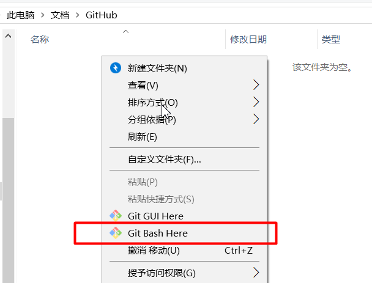
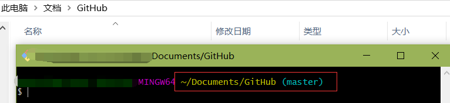

### Git 与 SVN 区别
SVN是Subversion的简称，是一个开放源代码的版本控制系统，相较于RCS、CVS，它采用了分支管理系统，它的设计目标就是取代CVS。CVS是个基于RCS文件的版本控制系统。
* 集中式代码管理的核心是服务器，所有开发者在开始新一天的工作之前必须从服务器获取代码，然后开发，最后解决冲突，提交。所有的版本信息都放在服务器上。如果脱离了服务器，开发者基本上可以说是无法工作的。
* 开始新一天的工作：
	* 1、从服务器下载项目组最新代码。
	* 2、进入自己的分支，进行工作，每隔一个小时向服务器自己的分支提交一次代码（很多人都有这个习惯。因为有时候自己对代码改来改去，最后又想还原到前一个小时的版本，或者看看前一个小时自己修改了哪些代码，就需要这样做了）。
	* 3、下班时间快到了，把自己的分支合并到服务器主分支上，一天的工作完成，并反映给服务器。

Git(读音为/gɪt/。)是一个开源的分布式版本控制系统，可以有效、高速地处理从很小到非常大的项目版本管理。 Git 是 Linus Torvalds 为了帮助管理 Linux 内核开发而开发的一个开放源码的版本控制软件。
* 分布式相比于集中式的最大区别在于开发者可以提交到本地，每个开发者通过克隆（git clone），在本地机器上拷贝一个完整的Git仓库。
* 从一般开发者的角度来看，git有以下功能：
	* 1、从服务器上克隆完整的Git仓库（包括代码和版本信息）到单机上。
	* 2、在自己的机器上根据不同的开发目的，创建分支，修改代码。
	* 3、在单机上自己创建的分支上提交代码。
	* 4、在单机上合并分支。
	* 5、把服务器上最新版的代码fetch下来，然后跟自己的主分支合并。
	* 6、生成补丁（patch），把补丁发送给主开发者。
	* 7、看主开发者的反馈，如果主开发者发现两个一般开发者之间有冲突（他们之间可以合作解决的冲突），就会要求他们先解决冲突，然后再由其中一个人提交。如果主开发者可以自己解决，或者没有冲突，就通过。
	* 8、一般开发者之间解决冲突的方法，开发者之间可以使用pull 命令解决冲突，解决完冲突之后再向主开发者提交补丁。

Git是目前世界上最先进的分布式版本控制系统，其实 Git 跟 SVN一样有自己的集中式版本库或服务器，但是Git 更倾向于被使用于分布式模式，也就是每个开发人员从中心版本库/服务器上 pull 代码后会在自己的机器上克隆一个跟中心版本库一模一样的本地版本库。可以这样说，如果你被困在一个不能连接网络的地方时，你仍然能够提交文件，查看log（历史版本记录），创建项目分支等。
* Git 只关心文件数据的整体是否发生变化，而SVN这类版本控制系统则只关心文件内容的具体差异。Git 会取出一天前的快照和当前文件作一次差异运算，显示出更新变动信息。
* 在Git 中的绝大多数操作都只需要访问本地文件和资源，不必联网就可以看到所有的历史版本记录，而SVN 却需要联网。如果想要看当前版本的文件和一个月前的版本之间有何差异，Git 会取出一个月前的快照和当前文件作一次差异运算。
* SVN 断开网络或者断开VPN就无法 commit 代码，但是Git 可以先 commit 到本地仓库。
* Git 的内容完整性要优于 SVN。在 Git 数据库中的东西都是用此哈希值来作索引，而不是靠文件名。
* Git 克隆一个完整项目的速度非常快，SVN 非常慢。
* 其中最重要的区别是在于Git 上的分支远比SVN上的强大。
	* 在 SVN 这类的版本控制系统上，分支（branch）是一个完整的目录，且这个目录拥有完整的实际文件。
	* 在 Git上，每个工作成员可以任意在自己的本地版本库开启无限个分支。只要我不合并及提交到主要版本库，没有一个工作成员会被影响。

SVN的特点是简单，只是需要一个放代码的地方时用是OK的。
Git的特点版本控制可以不依赖网络做任何事情，对分支和合并有更好的支持。

### Git 基本使用
1. 首先需要在官网下载 [Git](https://git-scm.com/downloads)
2. 安装之后，创建一个空文件夹，在文件夹里空白处点击鼠标右键，选择```Git Bash Here```，然后就会看到 git 的控制台。





3. 接着配置信息和初始化等：
```
（1）配置用户信息(英文或拼音)
git config --global user.name "用户名"
// 用户名是自己取得，如果你叫张三，可以输入：
git config --global user.name "zhangsan"

（2）配置邮箱
git config --global user.email "邮箱"
// 此时配置的是全局的用户名与邮箱，表达的含义是在当前计算机中，创建的项目仓库均使用该用户名和邮箱
// 如果希望只配置当前项目用这个用户名和邮箱，其他项目部使用，则用局部配置。比如你在其他人电脑上 git
git config user.name "用户名"
git config user.email "邮箱"
// 创建之后可以查看是否创建正确
git config user.name
git config user.email

（3）初始化仓库
git init
// 初始化仓库以后，会在当前目录下创建一个 .git 隐藏的文件夹，这是备份的地方
// 这个相当于创建了一个仓库

（4）创建文件夹
mkdir directory1   // 创建之后，就会多一个文件夹
// 语法和 linux 的指令一样
cd directory1   // 就会进入到 directory1 目录里  
ls -alh   // 查看当前目录下创建的文件
touch index.html   // 创建了一个 index.html 的文件
rm index.html   // 删除 index.html 文件
```

4. 管理文件：在 git 中只会管理```文件```，不会管理文件夹
```
（1）查看当前状态
git status   // 查看当前 git 的状态，会提示下面信息
// On branch master    在 master 分支中
// No commits yet   还没有提交
// nothing to commit (create/copy files and use "git add" to track)

（2）把文件夹放入缓存区
git add .
// 表示将当前文件夹（.）中的所以wenjianm加入到管理的缓存中（不是一次性加入到仓库中而是先加入到缓存区）
// 再输入 git status 可以看到变化
```
5. 将缓存区的文件放入本地仓库
```
git commit -m "提交信息"
// 提交信息是用于查看的，相当于是备注你修改了什么东西，具体描述一下
git log // 可以查看提交的日志
```