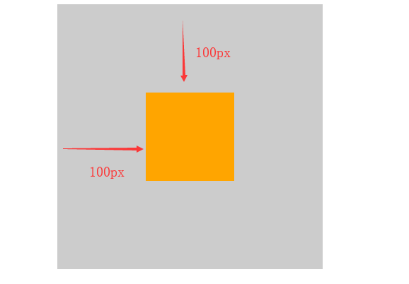

## 盒子模型（Box Model）
CSS有三个大模块：  盒子模型 、 浮动 、 定位，其余的都是细节。  
所谓盒子模型就是把HTML页面中的元素看作是一个矩形的盒子，也就是一个盛装内容的容器。每个矩形都由元素的内容、内边距（padding）、边框（border）和外边距（margin）组成。

所有的文档元素（标签）都会生成一个矩形框，称为元素框（element box），它描述了一个文档元素再网页布局汇总所占的位置大小。因此，```每个盒子除了有自己大小和位置外，还影响着其他盒子的大小和位置。```

### 盒子边框（border）
边框就是那层皮。  橘子皮。。柚子皮。。橙子皮。。。
```
	语法：border : border-width || border-style || border-color 
```
border-style：设置边框样式用于定义页面中边框的风格，常用属性值如下：
* none：没有边框即忽略所有边框的宽度（默认值）
* solid：边框为单实线(最为常用的)
* dashed：边框为虚线  
* dotted：边框为点线
* double：边框为双实线

|  设置内容   |  样式属性   |  常用属性值   |
| --- | --- | --- |
| 上边框    |  border-top-style:样式; border-top-width:宽度;border-top-color:颜色;border-top:宽度 样式 颜色;   |     |
|  下边框   |   border-bottom-style:样式;border- bottom-width:宽度;border- bottom-color:颜色;border-bottom:宽度 样式 颜色;  |     |
| 左边框    | border-left-style:样式; border-left-width:宽度;border-left-color:颜色;border-left:宽度 样式 颜色;    |     |
|  右边框   |  border-right-style:样式;border-right-width:宽度;border-right-color:颜色;border-right:宽度 样式 颜色;   |     |
|   样式综合设置  |  border-style:上边 [右边 下边 左边];   |  none无（默认）、solid单实线、dashed虚线、dotted点线、double双实线   |
|   宽度综合设置  |  border-width:上边 [右边 下边 左边];   |   像素值  |
|  颜色综合设置   |  border-color:上边 [右边 下边 左边];   |  颜色值、#十六进制、rgb(r,g,b)、rgb(r%,g%,b%)   |
|   边框综合设置  |  border:四边宽度 四边样式 四边颜色;   |     |

#### 表格的细线边框
html表格边框很粗，是因为单元格边框重叠起来了，这里只需要CSS一句话就可以美观起来。
* ```table{ border-collapse:collapse; }``` collapse 单词是合并的意思
* ```border-collapse:collapse;``` 表示边框合并在一起。

#### 圆角边框(CSS3)
从此以后，我们的世界不只有矩形。radius 半径（距离）
* border-radius: 左上角  右上角  右下角  左下角;

### 内边距（padding）
padding属性用于设置内边距。  是指 边框与内容之间的距离。
和边框一样，存在上下左右四个方向的：padding-top:上内边距、padding-right:右内边距、padding-bottom:下内边距、padding-left:左内边距。

但是常看到的写法是合并之后的写法，常见的写法如下：

|   值的个数  | 表达意思    |
| --- | --- |
|   1个值  |  padding：上下左右边距 比如padding: 3px; 表示上下左右都是3像素   |
|  2个值   |  padding: 上下边距 左右边距 比如 padding: 3px 5px; 表示 上下3像素 左右 5像素   |
|  3个值   |  padding：上边距 左右边距 下边距 比如 padding: 3px 5px 10px; 表示 上是3像素 左右是5像素 下是10像素   |
|   4个值  |  padding:上内边距 右内边距 下内边距 左内边距 比如: padding: 3px 5px 10px 15px; 表示 上3px 右是5px 下 10px 左15px ```顺时针```   |

### 外边距（margin）
margin属性用于设置外边距。  设置外边距会在元素之间创建“空白”， 这段空白通常不能放置其他内容。
也是有上下左右之分：margin-top:上外边距、margin-right:右外边距、margin-bottom:下外边距、margin-left:上外边距。

margin:上外边距 右外边距  下外边距  左外边。取值顺序跟内边距相同。

#### 外边距实现盒子居中

可以让一个盒子实现水平居中，需要满足一下两个条件：
1.必须是块级元素。     
2.盒子必须指定了宽度（width）

然后就给```左右的外边距都设置为auto```，就可使块级元素水平居中。
实际工作中常用这种方式进行网页布局，示例代码：```.header{ width:960px; margin:0 auto;}```
**auto**就是自动充满的意思。
``` margin: 0 auto;  等价于  margin-left: auto; margin-right: auto;```

#### 文字与盒子居中、图片和背景的区别
1.文字水平居中是  text-align: center
2.盒子水平居中  左右margin 改为 auto 

1.插入图片 用的最多 比如产品展示类
2.背景图片一般用于小图标背景 或者 超大背景图片
```css
	section img {  
			width: 200px;/* 插入图片更改大小 width 和 height */
			height: 210px;
			margin-top: 30px;  /* 插入图片更改位置 可以用margin 或padding  盒模型 */
			margin-left: 50px; /* 插入当图片也是一个盒子 */
		}

	aside {
			width: 400px;
			height: 400px;
			border: 1px solid purple;
			background: #fff url(images/son.jpg) no-repeat;
			background-size: 200px 210px; /*  背景图片更改大小只能用 background-size */
			background-position: 30px 50px; /* 背景图片更该位置 可用 background-position */
		}
```

#### 清除元素的默认内外边距
为了更方便地控制网页中的元素，制作网页时，可用如下代码清除元素的默认内外边距：
```css
	* {
  	 	padding:0;         /* 清除内边距 */
  		margin:0;          /* 清除外边距 */
	}
```

### 外边距合并
使用margin定义块元素的垂直外边距时，可能会出现外边距的合并。

#### 相邻块元素垂直外边距的合并
当上下相邻的两个块元素相遇时，如果上面的元素有下外边距margin-bottom，下面的元素有上外边距margin-top，则他们之间的垂直间距不是margin-bottom与margin-top之和，而是两者中的较大者。这种现象被称为相邻块元素垂直外边距的合并（也称外边距塌陷）。


解决方案：  避免就好了。

#### ### 嵌套块元素垂直外边距的合并
对于两个嵌套关系的块元素，如果父元素没有上内边距及边框，则父元素的上外边距会与子元素的上外边距发生合并，合并后的外边距为两者中的较大者，即使父元素的上外边距为0，也会发生合并。


解决方案：
1.可以为父元素定义1像素的上边框或上内边距。
2.可以为父元素添加overflow:hidden。

待续。。。。

### content宽度和高度
使用宽度属性width和高度属性height可以对盒子的大小进行控制。
width和height的属性值可以为不同单位的数值或相对于父元素的百分比%，实际工作中最常用的是像素值。
大多数浏览器，如Firefox、IE6及以上版本都采用了W3C规范，符合CSS规范的盒子模型的总宽度和总高度的计算原则是：
```
 	/*外盒尺寸计算（元素空间尺寸）*/
 		Element 空间高度 = content height + padding + border + margin
  		Element 空间宽度 = content width + padding + border + margin
 	 /*内盒尺寸计算（元素实际大小）*/
 		 Element Height = content height + padding + border （Height为内容高度）
  		 Element Width = content width + padding + border （Width为内容宽度）
```
注意：
* 宽度属性 width 和高度属性 height 仅适用于块级元素，对行内元素无效（ img 标签和 input除外）。
* 计算盒子模型的总高度时，还应考虑上下两个盒子垂直外边距合并的情况。
* **如果一个盒子没有给定宽度/高度或者继承父亲的宽度/高度，则padding 不会影响本盒子大小**

### 盒子模型布局稳定性
内外边距的使用，什么情况下使用内边距，什么情况下使用外边距？
其实他们大部分情况下是可以混用的。  就是说，你用内边距也可以，用外边距也可以。 你觉得哪个方便，就用哪个。

但是，总有一个最好用的吧，根据稳定性来分，建议如下：
按照 优先使用  宽度 （width）  其次 使用内边距（padding）    再次  外边距（margin）。 
```
	  width >  padding  >   margin   
```
原因：
1.margin 会有外边距合并 还有 ie6下面margin 加倍的bug     所以最后使用。
2.padding  会影响盒子大小， 需要进行加减计算     其次使用。
3.width   没有问题     我们经常使用宽度剩余法 高度剩余法来做。

### 盒子阴影
```css
	box-shadow: 水平阴影 垂直阴影 模糊距离 阴影尺寸 阴影颜色  内/外阴影；
```


1.前两个属性是必须写的。其余的可以省略。
2.外阴影 (outset) 但是不能写    默认      想要内阴影  inset 
```css
		div {
			width: 200px;
			height: 200px;
			border: 10px solid red;
			/* box-shadow: 5px 5px 3px 4px rgba(0, 0, 0, .4);  */
			/* box-shadow:水平位置 垂直位置 模糊距离 阴影尺寸（影子大小） 阴影颜色  内/外阴影； */
			box-shadow: 0 15px 30px  rgba(0, 0, 0, .4);
		}
```

## 浮动(float)

### 普通流(normal flow)
这个单词很多人翻译为 文档流 ， 字面翻译  普通流 或者标准流都可以。
网页布局的核心，就是用CSS来摆放盒子位置。如何把盒子摆放到合适的位置？  

CSS的定位机制有3种：普通流（标准流）、浮动和定位。

html语言当中另外一个相当重要的概念----------标准流！或者普通流。普通流实际上就是一个网页内标签元素正常从上到下，从左到右排列顺序的意思，比如块级元素会独占一行，行内元素会按顺序依次前后排列；按照这种大前提的布局排列之下绝对不会出现例外的情况叫做普通流布局。

### 浮动(float)
浮动最早是用来控制图片，以便达到其他元素（特别是文字）实现“环绕”图片的效果。

后来，发现浮动有个很有意思的事情：就是让任何盒子可以一行排列,因此我们就慢慢的偏离主题，用浮动的特性来布局了。


#### 什么是浮动？
元素的浮动是指设置了浮动属性的元素会脱离标准普通流的控制，移动到其父元素中指定位置的过程。

在CSS中，通过float属性来定义浮动，其基本语法格式如下：
```css
		选择器{	float:属性值;	}
```

|  属性值   |  描述   |
| --- | --- |
|  left   |   元素向左浮动  |
|   right  |  元素向右浮动   |
|   none  |  元素不浮动（默认值）   |

#### 浮动详细内幕特性
浮动脱离标准流，不占位置，会影响标准流。浮动只有左右浮动。
浮动首先创建包含块的概念（包裹）。就是说， 浮动的元素总是找理它最近的父级元素对齐。但是不会超出内边距的范围。


浮动的元素排列位置，跟上一个元素（块级）有关系。如果上一个元素有浮动，则A元素顶部会和上一个元素的顶部对齐；如果上一个元素是标准流，则A元素的顶部会和上一个元素的底部对齐。


由2可以推断出，一个父盒子里面的子盒子，如果其中一个子级有浮动的，则其他子级都需要浮动。这样才能一行对齐显示。

元素添加浮动后，元素会具有行内块元素的特性。元素的大小完全取决于定义的大小或者默认的内容多少浮动根据元素书写的位置来显示相应的浮动。

> 总结：浮动的目的就是为了让多个块级元素同一行上显示。float      浮 漏 特   
* 浮：    加了浮动的元素盒子是浮起来的，漂浮在其他的标准流盒子上面。
* 漏：    加了浮动的盒子，不占位置的，它浮起来了，它原来的位置漏 给了标准流的盒子。
* 特：    特别注意，首先浮动的盒子需要和标准流的父级搭配使用， 其次 特别的注意浮动可以使元素显示模式体现为行内块特性。

### 清除浮动

#### 为什么要清除浮动
浮动本质是用来做一些文字混排效果的，但是被拿来做布局用，则会有很多的问题出现， 但是，你不能说浮动不好 

由于浮动元素不再占用原文档流的位置，所以它会对后面的元素排版产生影响，为了解决这些问题，此时就需要在该元素中清除浮动。准确地说，并不是清除浮动，而是**清除浮动后造成的影响**

#### 清除浮动本质
清除浮动主要为了解决父级元素因为子级浮动引起内部高度为0 的问题。


#### 清除浮动的方法
其实本质叫做闭合浮动更好一些, 记住，清除浮动就是把浮动的盒子圈到里面，让父盒子闭合出口和入口不让他们出来影响其他元素。
在CSS中，clear属性用于清除浮动，其基本语法格式如下：```选择器{clear:属性值;}```

|  属性值   |  描述   |
| --- | --- |
|  left   |  不允许左侧有浮动元素（清除左侧浮动的影响）   |
|   right  |  不允许右侧有浮动元素（清除右侧浮动的影响）   |
|  both   |   同时清除左右两侧浮动的影响  |

#### 额外标签法
是W3C推荐的做法是通过在浮动元素末尾添加一个空的标签例如 <div style=”clear:both”></div>，或则其他标签br等亦可。

优点： 通俗易懂，书写方便
缺点： 添加许多无意义的标签，结构化较差。

#### 父级添加overflow属性方法
可以通过触发BFC的方式，可以实现清除浮动效果。
```css
	可以给父级添加： overflow为 hidden|auto|scroll  都可以实现。
```
优点：  代码简洁
缺点：  内容增多时候容易造成不会自动换行导致内容被隐藏掉，无法显示需要溢出的元素。

#### 使用after伪元素清除浮动
**:after 方式为空元素的升级版，好处是不用单独加标签了** 
使用方法：
```css
 	.clearfix:after {  content: ".";  display: block;  height: 0;  clear: both;  visibility: hidden;  }   
	 .clearfix { *zoom: 1; }   /* IE6、7 专有 */
```
优点： 符合闭合浮动思想  结构语义化正确
缺点： 由于IE6-7不支持:after，使用 zoom:1 触发 hasLayout。
注意： content:"."  里面尽量跟一个小点，或者其他，尽量不要为空，否则再firefox 7.0前的版本会有生成空格。

#### 使用before和after双伪元素清除浮动
使用方法：
```css
	.clearfix:before, .clearfix:after { 
  		content:"";
  		display:table;  /* 这句话可以触发BFC BFC可以清除浮动,BFC我们后面讲 */
	}
	.clearfix:after {
 		clear:both;
	}
	.clearfix {
 		 *zoom:1;
	}
```
优点：  代码更简洁
缺点：  由于IE6-7不支持:after，使用 zoom:1触发 hasLayout。

### 定位(position)
如果，说浮动， 关键在一个 “浮” 字上面， 那么 定位，关键在于一个 “位” 上。

#### 为什么要用定位？
为了把元素放在指定的位置上，用浮动比较复杂或者难以实现，所以需要定位。

#### 元素的定位属性
元素的定位属性主要包括定位模式和边偏移两部分。
1.边偏移

|   边偏移属性  |  描述   |
| --- | --- |
|  top   |  顶端偏移量，定义元素相对于其父元素上边线的距离   |
|  bottom   |   底部偏移量，定义元素相对于其父元素下边线的距离  |
|  left  |  左侧偏移量，定义元素相对于其父元素左边线的距离   |
|  right   |  右侧偏移量，定义元素相对于其父元素右边线的距离  |
定位要和这边偏移搭配使用， 比如 top: 100px;  left: 30px; 等等

2.定位模式（定位的分类）
在CSS中，position属性用于定义元素的定位模式，其基本语法格式如下：```选择器{position:属性值;}```
position属性的常用值:

|  值   |  描述   |
| --- | --- |
|  static   |  自动定位（默认定位方式）   |
|   relative  |  相对定位，相对于其原文档流的位置进行定位   |
|  absolute   |   绝对定位，相对于其上一个已经定位的父元素进行定位  |
|   fixed  |  固定定位，相对于浏览器窗口进行定位   |

#### 静态定位(static)

静态定位是所有元素的默认定位方式，当position属性的取值为static时，可以将元素定位于静态位置。 所谓静态位置就是各个元素在HTML文档流中默认的位置。

就是网页中所有元素都默认的是静态定位，其实就是标准流的特性。

在静态定位状态下，无法通过边偏移属性（top、bottom、left或right）来改变元素的位置。

#### 相对定位relative

相对定位是将元素相对于它在标准流中的位置进行定位，当position属性的取值为relative时，可以将元素定位于相对位置。

对元素设置相对定位后，可以通过边偏移属性改变元素的位置，但是它在文档流中的位置仍然保留。如下图所示，即是一个相对定位的效果展示：


注意：
1.相对定位最重要的一点是，它可以通过边偏移移动位置，但是原来的所占的位置，继续占有。
2.其次，每次移动的位置，是以自己的左上角为基点移动（相对于自己来移动位置）

就是说，相对定位的盒子仍在标准流中，它后面的盒子仍以标准流方式对待它。（相对定位不脱标）

如果说浮动的主要目的是 让多个块级元素一行显示，那么定位的主要价值就是 移动位置， 让盒子到我们想要的位置上去。

#### 绝对定位absolute

**注意**如果文档可滚动，绝对定位元素会随着它滚动，因为元素最终会相对于正常流的某一部分定位。

当position属性的取值为absolute时，可以将元素的定位模式设置为绝对定位。
绝对定位最重要的一点是，它可以通过边偏移移动位置，但是它完全脱标，完全不占位置。

1.父级没有定位
若所有父元素都没有定位，以浏览器为准对齐(document文档)。


2.父级有定位
绝对定位是将元素依据最近的已经定位（绝对、固定或相对定位）的父元素（祖先）进行定位。 



**子绝父相**
这句话的意思是 子级是绝对定位的话， 父级要用相对定位。

首先， 绝对定位是将元素依据最近的已经定位绝对、固定或相对定位）的父元素（祖先）进行定位。
就是说， 子级是绝对定位，父亲只要是定位即可（不管父亲是绝对定位还是相对定位，甚至是固定定位都可以），就是说， 子绝父绝，子绝父相都是正确的。

因为子级是绝对定位，不会占有位置， 可以放到父盒子里面的任何一个地方。父盒子布局时，需要占有位置，因此父亲只能是 相对定位。这就是子绝父相的由来。

#### 绝对定位的盒子水平/垂直居中

普通的盒子是左右margin 改为 auto就可， 但是对于绝对定位就无效了

定位的盒子也可以水平或者垂直居中，有一个算法。
1.首先left 50%   父盒子的一半大小
2.然后走自己外边距负的一半值就可以了 margin-left。

#### 固定定位fixed
固定定位是绝对定位的一种特殊形式，类似于 正方形是一个特殊的 矩形。它以浏览器窗口作为参照物来定义网页元素。当position属性的取值为fixed时，即可将元素的定位模式设置为固定定位。

当对元素设置固定定位后，它将脱离标准文档流的控制，始终依据浏览器窗口来定义自己的显示位置。不管浏览器滚动条如何滚动也不管浏览器窗口的大小如何变化，该元素都会始终显示在浏览器窗口的固定位置。


固定定位有两点：
1.固定定位的元素跟父亲没有任何关系，只认浏览器。
2.固定定位完全脱标，不占有位置，不随着滚动条滚动。
3.ie6等低版本浏览器不支持固定

#### 叠放次序（z-index）
当对多个元素同时设置定位时，定位元素之间有可能会发生重叠。
在CSS中，要想调整重叠定位元素的堆叠顺序，可以对定位元素应用z-index层叠等级属性，其取值可为正整数、负整数和0。

比如：  z-index: 2;
注意：
1.z-index的默认属性值是0，取值越大，定位元素在层叠元素中越居上。
2.如果取值相同，则根据书写顺序，后来居上。
3.后面数字一定不能加单位。
4.只有相对定位，绝对定位，固定定位有此属性，其余标准流，浮动，静态定位都无此属性，亦不可指定此属性。

#### 四种定位总结

|  定位模式   |  是否脱标占有位置   |  是否可以使用边偏移   |  移动位置基准   |
| --- | --- | --- | --- |
|  静态static   |  不脱标，正常模式   | 不可以    |   正常模式  |
|  相对定位relative   |   不脱标，占有位置  |  可以   |  相对自身位置移动（自恋型）   |
|  绝对定位absolute   | 完全脱标，不占有位置    |  可以   |  相对于定位父级移动位置（拼爹型）   |
|  固定定位fixed   |  完全脱标，不占有位置   |  可以   |   相对于浏览器移动位置（认死理型）  |

#### 定位模式转换
跟 浮动一样， 元素添加了 绝对定位和固定定位之后， 元素模式也会发生转换， 都转换为 行内块模式，

** 因此 比如 行内元素 如果添加了 绝对定位或者 固定定位后 浮动后，可以不用转换模式，直接给高度和宽度就可以了。**


