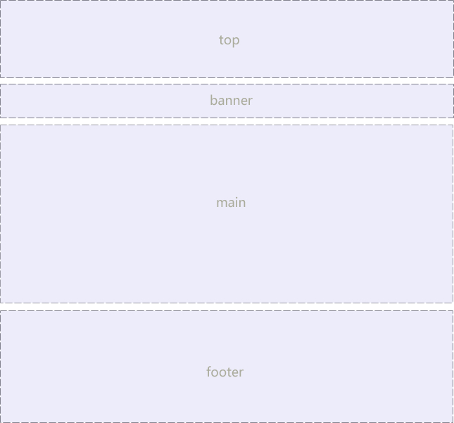

## 版心和布局流程

阅读报纸时容易发现，虽然报纸中的内容很多，但是经过合理地排版，版面依然清晰、易读。同样，在制作网页时，要想使页面结构清晰、有条理，也需要对网页进行“排版”。

“版心”(可视区) 是指网页中主体内容所在的区域。一般在浏览器窗口中水平居中显示，常见的宽度值为960px、980px、1000px、1200px等。

### 布局流程

为了提高网页制作的效率，布局时通常需要遵守一定的布局流程，具体如下：
1.确定页面的版心（可视区）。
2.分析页面中的行模块，以及每个行模块中的列模块。
3.制作HTML结构 。
4.CSS初始化，然后开始运用盒子模型的原理，通过DIV+CSS布局来控制网页的各个模块。

### 一列固定宽度且居中


最普通的，最为常用的结构

### 两列左窄右宽型


### 通栏平均分布型


## 元素的显示与隐藏

在CSS中有三个显示和隐藏的单词比较常见，我们要区分开，他们分别是 display visibility 和 overflow。

主要目的是让一个元素在页面中消失，但是不在文档源码中删除。 最常见的是网站广告，当我们点击类似关闭不见了，但是我们重新刷新页面，它们又会出现和你玩躲猫猫！！

### display 显示

display 设置或检索对象是否及如何显示。

* display : none   隐藏对象  
* display:block    除了转换为块级元素之外，同时还有显示元素的意思。
* 特点： 隐藏之后，不再保留位置。

### visibility 可见性

设置或检索是否显示对象。

* visible : 　对象可视
* hidden : 　对象隐藏
* 特点： 隐藏之后，继续保留原有位置。（停职留薪）

### overflow 溢出

检索或设置当对象的内容超过其指定高度及宽度时如何管理内容。

* visible : 　不剪切内容也不添加滚动条。
* auto : 　 超出自动显示滚动条，不超出不显示滚动条
* hidden : 　不显示超过对象尺寸的内容，超出的部分隐藏掉
* scroll : 　不管超出内容否，总是显示滚动条

## CSS高级技巧

### CSS用户界面样式

所谓的界面样式， 就是更改一些用户操作样式， 比如 更改用户的鼠标样式， 表单轮廓等。但是比如滚动条的样式改动受到了很多浏览器的抵制，因此我们就放弃了。 防止表单域拖拽

#### 鼠标样式cursor
 设置或检索在对象上移动的鼠标指针采用何种系统预定义的光标形状。 
 ```css
 cursor :  default  小白 | pointer  小手  | move  移动  |  text  文本
 ```
  鼠标放元素身上查看效果哦：
  ```html
  <ul>
  <li style="cursor:default">我是小白</li>
  <li style="cursor:pointer">我是小手</li>
  <li style="cursor:move">我是移动</li>
  <li style="cursor:text">我是文本</li>
</ul> 
<!-- 尽量不要用hand  因为 火狐不支持     pointer ie6以上都支持的尽量用 -->
  ```

#### 轮廓 outline
是绘制于元素周围的一条线，位于边框边缘的外围，可起到突出元素的作用。
```css
 outline : outline-color || outline-style || outline-width 
```
平时都是去掉的，最直接的写法是 ：  outline: 0;   或者  outline: none;
```<input  type="text"  style="outline: 0;"/>```

#### 防止拖拽文本域resize
resize：none    这个单词可以防止 火狐 谷歌等浏览器随意的拖动 文本域。

右下角可以拖拽： 
<textarea></textarea>

右下角不可以拖拽： 
<textarea  style="resize: none;"></textarea>

#### vertical-align 垂直对齐
以前让带有宽度的块级元素居中对齐，是margin: 0 auto;
以前让文字居中对齐，是 text-align: center;
但是从来没有讲过有垂直居中的属性， vertical-align 垂直对齐。


```css
vertical-align : baseline | top | middle | bottom 
```
设置或检索对象内容的垂直对其方式。 
vertical-align 不影响块级元素中的内容对齐，它只针对于 行内元素或者行内块元素，特别是行内块元素， **通常用来控制图片/表单与文字的对齐**。


**图片、表单和文字对齐**
可以通过vertical-align 控制图片和文字的垂直关系了。 默认的图片会和文字基线对齐。

**去除图片底侧空白缝隙**
图片或者表单等行内块元素，他的底线会和父级盒子的基线对齐。这样会造成一个问题，就是图片底侧会有一个空白缝隙。

解决的方法就是：  
1.给img vertical-align:middle | top等等。  让图片不要和基线对齐。
2.给img 添加 display：block; 转换为块级元素就不会存在问题了。

### 溢出的文字隐藏

#### word-break:自动换行

* normal   使用浏览器默认的换行规则。
* break-all   允许在单词内换行。
* keep-all    只能在半角空格或连字符处换行。
* 主要处理英文单词

#### white-space
white-space设置或检索对象内文本显示方式。通常使用于强制一行显示内容 
* normal : 　默认处理方式
* nowrap : 　强制在同一行内显示所有文本，直到文本结束或者遭遇br标签对象才换行。
* 可以处理中文

#### text-overflow 文字溢出
```css
text-overflow : clip | ellipsis
```
设置或检索是否使用一个省略标记（...）标示对象内文本的溢出
* clip : 　不显示省略标记（...），而是简单的裁切 
* ellipsis : 　当对象内文本溢出时显示省略标记（...）
* 注意一定要首先强制一行内显示，再次和overflow属性  搭配使用

### CSS精灵技术（sprite） 小妖精  雪碧

#### 精灵技术产生的背景


上图图所示为网页的请求原理图，当用户访问一个网站时，需要向服务器发送请求，网页上的每张图像都要经过一次请求才能展现给用户。

然而，一个网页中往往会应用很多小的背景图像作为修饰，当网页中的图像过多时，服务器就会频繁地接受和发送请求，这将大大降低页面的加载速度。为了有效地减少服务器接受和发送请求的次数，提高页面的加载速度，出现了CSS精灵技术（也称CSS Sprites、CSS雪碧）。

#### 精灵技术本质
简单地说，CSS精灵是一种处理网页背景图像的方式。它将一个页面涉及到的所有零星背景图像都集中到一张大图中去，然后将大图应用于网页，这样，当用户访问该页面时，只需向服务发送一次请求，网页中的背景图像即可全部展示出来。通常情况下，这个由很多小的背景图像合成的大图被称为精灵图（雪碧图），如下图所示为京东网站中的一个精灵图。


#### 精灵技术的使用
CSS 精灵其实是将网页中的一些背景图像整合到一张大图中（精灵图），然而，各个网页元素通常只需要精灵图中不同位置的某个小图，要想精确定位到精灵图中的某个小图，就需要使用CSS的background-image、background-repeat和background-position属性进行背景定位，其中最关键的是使用background-position属性精确地定位。

#### 制作精灵图
CSS 精灵其实是将网页中的一些背景图像整合到一张大图中（精灵图），那我们要做的，就是把小图拼合成一张大图。大部分情况下，精灵图都是网页美工做。
* 精灵图上放的都是小的装饰性质的背景图片。 插入图片不能往上放。
* 精灵图的宽度取决于最宽的那个背景。 
* 可以横向摆放也可以纵向摆放，但是每个图片之间，间隔至少隔开偶数像素合适。
* 精灵图的最低端，留一片空隙，方便以后添加其他精灵图。
* 背景图片很少的情况，没有必要使用精灵技术，维护成本太高。 如果是背景图片比较多，可以建议使用精灵技术。

### 滑动门

#### 滑动门出现的背景
制作网页时，为了美观，常常需要为网页元素设置特殊形状的背景，比如微信导航栏，有凸起和凹下去的感觉，最大的问题是里面的字数不一样多。


为了使各种特殊形状的背景能够自适应元素中文本内容的多少，出现了CSS滑动门技术。它从新的角度构建页面，使各种特殊形状的背景能够自由拉伸滑动，以适应元素内部的文本内容，可用性更强。 最常见于各种导航栏的滑动门。

#### 核心技术
核心技术就是利用CSS精灵（主要是背景位置）和盒子padding撑开宽度, 以便能适应不同字数的导航栏。

一般的经典布局都是这样的：
```html
<li>
  <a href="#">
    <span>导航栏内容</span>
  </a>
</li>
```
总结：
1.a 设置 背景左侧，padding撑开合适宽度。    
2.span 设置背景右侧， padding撑开合适宽度 剩下由文字继续撑开宽度。
3.之所以a包含span就是因为 整个导航都是可以点击的。

## 字体图标
图片是有诸多优点的，但是缺点很明显，比如图片不但增加了总文件的大小，还增加了很多额外的"http请求"，这都会大大降低网页的性能的。更重要的是图片不能很好的进行“缩放”，因为图片放大和缩小会失真。学习移动端响应式，很多情况下希望我们的图标是可以缩放的。此时，字体图标（iconfont)出现了。

#### 字体图标优点

* 可以做出跟图片一样可以做的事情,改变透明度、旋转度，等..
* 但是本质其实是文字，可以很随意的改变颜色、产生阴影、透明效果等等...
* 本身体积更小，但携带的信息并没有削减。
* 几乎支持所有的浏览器
* 移动端设备上常用...

### 字体图标使用流程
总体来说，字体图标按照如下流程：


#### 设计字体图标

假如图标是公司单独设计，那就需要第一步了，这个属于UI设计人员的工作， 他们在 illustrator 或 Sketch 这类矢量图形软件里创建 icon图标， 比如下图：


之后保存为svg格式，进行第二步。其实第一步，我们不需要关心，只需要给我们这些图标就可以了，如果图标是大众的，网上本来就有的，可以直接跳过第一步，进入第三步。

#### 上传生成字体包

当UI设计人员给我们svg文件的时候，我们需要转换成我们页面能使用的字体文件， 而且需要生成的是兼容性的适合各个浏览器的。

推荐网站： [icomoon](http://icomoon.io)

**阿里icon font字库** [iconfont](http://www.iconfont.cn/) 可以使用AI制作图标上传生成。 

**fontello** [fontello](http://fontello.com/) 在线定制你自己的icon font字体图标字库，也可以直接从GitHub下载整个图标集，该项目也是开源的。

**Font-Awesome** [fontawesome](https://fontawesome.com/) 更新比较快。

**Glyphicon Halflings** [glyphicons](http://glyphicons.com/) 这个字体图标可以在Bootstrap下免费使用。

**Icons8** [icons8](https://icons8.com/) 提供PNG免费下载，像素大能到500PX。

#### 下载兼容字体包
上传完毕， 网站会给我们把UI做的svg图片转换为我们的字体格式， 然后下载下来就好了。

当然，我们不需要自己专门的图标，是想网上找几个图标使用，以上2步可以直接省略了， 直接到刚才的网站上找喜欢的下载使用吧。


#### 字体引入到HTML
得到压缩包之后，最后一步，是最重要的一步了， 就是字体文件已经有了，我们需要引入到我们页面中。
1.首先把 以下4个文件放入到 fonts文件夹里面。 通俗的做法


* 第一步：在样式里面声明字体： 告诉别人我们自己定义的字体
```css
@font-face {
  font-family: 'icomoon';
  src:  url('fonts/icomoon.eot?t3rxa7');
  src:  url('fonts/icomoon.eot?t3rxa7#iefix') format('embedded-opentype'),
    url('fonts/icomoon.ttf?t3rxa7') format('truetype'),
    url('fonts/icomoon.woff?t3rxa7') format('woff'),
    url('fonts/icomoon.svg?t3rxa7#icomoon') format('svg');
  font-weight: normal;
  font-style: normal;
}
```
* 第二步：给盒子使用字体：``` span { font-family: "icomoon"; } ```
* 第三步：盒子里面添加结构
```css
span::before {
		 content: "\e981";
	}
或者  
<span></span> 
```

#### 追加新图标到原来库里面
如果工作中，原来的字体图标不够用了，我们需要添加新的字体图标，但是原来的不能删除，继续使用，此时我们需要这样做
把压缩包里面的selection.json 从新上传，然后，选中自己想要新的图标，从新下载压缩包，替换原来文件即可。


