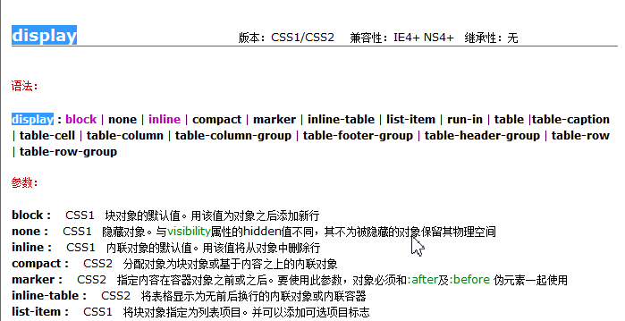

### CSS 初始化
CSS Rest 类库，为跨浏览器兼容做准备
**normalize.css**只是一个很小的CSS文件，但它在默认的HTML元素样式上提供了跨浏览器的高度一致性。相比于传统的CSS reset，Normalize.css是一种现代的、为HTML5准备的优质替代方案。Normalize.css现在已经被用于Twitter Bootstrap、HTML5 Boilerplate、GOV.UK、Rdio、CSS Tricks 以及许许多多其他框架、工具和网站上。 
* 保护有用的浏览器默认样式而不是完全去掉它们
* 一般化的样式：为大部分HTML元素提供
* 修复浏览器自身的bug并保证各浏览器的一致性
* 优化CSS可用性：用一些小技巧
* 解释代码：用注释和详细的文档来
* 低版本浏览器 单独制作一个跳转页面，比如京东的：[低版本京东跳转页面](https://h5.m.jd.com/dev/3dm8aE4LDBNMkDfcCaRxLnVQ7rqo/index.html)
* 要实现结构和样式相分离的设计思想。 根目录下有这4个文件（目录）：css、images、index、js

### 引入 ico 图标
```css
/*Shortcut Icon 就是在网址列前面出现的 Icon，这一句是必须的 */
/*favicon必须是16*16或者32*32的，必须是8位色或者24位色的，格式必须是png或者ico或者gif。*/
<link rel="shortcut icon" href="favicon.ico"  type="image/x-icon"/>  
<link rel="icon" href="animated_favicon.gif" type="image/gif" />   
```
* 她(它)不是iconfont字体。
* 位置是放到 head 标签中间。
* 后面的type="image/x-icon"  属性可以省略。
* 为了兼容性，请将favicon.ico 这个图标放到根目录下。

#### 转换 ico 图标
我们可以自己做的图片，转换为 ico图标，以便放到我们站点里面。[比特虫](http://www.bitbug.net/)

### 网站优化三大标签
SEO是由英文Search Engine Optimization缩写而来， 中文意译为“搜索引擎优化”！SEO是指通过对网站进行站内优化、网站结构调整、网站内容建设、网站代码优化等)和站外优化，从而提高网站的关键词排名以及公司产品的曝光度。 简单的说就是，把产品做好，搜索引擎就会介绍客户来。


#### 网页 title 标题
title具有不可替代性，是我们的内页第一个重要标签，是搜索引擎了解网页的入口，和对网页主题归属的最佳判断点。


建议：首页标题：网站名（产品名）- 网站的介绍   
例如：
京东(JD.COM)-正品低价、品质保障、配送及时、轻松购物！
小米商城 - 小米MIX 3、小米8、红米6 Pro、小米电视官方网站

#### Description  网站说明
对于关键词的作用明显降低，但由于很多搜索引擎，仍然大量采用网页的MATA标签中描述部分作为搜索结果的“内容摘要”。 就是简要说明我们网站的主要做什么的。
提倡 Description 作为网站的总体业务和主题概括，多采用“我们是…”“我们提供…”“×××网作为…”“电话：010…”之类语句。
```css
京东：
<meta name="description" content="京东JD.COM-专业的综合网上购物商城，为您提供正品低价的购物选择、优质便捷的服务体验。商品来自全球数十万品牌商家，囊括家电、手机、电脑、服装、居家、母婴、美妆、个护、食品、生鲜等丰富品类，满足各种购物需求。">
```
注意点：
* 描述中出现关键词，与正文内容相关，这部分内容是给人看的，所以要写的很详细，让人感兴趣， 吸引用户点击。
* 同样遵循简短原则，字符数含空格在内不要超过 120  个汉字。
* 补充在 title  和 keywords  中未能充分表述的说明.
* 用英文逗号 关键词1,关键词2

#### Keywords 关键字
Keywords是页面关键词，是搜索引擎关注点之一。Keywords应该限制在6～8个关键词左右，电商类网站可以多 少许。
```css
京东：
<meta name="Keywords" content="网上购物,网上商城,家电,手机,电脑,服装,居家,母婴,美妆,个护,食品,生鲜,京东">
```

### BFC(块级格式化上下文)
BFC(Block formatting context)，直译为"块级格式化上下文"。


元素的显示模式 display，分为 块级元素   行内元素  行内块元素 ，其实，它还有很多其他显示模式。

#### 那些元素会具有BFC的条件
不是所有的元素模式都能产生BFC，w3c 规范： ```display 属性为 block, list-item, table 的元素，会产生BFC.```
这个三个都是用来布局最为合理的元素，因为他们就是用来可视化布局。
注意其他的，display属性，比如 line 等等，他们创建的是 IFC 。
这个BFC 有着具体的布局特性： 


有宽度和高度 ， 有 外边距margin  有内边距padding 有边框 border。

#### 什么情况下可以让元素产生BFC
要给这些元素添加如下属性就可以触发BFC:
* float 属性不为none
* position 为 absolute 或 fixed
* display 为 inline-block ，table-cell ，table-caption ，flex ，inline-flex
* overflow 不为 visible。

#### BFC元素所具有的特性
BFC 布局规则特性：
1.在 BFC 中，盒子从顶端开始垂直地一个接一个地排列。
2.盒子垂直方向的距离由 margin 决定。属于同一个 BFC 的两个相邻盒子的 margin会发生重叠
3.在 BFC 中，每一个盒子的左外边缘（margin-left）会触碰到容器的左边缘(border-left)（对于从右到左的格式来说，则触碰到右边缘）。
* BFC的区域不会与浮动盒子产生交集，而是紧贴浮动边缘。
* 计算BFC的高度时，自然也会检测浮动或者定位的盒子高度。

它是一个独立的渲染区域，只有Block-level box参与， 它规定了内部的Block-level Box如何布局，并且与这个区域外部毫不相干。

#### BFC的主要用途
1.**清除元素内部浮动**
只要把父元素设为BFC就可以清理子元素的浮动了，最常见的用法就是在父元素上设置overflow: hidden样式，对于IE6加上zoom:1就可以了。主要用到：```计算BFC的高度时，自然也会检测浮动或者定位的盒子高度。```

2.**解决外边距合并问题**
外边距合并的问题。主要用到：```盒子垂直方向的距离由margin决定。属于同一个BFC的两个相邻盒子的margin会发生重叠```
属于同一个BFC的两个相邻盒子的margin会发生重叠，那么我们创建不属于同一个BFC，就不会发生margin重叠了。

3.**制作右侧自适应的盒子问题**
主要用到：```普通流体元素BFC后，为了和浮动元素不产生任何交集，顺着浮动边缘形成自己的封闭上下文```

#### BFC 总结
BFC就是页面上的一个隔离的独立容器，容器里面的子元素不会影响到外面的元素。反之也如此。包括浮动，和外边距合并等等，因此，有了这个特性，我们布局的时候就不会出现意外情况了。

### 优雅降级和渐进增强
**渐进增强 progressive enhancement**：
针对低版本浏览器进行构建页面，保证最基本的功能，然后再针对高级浏览器进行效果、交互等改进和追加功能达到更好的用户体验。类似 爬山，由低出往高处爬

**优雅降级 graceful degradation**：
一开始就构建完整的功能，然后再针对低版本浏览器进行兼容。类似蹦极，由高处往低处下落

区别：渐进增强是向上兼容，优雅降级是向下兼容。

### 浏览器前缀

|  浏览器前缀   |  浏览器   |
| --- | --- |
|  -webkit-   |   Google Chrome, Safari, Android Browser  |
|  -moz-   |  Firefox   |
|  -o-   |  Opera   |
|   -ms-  |  Internet Explorer, Edge   |
|  -khtml-   |  Konqueror   |
常用的解决H5和C3 的兼容问题。

### CSS W3C 统一验证工具
CssStats 是一个在线的 CSS 代码分析工具：[cssstats](https://cssstats.com/)
W3C 统一验证工具：[validator](http://validator.w3.org/unicorn/) 
