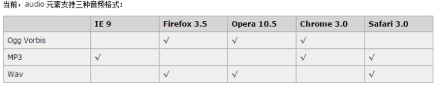
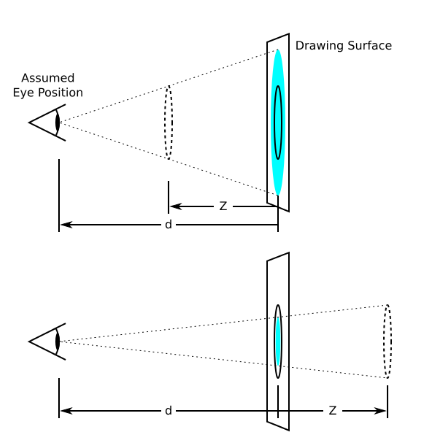
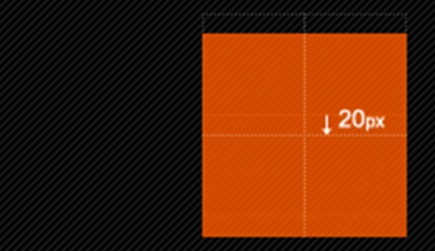

## HTML5新标签与特性


### 文档类型设定

|  文档类型   |   文档开头  |
| --- | --- |
|  HTML   |  `<!DOCTYPE HTML PUBLIC "-//W3C//DTD HTML 4.01//EN" "http://www.w3.org/TR/html4/strict.dtd">`   |
|  XHTML   |   `<!DOCTYPE html PUBLIC "-//W3C//DTD XHTML 1.0 Transitional//EN" "http://www.w3.org/TR/xhtml1/DTD/xhtml1-transitional.dtd">`  |
|  HTML5   |  `<!DOCTYPE html>`  |

### 字符设定
* <meta http-equiv="Content-Type" content="text/html;charset=UTF-8">：HTML与XHTML中建议这样去写
* <meta charset="utf-8">：HTML5的标签中建议这样去写

### 常用新标签
 w3c  手册中文官网 :   [w3school](http://www.w3school.com.cn/)
* header：定义文档的页眉 头部
* nav：定义导航链接的部分
* footer：定义文档或节的页脚 底部
* article：定义文章。
* section：定义文档中的节（section、区段）
* aside：定义其所处内容之外的内容 侧边
```html
<header> 语义 :定义页面的头部  页眉</header>
<nav>  语义 :定义导航栏 </nav> 
<footer> 语义: 定义 页面底部 页脚</footer>
<article> 语义:  定义文章</article>
<section> 语义： 定义区域</section>
<aside> 语义： 定义其所处内容之外的内容 侧边</aside>
```
* datalist   标签定义选项列表。请与 input 元素配合使用该元素
```html
<input type="text" placeholder="输入明星" list="star"/> <!--  input里面用 list -->
<datalist id="star">   <!-- datalist 里面用 id  来实现和 input 链接 -->  
    		<option>周杰伦1</option>
    		<option>周杰伦2</option>
    		<option>周杰伦3</option>
    		<option>周杰伦4</option>
    		<option>周杰伦5</option>
    		<option>周杰伦6</option>
</datalist>
```
* fieldset 元素可将表单内的相关元素分组，打包      legend 搭配使用
```html
<fieldset>
    		<legend>用户登录</legend>  标题
    		用户名: <input type="text"><br /><br />
    		密　码: <input type="password">
</fieldset>
```

### 新增的 input type 属性值

|  类型   |  使用示例   |  含义   |
| --- | --- | --- |
|  email   |  <input type="email">   |  输入邮箱格式   |
|  tel   |  <input type="tel">   |   输入手机号码格式  |
|   url  |  <input type="url">   |  输入url格式   |
|  number   |  <input type="number">   |   输入数字格式  |
| search   |  <input type="search">   |  搜索框（体现语义化）   |
|   range  |  <input type="range">   |   自由拖动滑块  |
|   time  |   <input type="time">  | 小时分钟    |
|   date  |  <input type="date">   |  年月日   |
|  datetime   |  <input type="datetime">   |  时间   |
|   month  |  <input type="month">   |  月年   |
|  week   |  <input type="week">   |   星期 年  |

### 常用新属性

|   属性  |  用法   |  含义   |
| --- | --- | --- |
|  placeholder   |  <input type="text" placeholder="请输入用户名">   |  占位符  当用户输入的时候 里面的文字消失  删除所有文字，自动返回   |
|  autofocus   |  <input type="text" autofocus>   |  规定当页面加载时 input 元素应该自动获得焦点   |
|  multiple   |   <input type="file" multiple>  |   多文件上传  |
|  autocomplete   |  <input type="text" autocomplete="off" name="cjr">   |  规定表单是否应该启用自动完成功能  有2个值，一个是on 一个是off      on 代表记录已经输入的值  1.autocomplete 首先需要提交按钮 <br/>2.这个表单您必须给他名字   |
|  required   |  <input type="text" required>   |  必填项  内容不能为空   |
|   accesskey  |  <input type="text" accesskey="s">   |  规定激活（使元素获得焦点）元素的快捷键   采用 alt + s的形式   |

### 多媒体标签
*  embed：标签定义嵌入的内容
*  audio：播放音频
*  video：播放视频

#### 多媒体 embed
embed可以用来插入各种多媒体，格式可以是 Midi、Wav、AIFF、AU、MP3等等。url为音频或视频文件及其路径，可以是相对路径或绝对路径。存在兼容问题.

```html5
<embed src='http://player.youku.com/player.php/sid/XMzU4MzIzMzY1Mg==/v.swf' allowFullScreen='true' quality='high' width='480' height='400' align='middle' allowScriptAccess='always' type='application/x-shockwave-flash'></embed>
```
多媒体还能看到 iframe 标签

```html
<iframe style="width:704px;height:436px;" src="http://cdn.aixifan.com/player/ACFlashPlayer.out.swf?vid=6550021&ref=http://www.acfun.cn/v/ac4839859" id="ACFlashPlayer-re" frameborder="0"></iframe>
```

#### 多媒体 audio
HTML5通过```<audio>```标签来解决音频播放的问题。

```html5
<audio  autoplay="autoplay" loop="loop" controls="controls">
		<source src="bgsound.mp3">
		<source src="bgsound.wav">
		<source src="bgsound.ogg>
</audio>
```
可以通过附加属性可以更友好控制音频的播放，如：
* autoplay 自动播放
* controls 是否显不默认播放控件
* loop 循环播放    如果这个属性不写 默认播放一次
由于版权等原因，不同的浏览器可支持播放的格式是不一样的，如下图供参考：


多浏览器支持的方案，```<source />```标签允许您规定可替换的视频/音频文件供浏览器根据它对媒体类型或者编解码器的支持进行选择。

#### 多媒体 video
HTML5通过```<video>```标签来解决音频播放的问题。
```html5
<video autoplay controls loop>
		<source src="mp4.mp4">
		<source src="mp4.ogg">
		<source src="mp4.webm">
</video>
```
同样，通过附加属性可以更友好的控制视频的播放：
* autoplay 自动播放
* controls 是否显示默认播放控件
* loop 循环播放
* width 设置播放窗口宽度
* height 设置播放窗口的高度
由于版权等原因，不同的浏览器可支持播放的格式是不一样的，如下图供参考：


多浏览器支持的方案，```<source />```标签允许您规定可替换的视频/音频文件供浏览器根据它对媒体类型或者编解码器的支持进行选择。

## CSS3

### CSS3 选择器

#### 结构(位置)伪类选择器（CSS3)  
* :first-child :选取属于其父元素的首个子元素的指定选择器
* :last-child :选取属于其父元素的最后一个子元素的指定选择器
* :nth-child(n) ： 匹配属于其父元素的第 N 个子元素，不论元素的类型，n 可以是 2n，2n+1，4n，4n+1
* :nth-last-child(n) ：选择器匹配属于其元素的第 N 个子元素的每个元素，不论元素的类型，从最后一个子元素开始计数。n 可以是数字、关键词或公式
* :nth-child(even) ：偶数个子元素  
* :nth-child(odd) ：奇数个子元素 
```css
li:first-child { /*  选择第一个孩子 */
        	color: pink; 
}
li:last-child {   /* 最后一个孩子 */
        	color: purple;
}
li:nth-child(4) {   /* 选择第4个孩子  n  代表 第几个的意思 */ 
			color: skyblue;
}
```

#### 属性选择器
选取标签带有某些特殊属性的选择器，如：input[type=text] 
```css
/* 获取到 拥有 该属性的元素 */
div[class] { /*  class 表示  有属性的元素 */
			color: red;
}
div[class^=font] { /*  class^=font 表示 font 开始位置就行了 */
			color: pink;
}
div[class$=footer] { /*  class$=footer 表示 footer 结束位置就行了 */
			color: skyblue;
}
div[class*=tao] { /* class*=tao  *=  表示tao 在任意位置都可以 */
			color: green;
}
```
```html
    <div class="font12">属性选择器</div>
    <div class="font12">属性选择器</div>
    <div class="font24">属性选择器</div>
    <div class="font24">属性选择器</div>
    <div class="font24">属性选择器</div>
    <div class="24font">属性选择器123</div>
    <div class="sub-footer">属性选择器footer</div>
    <div class="jd-footer">属性选择器footer</div>
    <div class="news-tao-nav">属性选择器</div>
    <div class="news-tao-header">属性选择器</div>
    <div class="tao-header">属性选择器</div>
```

#### 伪元素选择器（CSS3)
* E::first-letter文本的第一个单词或字（如中文、日文、韩文等）
* E::first-line 文本第一行；
* E::selection 可改变选中文本的样式；
```css
p::first-letter {
    font-size: 20px;
    color: hotpink;
}
/* 首行特殊样式 */
p::first-line {
    color: skyblue;
}
p::selection {
    background-color: pink;
    color: orange;
}
```
* **E::before 和 E::after**
在E元素内部的开始位置和结束位创建一个元素，该元素为行内元素，且必须要结合content属性使用。
```css
div::befor {
    content:"开始";
}
div::after {
    content:"结束";
}
```
E:after、E:before 在旧版本里是伪元素，CSS3 的规范里 “:” 用来表示伪类，“::” 用来表示伪元素，但是在高版本浏览器下 E:after、E:before 会被自动识别为E::after、E::before，这样做的目的是用来做兼容处理。

":" 与 "::" 区别在于区分伪类和伪元素

之所以被称为伪元素，是因为他们不是真正的页面元素，html没有对应的元素，但是其所有用法和表现行为与真正的页面元素一样，可以对其使用诸如页面元素一样的css样式，表面上看上去貌似是页面的某些元素来展现，实际上是css样式展现的行为，因此被称为伪元素。是伪元素在html代码机构中的展现，可以看出无法伪元素的结构无法审查

**注意**
伪元素 :before 和 :after 添加的内容默认是 inline 元素，**这个两个伪元素的 `content` 属性，表示伪元素的内容，设置 :before 和 :after 时必须设置其 `content` 属性，否则伪元素就不起作用。**

### CSS3盒模型
CSS3 中可以通过 box-sizing 来指定盒模型，即可指定为 content-box、border-box，这样我们计算盒子大小的方式就发生了改变。可以分成两种情况：

1.box-sizing: content-box  盒子大小为 width + padding + border   content-box: 此值为其默认值，其让元素维持W3C的标准 Box Mode

2.box-sizing: border-box  盒子大小为 width    就是说  padding 和 border 是包含到width里面的

注：上面的标注的 width 指的是CSS属性里设置的 width: length，content 的值是会自动调整的。
```css
div:first-child {
			width: 200px;
			height: 200px;
			background-color: pink; 
			box-sizing: content-box;  /*  以前的标准盒模型  w3c */
			padding: 10px;
			border: 15px solid red;
			/* 盒子大小为 width + padding + border   content-box: 此值为其默认值，其让元素维持W3C的标准Box Mode */
}
div:last-child {
			width: 200px;
			height: 200px;
			background-color: purple;
			padding: 10px;
			box-sizing: border-box;   /* padding border  不撑开盒子 */
			border: 15px solid red;
			/* 盒子大小为 width    就是说  padding 和 border 是包含到width里面的 */
}
```

### 过渡(CSS3)
过渡（transition) 是 CSS3 中具有颠覆性的特征之一，我们可以在不使用 Flash 动画或 JavaScript 的情况下，当元素从一种样式变换为另一种样式时为元素添加效果。

过渡动画：   是从一个状态 渐渐的过渡到另外一个状态
帧动画：通过一帧一帧的画面按照固定顺序和速度播放。如电影胶片

在 CSS3 里使用 transition 可以实现补间动画（过渡效果），并且当前元素只要有“属性”发生变化时即存在两种状态(我们用A和B代指），就可以实现平滑的过渡，为了方便查看用 hover 切换两种状态，但是并不仅仅局限于 hove r状态来实现过渡。
```css3
transition: 要过渡的属性  花费时间  运动曲线  何时开始;
如果有多组属性变化，还是用逗号隔开。
```

|  属性   |   描述  |
| --- | --- |
|  transition   |  简写属性，用于在一个属性中设置四个过渡属性。   |
|  transition-property   |  规定应用过渡的 CSS 属性的名称。单位是 秒 s，比如 0.5s，s单位必须写。   |
|  transition-duration   |  定义过渡效果花费的时间。默认是 0。   |
|  transition-timing-function   |  规定过渡效果的时间曲线。默认是 "ease"。   |
|  transition-delay   |  规定过渡效果何时开始。默认是 0。   |


```css
div {
			width: 200px;
			height: 100px;
			background-color: pink;
			/* transition: 要过渡的属性  花费时间  运动曲线  何时开始; */
			transition: width 0.6s ease 0s, height 0.3s ease-in 1s;
			/* transtion 过渡的意思  这句话写到div里面而不是 hover里面 */
}
div:hover {  /* 鼠标经过盒子，我们的宽度变为400 */
			width: 600px;
			height: 300px
}
transition: all 0.6s;  /* 所有属性都变化用all 就可以了  后面俩个属性可以省略 */
```

### 2D变形(CSS3) transform
transform 是 CSS3 中具有颠覆性的特征之一，可以实现元素的位移、旋转、倾斜、缩放，甚至支持矩阵方式，配合过渡和即将学习的动画知识，可以取代大量之前只能靠Flash才可以实现的效果。

#### 移动 translate(x, y)    


```translate(50px,50px);```使用translate方法来将文字或图像在水平方向和垂直方向上分别垂直移动50像素。

可以改变元素的位置，x、y可为负值；
*  translate(x,y)水平方向和垂直方向同时移动（也就是X轴和Y轴同时移动）
*  translateX(x)仅水平方向移动（X轴移动）
*  translateY(Y)仅垂直方向移动（Y轴移动）

让定位的盒子居中：
```css
.box {
      width: 400px;
      height: 400px;
      background: pink;
      position: absolute;
      left:50%;
      top:50%;
      transform:translate(-50%,-50%);  /* 走的自己的一半 */
}
```

#### 缩放 scale(x, y) 


```transform:scale(0.8,1);```可以对元素进行水平和垂直方向的缩放。该语句使用scale方法使该元素在水平方向上缩小了20%，垂直方向上不缩放。

* scale(X,Y)使元素水平方向和垂直方向同时缩放（也就是X轴和Y轴同时缩放）
* scaleX(x)元素仅水平方向缩放（X轴缩放）
* scaleY(y)元素仅垂直方向缩放（Y轴缩放）

scale()的取值默认的值为1，当值设置为0.01到0.99之间的任何值，作用使一个元素缩小；而任何大于或等于1.01的值，作用是让元素放大 1.

#### 旋转 rotate(deg) 
可以对元素进行旋转，正值为顺时针，负值为逆时针：


```transform:rotate(45deg);```单位是 deg 度数 ，表示顺时针旋转45度。也有 	

**transform-origin可以调整元素转换变形的原点**


```css
 div{
     transform-origin: left top;transform: rotate(45deg); 
}  /* 改变元素原点到左上角，然后进行顺时旋转45度 */    
```
如果是4个角，可以用 left top这些，如果想要精确的位置， 可以用  px 像素。

#### 倾斜 skew(deg, deg) 


```transform:skew(30deg,0deg);```通过skew方法把元素水平方向上倾斜30度，处置方向保持不变。可以使元素按一定的角度进行倾斜，可为负值，第二个参数不写默认为0。

### 3D变形(CSS3) transform
2d 只有  x轴  y轴，  3d 还有  z轴


#### rotateX() 
就是沿着 x 立体旋转.
```css
img {
    transition:all 0.5s ease 0s;
}
img:hover {
    transform:rotateX(180deg);
}
```

#### rotateY()
沿着y轴进行旋转
```css
img {
    transition:all 0.5s ease 0s;
}
img:hover {
    transform:rotateX(180deg);
}
```

#### rotateZ()
沿着z轴进行旋转
```css
img {
    transition:all .25s ease-in 0s;
}
img:hover {
    /* transform:rotateX(180deg); */
    /* transform:rotateY(180deg); */
    /* transform:rotateZ(180deg); */
    transform:rotateX(45deg) rotateY(180deg) rotateZ(90deg) skew(0,10deg); 
}
```

#### 透视(perspective)
透视可以将一个2D平面，在转换的过程当中，呈现3D效果。
* 透视原理： 近大远小 。
* 浏览器透视：把近大远小的所有图像，透视在屏幕上。
* perspective：视距，表示视点距离屏幕的长短。视点，用于模拟透视效果时人眼的位置。perspective 一般作为一个属性，设置给父元素，作用于所有3D转换的子元素

透视距离原理：


目前浏览器都不支持 perspective 属性。Chrome 和 Safari 支持替代的 -webkit-perspective 属性。```-webkit-perspective:500;```

#### translateX(x)
仅水平方向移动（X轴移动），主要目的实现移动效果


#### translateY(y)
仅垂直方向移动（Y轴移动）



#### ranslateZ(z)
transformZ的直观表现形式就是大小变化，实质是XY平面相对于视点的远近变化（说远近就一定会说到离什么参照物远或近，在这里参照物就是perspective属性）。比如设置了perspective为200px;那么transformZ的值越接近200，就是离的越近，看上去也就越大，超过200就看不到了，因为相当于跑到后脑勺去了，正常情况下，是看不到自己的后脑勺的。

#### translate3d(x,y,z)
其中，x和y可以是长度值，也可以是百分比，百分比是相对于其本身元素水平方向的宽度和垂直方向的高度和；z只能设置长度值。

#### backface-visibility 
backface-visibility 属性定义当元素不面向屏幕时是否可见。
```backface-visibility: visible | hidden; /* 只在 Internet Explorer 10、Firefox、Chrome 以及 Safari 中有效。 */```

### 动画(CSS3) animation
动画是CSS3中具有颠覆性的特征之一，可通过设置多个节点来精确控制一个或一组动画，常用来实现复杂的动画效果。语法格式：
```css
animation:动画名称 花费时间 运动曲线  何时开始  播放次数  是否反方向;
/* 关于几个值，除了名字，动画时间，延时有严格顺序要求其它随意 */
```


```css
@keyframes 动画名称 {
    from{   开始位置   }  0%
    to{    结束    }  100%
}/* from 和 to 可以变成半分比，可以添加多个百分比，类似动画里面的帧 */
```
```css
animation-iteration-count: infinite;  /* 无限循环播放    默认是1次 */
animation-direction： alternate;   /* 动画应该轮流反向播放    默认是 normal */
animation-play-state: paused;   /* 暂停动画，运行动画是 running */
```

### 伸缩布局(CSS3)
CSS3 在布局方面做了非常大的改进，使得我们对块级元素的布局排列变得十分灵活，适应性非常强，其强大的伸缩性，在响应式开中可以发挥极大的作用。

主轴：Flex 容器的主轴主要用来配置 Flex 项目，默认是水平方向

侧轴：与主轴垂直的轴称作侧轴，默认是垂直方向的

方向：默认主轴从左向右，侧轴默认从上到下。**主轴和侧轴并不是固定不变的，通过flex-direction可以互换。**


Flex布局的语法规范经过几年发生了很大的变化，也给Flexbox的使用带来一定的局限性，因为语法规范版本众多，浏览器支持不一致，致使Flexbox布局使用不多

#### 各属性详解
1.flex 子项目在主轴方向缩放比例，不指定 flex 属性，则不参与伸缩分配
* min-width  表示最小值，   min-width: 280px  最小宽度  不能小于 280
* max-width: 1280px  最大宽度  不能大于 1280

2.flex-direction 调整主轴方向（默认为水平方向）
* flex-direction: column 垂直排列
* flex-direction: row  水平排列
携程网手机端地址就是用的 flex 布局，[携程网](http://m.ctrip.com/html5/)

### 文字阴影(CSS3)
给文字添加阴影效果  Shadow  影子  
```css
text-shadow: 水平位置 垂直位置 模糊距离 阴影颜色;
/* 前两项是必须写的。  后两项可以选写。 */
```


### 背景渐变
在线性渐变过程中，颜色沿着一条直线过渡：从左侧到右侧、从右侧到左侧、从顶部到底部、从底部到顶部或着沿任何任意轴。兼容性问题很严重。

```css
/* 线性渐变（Linear Gradients）- 向下/向上/向左/向右/对角方向 */
background:  -webkit-linear-gradient(渐变的起始位置， 起始颜色， 结束颜色)；
background: -webkit-linear-gradient(left, red , blue); 
或者
background:  -webkit-linear-gradient(渐变的起始位置， 颜色， 颜色....)；
background: -webkit-linear-gradient(left, red, orange, yellow, green, blue, indigo, violet);
```

### 背景缩放(CSS3)
通过background-size设置背景图片的尺寸，就像我们设置img的尺寸一样，在移动Web开发中做屏幕适配应用非常广泛。

其参数设置如下：
a) 可以设置长度单位(px)或百分比（设置百分比时，参照盒子的宽高）
b) 设置为cover时，会自动调整缩放比例，保证图片始终填充满背景区域，如有溢出部分则会被隐藏。平时用的cover 最多
c) 设置为contain会自动调整缩放比例，保证图片始终完整显示在背景区域。
```css
background-image: url('image.jpg');
background-size: 300px 100px;
			/* background-size: contain; */
			/* background-size: cover; */
```

### 多背景(CSS3)
以逗号分隔可以设置多背景，可用于自适应布局  做法就是 用逗号隔开就好了。
* 一个元素可以设置多重背景图像。 
* 每组属性间使用逗号分隔。 
* 如果设置的多重背景图之间存在着交集（即存在着重叠关系），前面的背景图会覆盖在后面的背景图之上。
```css
background:    url(test1.jpg) no-repeat scroll 10px 20px/70px 90px , url(test1.jpg) no-repeat scroll 10px 20px/110px 130px c #aaa;

```