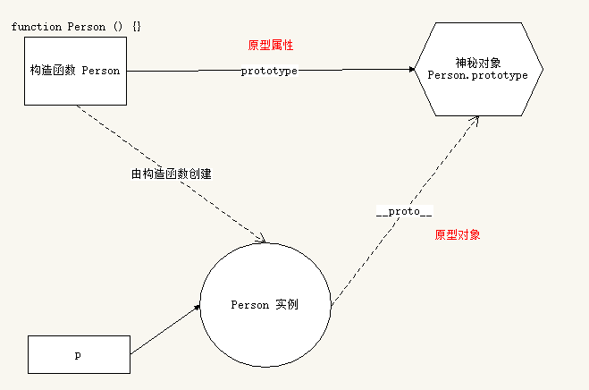

> 今日鸡汤：这个世界不会因为你的付出就必须给予回报，也不会因为你以怎样的方式对待别人，就要求他人同等对待你。人活在这世上，最难的就是保持一份谦卑和平和，而这份谦卑，来源于内心的真诚和踏实的努力。

## 前提摘要
1. JavaScript 是什么
* 解析执行：轻量级解释型的，或是 JIT 编译型(即时编译)的程序设计语言
* 语言特点：动态，头等函数 (First-class Function) - 函数可以作为别的函数的参数、函数的返回值，赋值给变量或存储在数据结构中
* 执行环境：在宿主环境（host environment）下运行，浏览器是最常见的 JavaScript 宿主环境
* 编程范式：基于原型、多范式的动态脚本语言，并且支持面向对象、命令式和声明式（如：函数式编程）编程风格


2. JavaScript 的组成：Ecmascript、DOM、BOM
[知乎 - JavaScript 能做什么](https://www.zhihu.com/question/20796866)
[GitHub - JavaScript 能做什么](https://github.com/phodal/articles/issues/1)
[阮一峰 - JavaScript 历史](http://javascript.ruanyifeng.com/introduction/history.html)


3. 基础
* 语法：区分大小写、标识符、注释、严格模式、语句
* 关键字和保留字：default 等、interface 等
* 变量
* 数据类型：Undefined、Null、Boolean、Number、String、Object
	* 基本类型（值类型）：Undefined、Null、Boolean、Number、String
	* 复杂类型（引用类型）：Object、Array、Date、RegExp、Function、基本包装类型（Boolean、Number、String）、单体内置对象（Global、Math）
	* 类型检测：typeof、instanceof、Object.prototype.toString.call()
* 操作符：算数操作符、比较操作符、逻辑操作符
* 流程控制语句：if...else if...else、while、do...while、for、switch
* 函数：function

4. 面向对象
* 对象是单个事物的抽象；对象是一个容器，封装了属性（property）和方法（method）
* 对象：**无序属性的集合，其属性可以包含基本值、对象或者函数**
* 面向对象与面向过程
* 面向对象的特性：封装性、继承性、[多态性]
[知乎 - 一句话说明什么是面向对象思想](https://www.zhihu.com/question/19854505)
[知乎 - 什么是面向对象编程思想](https://www.zhihu.com/question/31021366)
* 面向对象的设计思想：抽象出 Class -> 根据 Class 创建 Instance -> 指挥 Instance 得结果。
* 面向对象的编程思想 ：根据需求,抽象出相关的对象,总结对象的特征和行为,把特征变成属性，行为变成方法,然后定义(js)构造函数,实例化对象,通过对象调用属性和方法,完成相应的需求
* 创建对象:
```javascript
var person = new Object();
person.name = "Tom";
person.sex = "male";
person.sayHi = function (){  console.log("Hello, I'am " + this.name);  };

var person = {
    name: "Tom",
	sex: "male",
	sayHi: function (){  console.log("Hello, I'am " + this.name);  }
}

function Person(name,sex){
    this.name = name;
	this.sex = sex;
	this.sayHi = function (){  console.log("Hello, I'am " + this.name);  };
}
```
5. 疑难点
* 值类型和引用类型在内存中的存储方式：值类型按值存储、引用类型按引用存储
* 值类型复制和引用类型复制：值类型按值复制、引用类型按引用复制
* 值类型和引用类型参数传递：值类型按值传递、引用类型按引用传递
* JavaScript 执行过程：
	1. 预解析：
		* 全局预解析（所有变量和函数声明都会提前；同名的函数和变量函数的优先级高）
		* 函数内部预解析（所有的变量、函数和形参都会参与预解析）：函数、形参、普通变量
	2. 执行：在执行全局代码的过程中遇到函数调用就会先进行函数预解析，然后再执行函数内代码
* 调用构造函数创建对象会经历 4 个步骤：
	* 创建一个新对象，开辟新空间
	* 将构造函数的作用域赋给新对象（因此 this 就指向了这个新对象）
	* 执行构造函数中的代码，初始化对象
	* 返回新对象
* 构造函数和实例对象的关系
	* 构造函数是根据具体的事物抽象出来的抽象模板
	* 实例对象是根据抽象的构造函数模板得到的具体实例对象
	* 每一个实例对象都具有一个 `constructor` 属性，指向创建该实例的构造函数
	* 可以通过实例的 `constructor` 属性判断实例和构造函数之间的关系
	
6. 扩展
[知乎 - Web 建站技术](https://www.zhihu.com/question/22689579)

## javascript 高级

### 原型

#### 原型的引用
构造函数为创建对象带来了方便，但是存在浪费内存的问题；比如，构造函数中有一个方法，每次创建对象的时候就会为这个方法申请内存空间，创建多个对象就需要多个内存空间
```javascript
function Person(name,sex){
this.name = name;
this.sex = sex;
this.sayHello = function () {  console.log("hello");  };
}
var per1 = Person("Tom","male");
var per2 = Person("Jury","famale");
```
1. 此时有了第一种解决方法：把函数声明放到外面
```javascript
function sayHello() {  console.log("hello");  }
function Person(name,sex){
this.name = name;
this.sex = sex;
this.sayHello = sayHello;
}
var per1 = Person("Tom","male");
var per2 = Person("Jury","famale");
console.log(per1.sayHello == per2.sayHello);  // true
```
2. 如果对象有多个方法，此时有了第二种解决方法：用一个对象存储方法
```javascript
var fns = {
    sayHello: function(){  console.log("hello ya");  },
	playGame: funciton(){ console.log("lai wan ya da ye"); }
};
function Person(name,sex){
this.name = name;
this.sex = sex;
this.sayHello = fns.sayHello;
this.playGame = fns.playGame;
}
var per1 = Person("Tom","male");
var per2 = Person("Jury","famale");
console.log(per1.sayHello == per2.sayHello);  // true
console.log(per1.playGame == per2.playGame);  // true
```
3. 但是这样的写法并不够优美，所以就有了原型：
	* Javascript 规定，每一个构造函数都有一个 `prototype` 属性，指向另一个对象。
这个对象的所有属性和方法，都会被构造函数的实例继承
	* 这也就意味着，可以把所有对象实例需要共享的属性和方法直接定义在 `prototype` 对象上
```javascript
function Person(name,sex){
this.name = name;
this.sex = sex;
}
Person.prototype.sayHello = function(){  console.log("hello ya");  };
Person.prototype.playGame = funciton(){ console.log("lai wan ya da ye"); };
var per1 = Person("Tom","male");
var per2 = Person("Jury","famale");
console.log(per1.sayHello == per2.sayHello);  // true
console.log(per1.playGame == per2.playGame);  // true
```
 原型的作用之一 : 数据共享,节省内存空间
 原型的写法:
 * 构造函数.prototype.属性 = 值
 * 构造函数.prototype.方法=值---->函数.prototype,函数也是对象,也有__proto__
 * 实例对象.prototype-------->实例对象中没有这个属性,只有__proto__(暂时的)
原型可以为内置对象添加原型的属性或者方法 :
 * 系统的内置对象的属性和方法可能不满足现在需求,所以,可以通过原型的方式加入属性或者方法,为了方便开发
 * 为内置对象的原型添加属性和方法,那么这个内置对象的实例对象就可以直接使用了

#### 构造函数、实例、原型三者之间的关系


（1）任何函数都具有一个 `prototype` 属性，该属性是一个对象。
```javascript
function F () {}
console.log(F.prototype);// => object

F.prototype.sayHi = function () {
  console.log('hi!');
}
```
（2）构造函数的 `prototype` 对象默认都有一个 `constructor` 属性，指向 `prototype` 对象所在函数，即构造函数。
```javascript
console.log(F.constructor === F); // => true
```
（3）通过构造函数得到的实例对象内部会包含一个指向构造函数的 `prototype` 对象的指针 `__proto__`。
```javascript
var instance = new F();
console.log(instance.__proto__ === F.prototype) ;// => true
//   `__proto__` 是非标准属性。
```
（4）实例对象可以直接访问原型对象成员。
```javascript
instance.sayHi();  // => hi!
```

#### 属性成员的搜索原则：原型链
每当代码读取某个对象的某个属性时，都会执行一次搜索，目标是具有给定名字的属性
* 搜索首先从实例对象本身开始
* 如果在实例中找到了具有给定名字的属性，则返回该属性的值
* 如果没有找到，则继续搜索指针指向的原型对象，在原型对象中查找具有给定名字的属性
* 如果在原型对象中找到了这个属性，则返回该属性的值，否则 undefined
```javascript
function Person(name){
	this.name = name;
}
Person.prototype.sayName = function(){  console.log(this.name);  };
function Student(age){
   this.age = age;
}
Student.prototype = new Person("张三");
var stu = new Student("23");
console.log(stu.age,stu.name);  // 23,张三
//  这正是多个对象实例共享原型所保存的属性和方法的基本原理

var divObj=document.getElementById("dv");
console.dir(divObj);
//divObj.__proto__---->HTMLDivElement.prototype的__proto__
//--->HTMLElement.prototype的__proto__---->Element.prototype的__proto__
//---->Node.prototype的__proto__---->EventTarget.prototype的__proto__
//---->Object.prototype没有__proto__,所以,Object.prototype中的__proto__是null

```

#### 实例对象读写原型对象成员
1. 读取
	* - 先在自己身上找，找到即返回
	* 自己身上找不到，则沿着原型链向上查找，找到即返回
	* 如果一直到原型链的末端还没有找到，则返回 `undefined`
2. 值类型成员写入（`实例对象.值类型成员 = xx`）
	* 当实例期望重写原型对象中的某个普通数据成员时实际上会把该成员添加到自己身上
	* 也就是说该行为实际上会屏蔽掉对原型对象成员的访问
3. 引用类型成员写入（`实例对象.引用类型成员 = xx`）：同上
4. 复杂类型修改（`实例对象.成员.xx = xx`）：
	* 同样会先在自己身上找该成员，如果自己身上找到则直接修改
	* 如果自己身上找不到，则沿着原型链继续查找，如果找到则修改
	* 如果一直到原型链的末端还没有找到该成员，则报错（`实例对象.undefined.xx = xx`）

#### 更简单的原型语法
前面例子中每添加一个属性和方法就要敲一遍 `Person.prototype` ，为减少不必要的输入，更常见的做法是用一个包含所有属性和方法的对象字面量来重写整个原型对象：
```javascript
function Person(name,age){
    this.name = name;
	this.age = age;
}
Person.prototype = {
    type: "human",
	sayHello: function (){  console.log(this.name+"*****"+this.age);  }
}
//  这样做的好处就是为 `Person.prototype` 添加成员简单了，但是也会带来一个问题，那就是原型对象丢失了 `constructor` 成员。
```
为了保持 `constructor` 的指向正确，建议的写法是：
```javascript
function Person(name,age){
    this.name = name;
	this.age = age;
}
Person.prototype = {
    constructor: Person, //  手动将 constructor 指向正确的构造函数
	type: "human",
	sayHello: fucntion(){  console.log(this.name+"***"+this.age);  }
}
```

#### 原生对象的原型
***所有函数都有 prototype 属性对象：***
* Object.prototype
* Function.prototype
* Array.prototype
* String.prototype
* Number.prototype
* Date.prototype  ...
可以通过原型为原生对象扩展原型方法。

#### 原型对象的问题
* 共享数组
* 共享对象
如果真的希望可以被实例对象之间共享和修改这些共享数据那就不是问题。但是如果不希望实例之间共享和修改这些共享数据则就是问题。
一个更好的建议是，最好不要让实例之间互相共享这些数组或者对象成员，一旦修改的话会导致数据的走向很不明确而且难以维护。

#### 原型对象使用建议
* 私有成员（一般就是非函数成员）放到构造函数中
* 共享成员（一般就是函数）放到原型对象中
* 如果重置了 `prototype` 记得修正 `constructor` 的指向

### 继承
继承是指一个对象直接使用另一对象的属性和方法。
在子类继承父类的同时，可以重新定义某些属性，并重写某些方法，即覆盖父类的原有属性和方法，使其获得与父类不同的功能。同类事物具有共同性，在同类事物中，每个事物又具有其特殊性。
运用抽象的原则舍弃对象的特殊性，抽取其共同性，则得到一个适应于一批对象的类，这便是基类（父类）,而把具有特殊性的类称为派生类（子类），派生类的对象拥有其基类的全部或部分属性与方法，称作派生类对基类的继承。

#### 构造函数的属性继承：借用构造函数
```javascript
function Person (name, age) {
    this.type = 'human';
    this.name = name;
    this.age = age;
}
Person.prototype.eat = function(){  console.log("吃了吗？");  };
function Student (name, age) {
  Person.call(this, name, age);    //  借用构造函数继承属性成员
}
var s1 = new Student('张三', 18);
console.log(s1.type, s1.name, s1.age); // => human 张三 18
//  这种继承只是属性继承，不继承父类的方法
```

#### 构造函数的原型方法继承：拷贝继承（for-in）
```javascript
function Person (name, age) {
  this.type = 'human';
  this.name = name;
  this.age = age;
}
Person.prototype.sayName = function () {
  console.log('hello ' + this.name);
};
function Student (name, age) {
  Person.call(this, name, age);
}
for(var key in Person.prototype) {
  Student.prototype[key] = Person.prototype[key];
}   // 原型对象拷贝继承原型对象成员
var s1 = Student('张三', 18);
s1.sayName(); // => hello 张三
//   这个是浅拷贝继承
```

#### 另一种继承方式：原型继承
```javascript
function Person (name, age) {
  this.type = 'human';
  this.name = name;
  this.age = age;
}
Person.prototype.sayName = function () {
  console.log('hello ' + this.name);
};
function Student (name, age) {
  Person.call(this, name, age);
}
Student.prototype = new Person();  // 利用原型的特性实现继承
var s1 = Student('张三', 18);
console.log(s1.type);  // => human
s1.sayName();  // => hello 张三
```
***总结：***
* 原型作用1: 数据共享 ，目的是:为了节省内存空间,
* 原型作用2: 继承  目的是:为了节省内存空间
* 原型继承: 改变原型的指向
* 借用构造函数继承: 主要解决属性的问题
* 组合继承: 原型继承 + 借用构造函数继承，既能解决属性问题,又能解决方法问题
* 拷贝继承: 把对象中需要共享的属性或者方法,通过遍历的方式复制到另一个对象中

### 函数进阶
函数的定义方式 ： 函数声明，函数表达式，`new Function`
#### 函数声明
```javascript
function foo(){
    //  函数体
}
```

#### 函数表达式
```javascript
var foo = function() { 
    // 函数体  
};  //  因为 foo 是变量，所以必须有 分号';'  
```

#### 函数声明与函数表达式的区别
* 函数声明必须有名字
* 函数声明会函数提升，在预解析阶段就已创建，声明前后都可以调用
* 函数表达式类似于变量赋值
* 函数表达式可以没有名字，例如匿名函数
* 函数表达式没有变量提升，在执行阶段创建，必须在表达式执行之后才可以调用
```javascript
if (true) {
    function f () {
      console.log(1);
    }
} else {
    function f () {
      console.log(2);
    }
}
f();    //   谷歌中输出 '1'，但是 IE8 中输出是 '2'
```
为解决执行结果在不同浏览器中结果不一致的问题，可以使用函数表达式的方式。
```javascript
var f;
if(true){
    f = function(){  console.log(1);  };
} else {
    f = function(){  console.log(2);   };
}
f();  // 结果都是 ‘1’
```

#### 函数的调用方式
普通函数```()```、构造函数```new```、对象方法```.```
函数是对象，实例对象也是对象，实例对象中有`__proto__`属性；
对象中有`__proto__`属性，对象不一定是函数，函数中有`prototype`属性，比如`Math`中有__proto__，但是没有prototype。

#### 函数内 `this` 指向的不同场景
函数的调用方式决定了 `this` 指向的不同：

|  调用方式   |   非严格模式  |   备注  |
| --- | --- | --- |
|  普通函数中的 this  |  window   |  严格模式下是 undefined   |
|  构造函数中的 this   |  实例对象   |     |
|  原型对象方法中的 this  |  实例对象  |  |
|  对象方法调用   |  该方法所属对象   |   紧挨着的对象  |
|  事件绑定方法   |  绑定事件对象   |     |
|  定时器函数  |  window   |     |
```javascript
"use strict";   //  严格模式，类似 html:4s 中的 doctype 声明
function f1(){
    console.log(this);   //  非严格模式中是 window
}
f1();   //  严格模式下是 undefined，相当于有了类的方法，但是不知道是哪个类
window.f1();   // 严格模式下是 window，添加了  对象.  才知道是哪个对象 
```

#### call、apply、bind
***函数也是对象：***所有函数都是 `Function` 的实例。
为了能在外部调用内部的 this ，例如在定时器外部备份 this 引用，然后在定时器函数内部使用外部 this 的引用，JavaScript 专门提供了一些函数方法用来帮我们更优雅的处理函数内部 this 指向问题。

1. call
`call()` 方法调用一个函数, 其具有一个指定的 `this` 值和分别地提供的参数(参数的列表)。

注意：该方法的作用和 `apply()` 方法类似，只有一个区别，就是 `call()` 方法接受的是若干个参数的列表，而 `apply()` 方法接受的是一个包含多个参数的数组。
```javascript
//   语法
   fun.call( thisArg [, arg1 [, arg2 [, ...]]] ); 
//   参数
* `thisArg`  ：在 fun 函数运行时指定的 this 值；如果指定了 null 或者 undefined 则内部 this 指向 window
* `arg1, arg2, ...` ：指定的参数列表
```
2. apply
`apply()` 方法调用一个函数, 其具有一个指定的 `this` 值，以及作为一个数组（或类似数组的对象）提供的参数。

 注意：该方法的作用和 `call()` 方法类似，只有一个区别，就是 `call()` 方法接受的是若干个参数的列表，而 `apply()` 方法接受的是一个包含多个参数的数组。
```javascript
//   语法
   fun.apply( thisArg, [argsArray] );
//   参数
* `thisArg` ： 对象
* `argsArray` ：参数数组，如：fun.apply(this, ['eat', 'bananas']);
```
3. bind
`bind()` 函数会创建一个新函数（称为绑定函数），新函数与被调函数（绑定函数的目标函数）具有相同的函数体（在 ECMAScript 5 规范中内置的call属性）。

当目标函数被调用时 this 值绑定到 bind() 的第一个参数，该参数不能被重写。绑定函数被调用时，bind() 也接受预设的参数提供给原函数。

一个绑定函数也能使用new操作符创建对象：这种行为就像把原函数当成构造器。
提供的 this 值被忽略，同时调用时的参数被提供给模拟函数。
```javascript
//   语法
   fun.bind( thisArg [, arg1 [, arg2 [, ...]]] );
//   参数
* `thisArg` ： 当绑定函数被调用时，该参数会作为原函数运行时的 this 指向。当使用new 操作符调用绑定函数时，该参数无效。
* `arg1, arg2, ...` ： 当绑定函数被调用时，这些参数将置于实参之前传递给被绑定的方法。
//  返回值 ：返回由指定的 this 值和初始化参数改造的原函数拷贝。
```
实例：
```javascript
this.x = 9; 
var module = {
    x: 81,
    getX: function() { return this.x; }
};
console.log(module.getX()); // 返回 81
var retrieveX = module.getX;  // 相当于声明了一个匿名函数
console.log(retrieveX());  // 返回 9，此时"this"指向全局作用域
// 创建一个新函数，将"this"绑定到module对象
var boundGetX = retrieveX.bind(module);  // 返回的是 module 中的 x
console.log(boundGetX()); // 返回 81

function getRandom(){
    this.num = parseInt(Math.random() * 10 + 1);
}
getRandom.prototype.getr = function (){
    //改变定时器中的this的指向,本来应该是window,现在是实例对象了
    window.setInterval(this.getr2.bind(this), 1000);
};
getRandom.prototype.getr2 = function (){
    console.log(this.number);
};
var r = new getRandom();
s.getr();  //  调用这个方法一次,可以不停的产生随机数字
```
***小结：***
* call 和 apply 特性一样
	* 都是用来调用函数，而且是立即调用
	* 但是可以在调用函数的同时，通过第一个参数指定函数内部 `this` 的指向
	* call 调用的时候，参数必须以参数列表的形式进行传递，也就是以逗号分隔的方式依次传递即可
	* apply 调用的时候，参数必须是一个数组，然后在执行的时候，会将数组内部的元素一个一个拿出来，与形参一一对应进行传递
	* 如果第一个参数指定了 `null` 或者 `undefined` 则内部 this 指向 window
* bind
	* 可以用来指定内部 this 的指向，然后生成一个改变了 this 指向的新的函数，相当于复制
	* 它和 call、apply 最大的区别是：bind 不会调用，返回一个函数
	* bind 支持传递参数，它的传参方式比较特殊，一共有两个位置可以传递
		* 1. 在 bind 的同时，以参数列表的形式进行传递
		* 2. 在调用的时候，以参数列表的形式进行传递
	* 参数以bind 时候传递的参数为准，还是以调用的时候传递的参数为准：
		* 两者合并：bind 的时候传递的参数和调用的时候传递的参数会合并到一起，传递到函数内部

#### 函数的其它成员
* arguments  --   参数集合，实参的个数
* name 属性 --  函数的名字,name属性是只读的,不能修改
* length 属性 -- 函数定义的时候形参的个数
* caller 属性 --  函数的调用者
```javascript
function fn(x, y, z) {
        console.log(fn.length);  // => 形参的个数   3
        console.log(arguments);  // 伪数组实参参数集合  10,20,30
        console.log(arguments.callee === fn); // 函数本身
        console.log(fn.caller);  // 函数的调用者
        console.log(fn.name); // => 函数的名字
}
function f() {
        fn(10, 20, 30);
        console.log(f.caller);   // null
}
f();
```

#### 高阶函数
1. 函数作为`参数`，也叫回调函数(不怎么准确)
```javascript
function learn(callback){
    setInterval(function (){
	    console.log("good good learning");
		callback();
	},1000);
}
learn(function(){
    console.log("well well sleep");
});
```
2. 函数作为`返回值`
```javascript
//  判断这个对象是不是某个类型的
var obj = {};
console.log(obj instanceof Object); 
//  判断输出某个对象的数据类型
console.log(Object.prototype.toString.call(new Date())); // [object Date]
console.log(Object.prototype.toString.call([])); // [object Array]
console.log(Object.prototype.toString()); // [object Object]
function getFun(type){
    return function(){ console.log(typeof type);  };
}
```

#### 函数闭包
闭包的概念 : 函数A中,有一个函数B,函数B中可以访问函数A中定义的变量或者是数据,此时形成了闭包。闭包就是能够读取其他函数内部变量的函数，即 “定义在一个函数内部的函数”。在本质上，闭包就是将函数内部和函数外部连接起来的一座桥梁。
闭包的模式 : 函数模式的闭包,对象模式的闭包
闭包的作用 : 缓存数据,延长作用域链
```javascript
function f1() {
      var num=parseInt(Math.random()*10+1);
      return function () {
         console.log(num);
      }
}    // 闭包的方式,产生三个随机数,但是都是相同的
//   如果想要缓存数据,就把这个数据放在外层的函数和里层的函数的中间位置
var f = f1();
f();  f();  f();  //  3个结果始终是一样的


    var name = "The Window";
    var object = {
        name: "My Object",
        getNameFunc: function () {
            return function () {
                return this.name;
            };   // this 指向调用它的对象
        }
    };
    console.log(object.getNameFunc()()); // The Window
		
	var name = "The Window";
    var object = {
        name: "My Object",
        getNameFunc: function () {
            var that = this;   //  把 object 对象保存，这样就会一直是这个对象
            return function () {
                return that.name;
            };
        }
    };
    console.log(object.getNameFunc()()); // My Object
```
***沙箱：***
* 环境,黑盒,在一个虚拟的环境中模拟真实世界,做实验,实验结果和真实世界的结果是一样,但是不会影响真实世界。作用：沙箱避免命名冲突。
```javascript
var rnum = 10;
(function (){
    function rnum(){
	    return Math.random()*10;
	}
	var rnum = rnum();
	console.log(rnum);
})();
console.log(rnum);  //  10
```

#### 递归
函数中调用自己，即我调我自己。
递归要有两个条件：函数体中调用自己，要有结束条件。
```javascript
//   递归调用模型
    function fn1() {
        console.log(111);
        fn2();
        console.log('fn1');
    }
    function fn2() {
        console.log(222);
        fn3();
        console.log('fn2');
    }
    function fn3() {
        console.log(333);
        fn4();
        console.log('fn3');
    }
    function fn4() {
        console.log(444);
        console.log('fn4');
    }
    fn1();  // 111  222 333 444 fn4 fn3 fn2 fn1
	
// 求斐波那契数列
function getFibonacci(index){
     if(index ==1 || index == 2){
	     return 1;
	 }
	 return getFibonacci(index - 1) + getFibonacci(index - 2);
} //  1 1 2(1+1) 3((1+1)+1) 5(((1+1)+1)+(1+1))

//  计算整数阶乘的递归函数
function factorial (num) {
    if (num <= 1) {
      return 1;
    } else {
      return num * factorial(num - 1);
    }
}  // 1 2*1 3*2*1 4*3*2*1

// 遍历 DOM 树
    var root = document.documentElement;   // html
    function getChildren(node) {
        var nodes = node.children;
        for(var i=0;i<nodes.length;i++){
            getNodeName(nodes[i]);   //  打印节点名字
            if(nodes[i].children){   //  如果节点中还有节点，就继续遍历
                getChildren(nodes[i]);
            }
        }
    }
    function getNodeName(node) {
        console.log("NodeName:==="+node.nodeName);
    }
    getChildren(root); //  HEAD   META  TITLE   BODY   SCRIPT
```

#### 浅拷贝与深拷贝
1. 浅拷贝 : 拷贝就是复制,就相当于把一个对象中的所有的内容,复制一份给另一个对象,直接复制,或者说,就是把一个对象的地址给了另一个对象,他们指向相同,两个对象之间有共同的属性或者方法,都可以使用
```javascript
var obj1 = {
    name: "naruto",
	age: 25,
	team: ["Sakura", "Sasuke", "Kakashi", function () {
          sex = "男";
        }]
};
var obj2 = {};
function extend(a,b){
    for(var key in a){
	    b[key] = a[key];
	}
}
extend(obj1,obj2);  
console.log(obj2);   //  {name: "naruto", age: 25, team: Array(4)} 
```
2. 深拷贝 : 拷贝还是复制,深拷贝把一个对象中所有的属性或者方法,一个一个的找到.并且在另一个对象中开辟相应的空间,一个一个的存储到另一个对象中
```javascript
var obj1 = {
    name: "naruto",
	age: 25,
	team: ["Sakura", "Sasuke", "Kakashi"],
	teacher: {
	    name1: "Iruka",
		name2: "Kakashi",
		name3: "Jiraya"
	}
};
var obj2 = {};
function extend(a, b){
    for(var key in a){
	    var item = a[key];  //   获取 a 对象中每个属性的值
		if(item instanceof Array){
		    b[key] = []; // 如果是数组,b对象中添加一个新的属性,并且这个属性值也是数组
			extend(item,b[key]);
		}else if(item instanceof Object){
		   b[key] = {}; // 如果是对象类型的,那么在b对象中添加一个属性,是一个空对象
		   extend(item,b[key]);
		}else {
		    b[key] = item; // 如果值是普通的数据,直接复制到b对象的这个属性中
		}
	}
}
extend(obj1,obj2);
console.dir(obj2);
```

### 正则表达式
正则表达式(regular expression)描述了一种字符串匹配的模式（pattern），可以用来检查一个串是否含有某种子串、将匹配的子串替换或者从某个串中取出符合某个条件的子串等。
正则表达式是对字符串操作的一种逻辑公式，就是用事先定义好的一些特定字符、及这些特定字符的组合，组成一个“规则字符串”，这个“规则字符串”用来表达对字符串的一种过滤逻辑。

正则表达式的作用：
* 给定的字符串是否符合正则表达式的过滤逻辑(匹配)
* 可以通过正则表达式，从字符串中获取我们想要的特定部分(提取)
* 强大的字符串替换能力(替换)

[菜鸟教程正则表达式在线测试](https://c.runoob.com/front-end/854)

#### 元字符

|  常用元字符串   |   说明  |
| --- | --- |
|   \d  |  匹配数字   |
|  \D   |  匹配任意非数字的字符   |
|  \w   |  匹配字母或数字或下划线   |
|  \W   |  匹配任意不是字母，数字，下划线   |
|  \s   |  匹配任意的空白符   |
|  \S   |   匹配任意不是空白符的字符  |
|   .  |   匹配除换行符（\n）以外的任意单个字符  |
|  ^   |  表示匹配行首的文本(以谁开始)，[ ]中括号中一般表示取反   |
|  $   |  表示匹配行尾的文本(以谁结束)   |

|  常用限定符   |  说明   |
| --- | --- |
|   *  |   重复零次或更多次  |
|  +   |  重复一次或更多次   |
|  ?   |  重复零次或一次   |
|  {n}   |  重复n次   |
|  {n,}   |  重复n次或更多次   |
|  {n,m}   |   重复n到m次  |
```javascript
其他：
[] 表示的是 : 范围,  [0-9] 表示的是0到9之间的任意的一个数字
[a-zA-Z] 表示的是 : 所有的字母的任意的一个
[0-9a-zA-Z] 表示的是: 所有的数字或者是字母中的一个
| 选择两者中的一个。注意|将左右两边分为两部分，而不管左右两边有多长
() 分组 提升优先级   从两个直接量中选择一个，gr(a|e)y 匹配 gray 和 grey
[^]  匹配除中括号以内的内容
\ 转义符
[\u4e00-\u9fa5]  匹配汉字
```

#### 运算符优先级
正则表达式从左到右进行计算，并遵循优先级顺序，这与算术表达式非常类似。

|  运算符   |  描述   |
| --- | --- |
|  ``` \ ``` |  转义符   |
| ```(), (?:), (?=), []	```   |   圆括号和方括号  |
| ``` *, +, ?, {n}, {n,}, {n,m}```  |  限定符   |
| ```^, $, \任何元字符、任何字符```    |  定位点和序列（即：位置和顺序）   |
| ```|```  | 替换，"或"操作；字符具有高于替换运算符的优先级，使得"m|food"匹配"m"或"food"  |

#### 正则表达式的使用
1。创建正则表达式的两种方法
（1）通过构造函数创建对象
```javascript
var reg = new RegExp(/\d{5}/);  // 如果添加双引号，需要转义
console.log(reg.test("211564")); // true
```
（2）通过字面量的方式创建对象
```javascript
var reg = /\d{5}/;
console.log(reg.text("8149912")); // true
```
在正则表达式中可以添加参数:

|   标志  |   说明  |  备注 |
| --- | --- | --- |
|  i   |  忽略大小写   | ```var reg = /\d/i; ``` |
|  g   |  全局匹配   |   |
|  gi   |  全局匹配+忽略大小写   | ```var reg = /\d/gi; ``` |

2。正则匹配
```javascript
    console.log(/./.test("除了回车换行以为的任意单个字符"));//true
    console.log(/.*/.test("0个到多个"));//true
    console.log(/.+/.test("1个到多个"));//true
    console.log(/.?/.test("哈哈"));//true
    console.log(/[0-9]/.test("9527"));//true
    console.log(/[a-z]/.test("what"));//true
    console.log(/[A-Z]/.test("Are"));//true
    console.log(/[a-zA-Z]/.test("干啥子"));//false
    console.log(/[0-9a-zA-Z]/.test("9cccc"));//true
    console.log(/b|(area)/.test("abrea"));//true
    console.log(/[a-z]{2,3}/.test("asas"));//true
```
3。正则提取
```javascript
    // 1. 提取工资
    var str = "张三：1000，李四：5000，王五：8000。";
    var array = str.match(/\d+/g);
    console.log(array);   //  (3) ["1000", "5000", "8000"]

    // 2. 提取email地址
    var str = "123123@xx.com,ffang@valions.cn 2869312@qq.com 286669312@qq.com...";
    var array = str.match(/\w+@\w+\.\w+(\.\w+)?/g);
    console.log(array);  //(4) ["123123@xx.com", "ffang@valions.cn", "2869312@qq.com", "286669312@qq.com"]

    // 3. 分组提取
    // 3. 提取日期中的年部分  2015-5-10
    var dateStr = '2016-1-5';
    // 正则表达式中的()作为分组来使用，获取分组匹配到的结果用Regex.$1 $2 $3....来获取
    var reg = /(\d{4})-\d{1,2}-\d{1,2}/;
    if (reg.test(dateStr)) {
        console.log(RegExp.$1);   // 2016
    }

    // 4. 提取邮件中的每一部分
    var reg = /(\w+)@(\w+)\.(\w+)(\.\w+)?/;
    var str = "123123@xx.com.cn";
    if (reg.test(str)) {
        console.log(RegExp.$1);  // 123123
        console.log(RegExp.$2);  // xx
        console.log(RegExp.$3);  // com
        console.log(RegExp.$4);  // .cn
    }
```
4。正则替换
```javascript
    // 1. 替换所有空白
    var str = "   12D  asf   assf  af ";
    str = str.replace(/\s/g, "xx");
    console.log(str); // xxxxxx12Dxxxxasfxxxxxxassfxxxxafxx

    // 2. 替换所有,|，
    var str = "abc,efg,123，abc,123，a";
    str = str.replace(/,|，/g, ".");
    console.log(str);  // abc.efg.123.abc.123.a
```

### 其他

#### 伪数组和数组
在JavaScript中，除了5种原始数据类型之外，其他所有的都是对象，包括函数（Function）。
在说区别之前，需要先提到另外一个知识，就是 JavaScript 的原型继承。
所有 JavaScript 的内置构造函数都是继承自 `Object.prototype` 。
在这个前提下，可以理解为使用 `new Array()` 或 `[]` 创建出来的数组对象，都会拥有 `Object.prototype` 的属性值。
```javascript
var obj = {};// 拥有 Object.prototype 的属性值
var arr = [];//使用数组直接量创建的数组，由于 Array.prototype 的属性继承自 Object.prototype，
//那么，它将同时拥有 Array.prototype 和 Object.prototype 的属性值
```
可以得到对象和数组的第一个区别：对象没有数组 Array.prototype 的属性值。

数组具有一个最基本特征：索引，这是对象所没有的。
```javascript
var obj = {};
var arr = [];
obj[2] = 'a';
arr[2] = 'a';
console.log(obj[2]); // => a
console.log(arr[2]); // => a
console.log(obj.length); // => undefined    obj.length并不具有数组的可变特性
console.log(arr.length); // => 3 
//  length是数组的一个内置属性，数组会根据索引长度来更改length的值
// arr.length输出3，而不是1，在给数组添加元素时，并没有按照连续的索引添加，所以导致数组的索引不连续，那么就导致索引长度大于元素个数
```
伪数组：
* 拥有 length 属性，其它属性（索引）为非负整数(对象中的索引会被当做字符串来处理，非负整数串来理解)
* 不具有数组所具有的方法
```javascript
    var fakeArray = {
        "0": "first",
        "1": "second",
        "2": "third",
        length: 3
    };
    for (var i = 0; i < fakeArray.length; i++) {
        console.log(fakeArray[i]); // first  second  third
    }
    var a = Array.prototype.join.call(fakeArray, '+');
    console.log(a); // first+second+third
```
* 创建的伪数组：
	* 函数内部的 `arguments`
	* DOM 对象列表（比如通过 `document.getElementsByTags` 得到的列表）
	* jQuery 对象（比如 `$("div")` ）
* 伪数组是一个 Object，而真实的数组是一个 Array。
* 伪数组存在的意义，是可以让普通的对象也能正常使用数组的很多方法
```javascript
var arr = Array.prototype.slice.call(arguments);
 
Array.prototype.forEach.call(arguments, function(v) {
  // 循环arguments对象
});

// push
// some
// every
// filter
// map
// ...

    var obj = {
        0: 'a',
        1: 'b',
        2: 'c',
        length: 3
    };

    console.log("push===="+[].push.call(obj, 'd')); //push====4

    console.log("slice===="+[].slice.call(obj)); // slice====a,b,c,d

    [].forEach.call(obj, function (num, index) {
        console.log(num); // a b c d
    });
```
总结：
* 对象没有数组 Array.prototype 的属性值，类型是 Object ，而数组类型是 Array
* 数组是基于索引的实现， length 会自动更新，而对象是键值对
* 使用对象可以创建伪数组，伪数组可以正常使用数组的大部分方法

#### JavaScript 运行机制
JavaScript语言的一大特点就是单线程，也就是说，同一个时间只能做一件事。那么，为什么JavaScript不能有多个线程呢？这样能提高效率啊。
单线程就意味着，所有任务需要排队，前一个任务结束，才会执行后一个任务。如果前一个任务耗时很长，后一个任务就不得不一直等着。
"任务队列"是一个事件的队列（也可以理解成消息的队列），IO设备完成一项任务，就在"任务队列"中添加一个事件，表示相关的异步任务可以进入"执行栈"了。主线程读取"任务队列"，就是读取里面有哪些事件。
所谓"回调函数"（callback），就是那些会被主线程挂起来的代码。异步任务必须指定回调函数，当主线程开始执行异步任务，就是执行对应的回调函数。

主线程从"任务队列"中读取事件，这个过程是循环不断的，所以整个的这种运行机制又称为Event Loop（事件循环）。
主线程运行的时候，产生堆（heap）和栈（stack），栈中的代码调用各种外部API，它们在"任务队列"中加入各种事件（click，load，done）。只要栈中的代码执行完毕，主线程就会去读取"任务队列"，依次执行那些事件所对应的回调函数。

#### 静态成员与实例成员
* 静态成员
	* Object.assign()
	* Object.create()
	* Object.keys()
	* Object.defineProperty()
* 实例成员
	* constructor
	* hasOwnProperty()
	* isPrototypeOf
	* propertyIsEnumerable()
	* toString()
	* valueOf()

#### more
代码风格：
[JavaScript Standard Style](https://github.com/feross/standard)
[Airbnb JavaScript Style Guide](https://github.com/airbnb/javascript)
校验工具：
[JSLint](https://github.com/douglascrockford/JSLint)
[JSHint](https://github.com/jshint/jshint)
[ESLint](https://github.com/eslint/eslint)
文档相关工具：
电子文档制作工具: [docute](https://github.com/egoist/docute)
流程图工具：[DiagramDesigner](http://logicnet.dk/DiagramDesigner/)