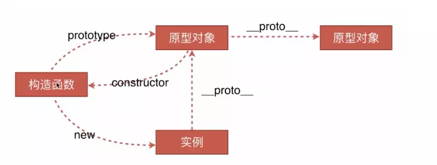

# 面试中的JavaScript

JavaScript ( JS ) 是一种具有函数优先的轻量级，解释型或即时编译型的编程语言。虽然它是作为开发Web 页面的脚本语言而出名的，但是它也被用到了很多非浏览器环境中，例如 Node.js、 Apache CouchDB 和 Adobe Acrobat。JavaScript 是一种基于原型编程、多范式的动态脚本语言，并且支持面向对象、命令式和声明式（如函数式编程）风格。

JavaScript 的标准是 ECMAScript 。截至 2012 年，所有的现代浏览器都完整的支持  ECMAScript 5.1，旧版本的浏览器至少支持 ECMAScript 3 标准。2015年6月17日，ECMA国际组织发布了 ECMAScript 的第六版，该版本正式名称为 ECMAScript 2015，但通常被称为 ECMAScript 6 或者 ES6。

## 函数

### 声明方式

1.函数声明：有预解析

```javascript
// ES5
function getSum(){}
function (){ // 匿名函数

// ES6
() => {} // 参数只有一个可以省略括号，返回值是一个表达式可以省略花括号和return
```

2.函数表达式（字面量）：

```javascript
// ES5
var sum=function(){}
// ES6
let sum=()=>{}
```

3.构造函数：会解析两次代码，第一次解析常规的JavaScript代码，第二次解析传入构造函数的字符串

```javascript
const sum = new Function('a', 'b' , 'return a + b')
```

### ES5中函数调用和this

1.调用中的this指向：

```javascript
function getSum() {
  console.log(this)  // this指向window
}

(function() {
  console.log(this) // 匿名函数调用，this指向window
 })()
 
 var getSum=function() {
  console.log(this) // this指向window
 }
```

2.对象中方法调用：

```javascript
var objList = {
  name: 'methods',
  getSum: function() {
    console.log(this) // objList对象
  }
}
```

3.构造器调用：

```javascript
function Person() {
  console.log(this); // 构造函数调用，this指向实例对象personOne
}
var personOne = new Person();
```

4.间接调用：call和apply对应的第一个参数,如果不传值或者第一个值为null,undefined时this指向window

```javascript
function foo() {
  console.log(this);
}
foo.apply('我是apply改变的this值'); // String {"我是apply改变的this值"}，指向String对象
foo.call('我是call改变的this值'); // String {"我是call改变的this值"}
```

### ES6中函数的调用和this

```javascript
(() => {
  console.log(this) // window
})()

let arrowFun = () => {
  console.log(this) // window
}

let arrowObj = {
  arrFun: function() {
    (() => {
      console.log(this) // this指向的是arrowObj对象
    })()
  }
}
arrowObj.arrFun();
```

### ES6中块级作用域和函数声明

ES5 规定，函数只能在顶层作用域和函数作用域之中声明，不能在块级作用域声明。但是，浏览器没有遵守这个规定，为了兼容以前的旧代码，还是支持在块级作用域之中声明函数，不会报错。

ES5环境下可以实现下面代码：

```javascript
demo()  // 打印 bbb

var flag = true
if (flag) {
  function demo() {
    console.log('aaa')
  }
} else {
  function demo() {
    console.log('bbb')
  }
}
```

执行此代码时，会先将函数声明提升到顶部而并不会根据判断在下面进行声明，打印bbb是因为第一个声明被第二个声明覆盖了，实际为下面代码：

```javascript
function demo() {
  console.log('aaa')
}
function demo() {
  console.log('bbb')
}
var flag
demo()  // 打印 bbb
flag = true
if (flag) {

} else {

}
```

ES6 引入了块级作用域，明确允许在块级作用域之中声明函数。ES6规定，块级作用域之中，函数声明语句的行为类似于let，在块级作用域之外不可引用。

**如果改变了块级作用域内声明的函数的处理规则，显然会对老代码产生很大影响。为了减轻因此产生的不兼容问题，ES6 在附录 B里面规定，浏览器的实现可以不遵守上面的规定，有自己的行为方式：**

- 允许在块级作用域内声明函数
- 函数声明类似于var，即会提升到全局作用域或函数作用域的头部
- 同时，函数声明还会提升到所在的块级作用域的头部

**注意，上面三条规则只对 ES6 的浏览器实现有效，其他环境的实现不用遵守，还是将块级作用域的函数声明当作let处理。**

```javascript
var flag
var demo
demo()  // demo is not a function

flag = true
if (flag) {
  function demo() {
    console.log('aaa')
  }
} else {
  function demo() {
   console.log('bbb')
  }
}
```


### call,apply和bind

1.IE5之前不支持`call`和`apply`，`bind`是ES5出来的，`call`和`apply`可以调用函数，改变this，实现继承和借用别的对象的方法;

2.call和apply：`对象.call(新this对象,实参1,实参2,实参3.....)`    `对象.apply(新this对象,[实参1,实参2,实参3.....])`

```javascript
var foo = {
  name:"张三",
  logName:function(){
    console.log(this.name);
  }
}
var bar={
  name:"李四"
};
foo.logName.call(bar); // '李四'，实质是call改变了foo的this指向为bar,并调用该函数
```

3.继承：

```javascript
function Animal(name){   
  this.name = name;   
  this.showName = function(){   
    console.log(this.name);   
  }   
}   
function Cat(name){  
  Animal.call(this, name);  
}    
var cat = new Cat("Black Cat");   
cat.showName(); //Black Cat
```

4.借用数组方法：

```javascript
(function(){
  Array.prototype.push.call(arguments,'王五');
  console.log(arguments); // ['张三','李四','王五']
})('张三','李四')

var arr1=[1,2,3]; 
var arr2=[4,5,6]; 
Array.prototype.push.apply(arr1,arr2); // arr1，[1, 2, 3, 4, 5, 6]
```

5.其他：

```javascript
Math.max.apply(null,arr) // 求数组最大值

Object.prototype.toString.call({}) // "[object Object]"，判断字符类型
```

6.bind()方法创建一个新的函数，在bind()被调用时，这个新函数的this被bind的第一个参数指定，其余的参数将作为新函数的参数供调用时使用，不兼容IE8：

**bind 是创建一个新的函数，我们必须要手动去调用。apply和call是立即执行。**

```javascript
const module = {
  x: 42,
  getX: function() {
    return this.x;
  }
}
const unboundGetX = module.getX;
console.log(unboundGetX()); // expected output: undefined

const boundGetX = unboundGetX.bind(module);
console.log(boundGetX()); // expected output: 42
```

7.call,apply和bind原生实现

```javascript
Function.prototype.newCall = function(context, ...parameter) {
  if (typeof context === 'object' || typeof context === 'function') {
    context = context || window
  } else {
    context = Object.create(null)
  }
  context[fn] = this  
  const res =context[fn](...parameter)
  delete context.fn;
  return res
}

Function.prototype.newApply = function(context, parameter) {
  if (typeof context === 'object' || typeof context === 'function') {
    context = context || window
  } else {
    context = Object.create(null)
  }
  let fn = Symbol()
  context[fn] = this
  return res=context[fn](..parameter);
  delete context[fn]
  return res
}

Function.prototype.bind = function (context,...innerArgs) {
  var fn = this
  return function (...finnalyArgs) {
    return fn.call(context,...innerArgs,...finnalyArgs)
  }
}
var person = {
  name: 'Abiel'
}
function sayHi(age,sex) {
  console.log(this.name, age, sex);
}
var personSayHi = sayHi.bind(person, 25)
personSayHi('男') // Abiel 25 男
```

### 节流和防抖

1.节流：事件触发后每隔一段时间触发一次，可触发多次；常用作处理scroll、resize事件一段时间触发多次

```javascript
let throttle = function(func, delay) {
  let timer = null;
  return ()=> {
    if (!timer) {
      timer = setTimeout(()=> {
        func.apply(this, arguments);
        timer = null;
      }, delay);
    }
  };
};
function handle() {
  console.log(Math.random());
}
window.addEventListener("scroll", throttle(handle, 1000));

throttle(fun, delay, immediate) {
  let flag = false;
  return (...args) => {
    if (!flag) {
      flag = true;
      setTimeout(() => {
        fun.apply(this, args);
        flag = false;
      }, delay);
    }
  };
}
```

2.防抖：事件触发动作完成后一段时间触发一次；scroll,resize事件触发完后一段时间触发

```javascript
function debounce(fn, wait) {
  var timeout = null;
  return function() {
    if (timeout !== null) clearTimeout(timeout); // 如果多次触发将上次记录延迟清除掉
    timeout = setTimeout(()=> {
      fn.apply(this, arguments);
      timeout = null;
    }, wait);
  };
}
function handle() {
  console.log(Math.random());
}
window.addEventListener("scroll", debounce(handle, 1000));

debounce(fun, delay, immediate) {
  let timer = null;
  return (...args) => {
    if (timer) {
      clearTimeout(timer);
    } else {
      timer = setTimeout(() => {
        fun.apply(this, args);
      }, delay);
    }
  };
}
```

### 其他工具类函数

1.缓存函数，可以缓存函数的执行结果，在第二次调用之后会加速：

```javascript
memeorize(fun) {
  let cache = {};
  return (...args) => {
    const key = args.toString();
    if (cache[key]) {
      return cache[key];
    }
    let value = fun.apply(this, args);
    cache[key] = value;
    return value;
  };
}
```

2.实现 promisy 函数，将一个callback的函数转化为promise 链式调用：

```javascript
promisy(fun) {
  return (...args) => {
    return new Promise((resolve, reject) => {
      try {
        fun(...args, resolve);
      } catch (e) {
        reject(e);
      }
    });
  };
}
fun(arg1,callback);
let promisey = promisy(fun);
promisey().then((res)=>());
```

3.柯里化

```javascript
function currying(fun) {
  function helper(fn, ...arg1) {
    let length = fn.length;
    let self = this;
    return function(...arg2) {
      let arg = arg1.concat(arg2);
      if (arg.length < length) {
        return helper.call(self, fn, ...arg);
      }
      return fn.apply(this, arg);
    };
  }
  return helper(fun);
}
function add(a, b) {
  return a + b;
}
let curryadd = currying(add);
let add1 = curryadd(1);
add1(2, 3)

const curry = (fn) => {
  if (fn.length <= 1) return fn;
  // const generator = (args) => (args.length === fn.length ? fn(...args) : arg => generator([...args, arg]));
  const generator = (args, rest) => (!rest ? fn(...args) : arg => generator([...args, arg], rest - 1));
  return generator([], fn.length);
};
const sum = (a, b, c) => a + b + c;
const curriedSum = curry(sum); 
curriedSum(1)(2)(3); 

function currying(fn,...args){
  if(fn.length <= args.length){
    return fn(...args)
  }
  return function(...args1){
    return currying(fn,...args,...args1)
  }
}
function add(a,b,c){
  return a + b + c
}
var curryingAdd = currying(add);
curryingAdd(1)(2)(3) // 6
```

4.格式化，以千分位格式化数字，输入123456，输出123,456

```javascript
formatNumber(number) {
  if (typeof number !== "number") {
    return null;
  }
  if (isNaN(number)) {
    return null;
  }
  let result = [];
  let tmp = number + "";
  let num = number;
  let suffix = "";
  if (tmp.indexOf(".") !== -1) {
    suffix = tmp.substring(tmp.indexOf(".") + 1);
    num = parseInt(tmp.substring(0, tmp.indexOf("."))); 	
  }
  while (num > 0) {
    result.unshift(num % 1000);
    num = Math.floor(num / 1000);
  }
  let ret = result.join(",");
  if (suffix !== "") {
    ret += "." + suffix;
  } 
  return ret;
}
```

4.实现一个sleep的函数：

```javascript
function sleep(delay){
  return new Promise((resolve,reject)=>{
    setTimeout(()=>{
      resolve()
    },delay);
  })
}
```

5.使用XMLHttpRequest 实现一个Promise的aja:

```javascript
function myRequest(url, method, params) {
  return new Promise((resolve, reject) => {
    let xhr = new XMLHttpRequest();
    xhr.open(method, url);
    xhr.onreadystatechange = () => {
      if (xhr.readyState != 4) {
        return null;
      }
      if (xhr.state === 200) {
        resolve(xhr.response);
      }
    };
    xhr.addEventListener("error", e => {
      reject(error);
    });
    xhr.send(params);
  });
}
```

6.实现eventEmitter：

```javascript
class EventEmitter {
  constructor(){
    this.events = {}
  }
  on(name,cb){
    if(!this.events[name]){
      this.events[name] = [cb];
    }else{
      this.events[name].push(cb)
    }
  }
  emit(name,...arg){
    if(this.events[name]){
      this.events[name].forEach(fn => {
        fn.call(this,...arg)
      })
    }
  }
  off(name,cb){
    if(this.events[name]){
      this.events[name] = this.events[name].filter(fn => {
        return fn != cb
      })
    }
  }
  once(name,fn){
    var onlyOnce = () => {
      fn.apply(this,arguments);
      this.off(name,onlyOnce)
    }
    this.on(name,onlyOnce);
    return this;
  }
}
```

7.实现Promise.all:

```javascript
Promise.all = function(arr){
  return new Promise((resolve,reject) => {
    if(!Array.isArray(arr)){
      throw new TypeError(`argument must be a array`)
    }
    var length = arr.length;
    var resolveNum = 0;
    var resolveResult = [];
    for(let i = 0; i < length; i++){
      arr[i].then(data => {
        resolveNum++;
        resolveResult.push(data)
        if(resolveNum == length){
          return resolve(resolveResult)
        }
      }).catch(data => {
        return reject(data)
      })
    }
  })
}
```

8.promise.retry:

```javascript
Promise.retry = function(fn, times, delay) {
  return new Promise(function(resolve, reject){
    var error;
    var attempt = function() {
      if (times == 0) {
        reject(error);
      } else {
        fn().then(resolve)
         .catch(function(e){
           times--;
           error = e;
           setTimeout(function(){attempt()}, delay);
        });
      }
    };
    attempt();
  });
};
```

### 原型链



1.构造函数、实例与原型对象

```javascript
var Person = function (name) { this.name = name; } // 构造函数
var onePerson = new Person('personTwo') // 实例
onePerson.__proto__ === Person.prototype // true
Person.prototype.constructor === Person // true
```

2.创建对象的方式

```javascript
let obj={'name':'张三'} // 字面量

let Obj=new Object() // Object构造函数创建

function createPerson(name){
 var o = new Object();
 o.name = name;
 return o; 
}
var person1 = createPerson('张三'); // 工厂模式

function Person(name){
 this.name = name;
}
var person1 = new Person('张三'); // 构造函数
```

3.new运算符创建实例对象做了哪些事情：

- 创建一个空的简单JavaScript对象（即{}）
- 链接该对象（即设置该对象的构造函数）到另一个对象
- 将步骤1新创建的对象作为this的上下文
- 如果该函数没有返回对象，则返回this

```javascript
var new2 = function (func) {
  var o = Object.create(func.prototype);//创建对象
  var k = func.call(o);//改变this指向，把结果赋值给k
  if (k && typeof k === 'object') {//判断k的类型是不是对象
    return k;//是，返回k
  } else {
    return o;//不是返回返回构造函数的执行结果
  }
} 
function newParent(Parent){
  var obj = {}; // 首先创建一个对象
  obj.__proto__ = Parent.prototype; // 然后将该对象的__proto__属性指向构造函数的protoType
  var result = Parent.call(obj) // 执行构造函数的方法，将obj作为this传入
  return typeof(result) == 'object' ?  result : obj
}

function myNew(fun, ...arg) {
  if (typeof fun !== "function") {
    throw new TypeError(" fun is not a function");
  }
  let obj = {};
  // Object.setPrototypeOf(obj, prototype)设置一个指定的对象的原型 ( 即, 内部[[Prototype]]属性）到另一个对象或  null
  Object.setPrototypeOf(obj, fun.prototype);
  fun.apply(obj, arg);
  return obj;
}
```

4.实现instanceof:

```javascript
function isInstanceOf(child, fun) {
  if (typeof fun !== "function") {
    throw new TypeError("arg2 fun is not a function");
  }
  if (child === null) {
    return false;
  }
  if (child.__proto__ !== fun.prototype) {
    return isInstanceOf(child.__proto__, fun);
  }
  return true;
}

function myInstanceof(left,right){
  var proto = left.__proto__;
  var protoType = right.prototype;
  while(true){
    if(proto === null){
      return false
    }
    if(proto == protoType){
      return true
    }
    proto = proto.__proto__
  }
}
```

5.实现JSON.parse函数:

```javascript
function JSONParse(strs) {
  if (strs === "" || typeof strs !== "string") {
    throw new SyntaxError("JSONParse error");
  }
  if (strs[0] === "{") {
    let obj = {};
    if (strs[strs.length - 1] == "}") {
      let fields = strs.substring(1, strs.length - 1).split(",");
      for (let field of fields) {
        let index = field.indexOf(":");
        let temp = [];
        if (index !== -1) {
          temp[0] = field.substring(0, index);
          temp[1] = field.substring(index + 1, field.length);
        }
        let key = temp[0].substring(1, temp[0].length - 1);
        let value = JSONParse(temp[1]);
        obj[key] = value;
      }
    }
    console.log("prase:", obj);
    return obj;
  }
  if (strs[0] === "[") {
    if (strs[strs.length - 1] == "]") {
      let result = [];
      let fields = strs.substring(1, strs.length - 1).split(",");
      for (let field of fields) {
        result.push(JSONParse(fields));
      }
      return result;
    }
  }
  return strs;
}
```

6.实现JSON.stringify函数:

```javascript
function JSONStringify(obj) {
  if (
    obj === undefined ||
    obj === null ||
    typeof obj === "string" ||
    typeof obj === "boolean" ||
    typeof obj === "number"
  ) {
    return obj;
  }
  if (typeof obj === "function") {
    return "";
  }
  if (Array.isArray(obj)) {
    let result = [];
    for (let i = 0; i < obj.length; i++) {
      result.push(JSONStringify(obj[i]));
    }
    return "[" + result.join(",") + "]";
  } else {
    let result = [];
    for (let key in obj) {
      result.push(`"${key}":${JSONStringify(obj[key])}`);
    }
    return "{" + result.join(",") + "}";
  }
}
```

7.lazyMan:

```javascript
function _LazyMan(name){
  this.nama = name;
  this.queue = [];
  this.queue.push(() => {
    console.log("Hi! This is " + name + "!");
    this.next();
  })
  setTimeout(()=>{
    this.next()
  },0)
}
_LazyMan.prototype.eat = function(name){
  this.queue.push(() =>{
    console.log("Eat " + name + "~");
    this.next()
  })
  return this;
}
_LazyMan.prototype.next = function(){
  var fn = this.queue.shift();
  fn && fn();
}
_LazyMan.prototype.sleep = function(time){
  this.queue.push(() =>{
    setTimeout(() => {
      console.log("Wake up after " + time + "s!");
      this.next()
    },time * 1000)
  })
  return this;
}
_LazyMan.prototype.sleepFirst = function(time){
  this.queue.unshift(() =>{
    setTimeout(() => {
      console.log("Wake up after " + time + "s!");
      this.next()
    },time * 1000)
  })
  return this;
}
function LazyMan(name){
  return new _LazyMan(name)
}
LazyMan("Hank").sleep(10).eat("dinner");
LazyMan("Hank").sleepFirst(5).eat("supper")
```

8.实现jsonp

```javascript
function handleResponse(response){
  alert("You’re at IP address " + response.ip + ", which is in " +response.city + ", " + response.region_name);    
}
var script = document.createElement("script");
script.src = "http://freegeoip.net/json/?callback=handleResponse";
document.body.insertBefore(script,document.body.firstChild);    

function jsonp(obj) {
  const {url,data} = obj;
  if (!url) return
  return new Promise((resolve, reject) => {
    const cbFn = `jsonp_${Date.now()}` 
    data.callback = cbFn
    const head = document.querySelector('head')
    const script = document.createElement('script')
    const src = `${url}?${data2Url(data)}`
    console.log('scr',src)
    script.src = src
    head.appendChild(script)
    window[cbFn] = function(res) {
      res ? resolve(res) : reject('error')
      head.removeChild(script)
      window[cbFn] = null 
    }
  })
}
function data2Url(data) {
  return Object.keys(data).reduce((acc, cur) => {
    acc.push(`${cur}=${data[cur]}`)
    return acc
  }, []).join('&')
}
jsonp({url:'www.xxx.com',data:{a:1,b:2}})
```

### 继承

1.原型链继承：子类新增属性和方法，必须要在new Animal()这样的语句之后执行,无法实现多继承

```javascript
function Animal (name) { // 父类
  this.name = name || 'Animal';
  this.sleep = function(){   // 实例方法
    console.log(this.name + '正在睡觉！');
  }
}
Animal.prototype.eat = function(food) { // 原型方法
  console.log(this.name + '正在吃：' + food);
};

function Cat(){ } // 子类
Cat.prototype = new Animal();
Cat.prototype.name = 'cat';
```

2.借用构造函数继承：利用call来改变Cat中的this指向，不能继承原型属性/方法

```javascript
function Cat(name){
  Animal.call(this);
  this.name = name || 'Tom';
}
```

3.实例继承：为父类实例添加新特性，作为子类实例返回，不能实现多继承

```javascript
function Cat(name){
  var instance = new Animal();
  instance.name = name || 'Tom';
  return instance;
}
```

4.拷贝继承：将父类的属性和方法拷贝一份到子类中，支持多继承,但是效率低占用内存

```javascript
function Cat(name){
  var animal = new Animal();
  for(var p in animal){
    Cat.prototype[p] = animal[p];
  }
  Cat.prototype.name = name || 'Tom';
}
```

5.组合继承：

```javascript
function Cat(name){
  Animal.call(this);
  this.name = name || 'Tom';
}
Cat.prototype = new Animal();
Cat.prototype.constructor = Cat;
```

6.寄生组合继承：

```javascript
function Cat(name){
  Animal.call(this);
  this.name = name || 'Tom';
}
(function(){
  // 创建一个没有实例方法的类
  var Super = function(){};
  Super.prototype = Animal.prototype;
  //将实例作为子类的原型
  Cat.prototype = new Super();
})();
```

7.使用封装类实现继承：

```javascript
function extend(Sub,Sup) {    //Sub表示子类，Sup表示超类
  var F = function(){};    // 首先定义一个空函数
  F.prototype = Sup.prototype;   // 设置空函数的原型为超类的原型
  Sub.prototype = new F();  // 实例化空函数，并把超类原型引用传递给子类
  Sub.prototype.constructor = Sub;  // 重置子类原型的构造器为子类自身
  Sub.sup = Sup.prototype;     // 在子类中保存超类的原型,避免子类与超类耦合
  if(Sup.prototype.constructor === Object.prototype.constructor) {
    Sup.prototype.constructor = Sup;  // 检测超类原型的构造器是否为原型自身
  }
}
```

8.ES6中的继承：先创造父类的实例对象this（所以必须先调用super方法），然后再用子类的构造函数修改this

```javascript
//父类
class Person {
  //constructor是构造方法
  constructor(skin, language) {
    this.skin = skin;
    this.language = language;
  }
  say() {
    console.log('我是父类')
  }
}

//子类
class Chinese extends Person {
  constructor(skin, language, positon) {
    super(skin, language);
    //super();相当于父类的构造函数
    //console.log(this);调用super后得到了this，不报错，this指向子类，相当于调用了父类.prototype.constructor.call(this)
    this.positon = positon;
  }
  aboutMe() {
    console.log(`${this.skin} ${this.language}  ${this.positon}`);
  }
}
```

### 高阶函数

函数的参数是函数或返回函数。常见的高阶函数，map、reduce、filter、sort。

1.柯里化：只传递给函数一部分参数来调用它，让它返回一个函数去处理剩下的参数

```javascript
fn(a,b,c,d)=>fn(a)(b)(c)(d)

const currying = fn => {
  const len = fn.length
  return function curr (...args1) {
    if (args1.length >= len) {
      return fn(...args1)
    }
    return (...args2) => curr(...args1, ...args2)
  }
}
```

2.反柯里化

```javascript
obj.func(arg1, arg2)=>func(obj, arg1, arg2)

Function.prototype.uncurrying = function() {
  var that = this;
  return function() {
    return Function.prototype.call.apply(that, arguments);
  }
};
 
function sayHi () {
  return "Hello " + this.value +" "+[].slice.call(arguments);
}
var sayHiuncurrying=sayHi.uncurrying();
console.log(sayHiuncurrying({value:'world'},"hahaha")); // Hello world hahaha
```

3.偏函数：指定部分参数来返回一个新的定制函数的形式

```javascript
function foo(a, b, c) {
  return a + b + c;
}
function func(a, b) {
  return foo(a,b,8);
}
```

## 对象

### 声明方式

1.字面量

```javascript
var test1 = {x:123,y:345};
```

2.构造函数

```javascript
var test2 = new Object({x:123,y:345});
```

3.内置方法：Obejct.create(obj,descriptor),obj是对象,describe描述符属性(可选)，实现了继承

```javascript
var test3 = Object.create({x:123,y:345});
console.log(test3); // {}，与上面的两种方式不一样，
console.log(test3.x); // 123
console.log(test3.__proto__.x); // 3
console.log(test3.__proto__.x === test3.x); // true
```

### 对象的属性

1.分类：

- 数据属性4个特性: configurable(可配置),enumerable(可枚举),writable(可修改),value(属性值)
- 访问器属性2个特性: get(获取),set(设置)
- 内部属性，由JavaScript引擎内部使用的属性，不能直接访问，但是可以通过对象内置方法间接访问，如:[[Prototype]]可以通过`Object.getPrototypeOf()`访问;内部属性用`[[]]`包围表示，是一个抽象操作，没有对应字符串类型的属性名

2.属性描述符

- 将一个属性的所有特性编码成一个对象返回；描述符的属性有：数据属性和访问器属性；使用范围:：作为方法`Object.defineProperty`, `Object.getOwnPropertyDescriptor`, `Object.create`的第二个参数
- 属性描述符的默认值：value(对应属性值)、get(对应属性值)、set(undefined)、writable(true)、enumerable(true)、configurable(true)
- 使用规则：get、set与wriable、value是互斥的，如果有交集设置会报错

3.属性定义

- 定义属性的函数有两个：`Object.defineProperty`和`Object.defineProperties`，例如: `Object.defineProperty(obj, propName, desc)`，desc表示属性描述符
- 在引擎内部会转换成这样的方法调用：`obj.[[DefineOwnProperty]](propName, desc, true)`

4.属性赋值

- 赋值运算符(=)就是在调用`[[Put]]`，比如: obj.prop = v;
- 在引擎内部会转换成这样的方法调用：`obj.[[Put]]("prop", v, isStrictModeOn)`

5.判断对象的属性：

- `in`：如果指定的属性在指定的对象或其原型链中，则`in`运算符返回`true`
- `hasOwnProperty()`：只判断自身属性
- `.`或`[]`：对象或原型链上不存在该属性，则会返回`undefined`

### Symbol（符号类型）

符号(Symbols)是ECMAScript 第6版新定义的一种数据类型，是唯一的并且是不可修改的, 并且也可以用来作为Object的key的值，不能new，因为Symbol是一个原始类型的值，不是对象。

1.定义

```javascript
const symbol1 = Symbol();
const symbol2 = Symbol(42);
const symbol3 = Symbol('foo');

console.log(typeof symbol1); // expected output: "symbol"

console.log(symbol3.toString()); // expected output: "Symbol(foo)"

console.log(Symbol('foo') === Symbol('foo')); // expected output: false
```

2.使用：不能与其他类型的值进行运算，常用作属性名，作为对象属性名时，不能用点运算符，可以用`[]`

```javascript
let mySymbol = Symbol();

// 第一种写法
var a = {};
a[mySymbol] = 'Hello!';

// 第二种写法
var a = {
  [mySymbol]: 'Hello!'
};

// 第三种写法
var a = {};
Object.defineProperty(a, mySymbol, { value: 'Hello!' });
a[mySymbol] // "Hello!"
```

3.Symbols 在 `for...in` 、`Object.keys()`、`for...of`中不可枚举。另外，`Object.getOwnPropertyNames()` 不会返回 symbol 对象的属性，但是你能使用 `Object.getOwnPropertySymbols()` 得到它们

```javascript
var obj = {};

obj[Symbol("a")] = "a";
obj[Symbol.for("b")] = "b";
obj["c"] = "c";
obj.d = "d";

for (var i in obj) {
   console.log(i); // logs "c" and "d"
}
```

4.当使用 JSON.strIngify() 时以 symbol 值作为键的属性会被完全忽略

```javascript
JSON.stringify({[Symbol("foo")]: "foo"});   // {}
```

5.Symbol.for 在全局中搜索有没有以该参数作为名称的Symbol值，如果有，就返回这个Symbol值，否则就新建并返回一个以该字符串为名称的Symbol值 

```javascript
var s1 = Symbol.for('foo');
var s2 = Symbol.for('foo');
console.log(s1 === s2) // true
```

6.Symbol.keyFor 返回一个已登记的Symbol类型值的key

```javascript
var s1 = Symbol.for("foo");
Symbol.keyFor(s1) // "foo"

var s2 = Symbol("foo");
Symbol.keyFor(s2) // undefined 
```

### 遍历

1.一级对象遍历方法：

|  方法   |   特性  |
| --- | --- |
|  for (variable in object)   |   以任意顺序遍历一个对象的除Symbol以外的可枚举属性  |
|  Object.keys(obj)   |   返回一个由一个给定对象的自身可枚举属性组成的数组，数组中属性名的排列顺序和使用 for...in 循环遍历该对象时返回的顺序一致  |
|  Object.getOwnPropertyNames(obj)   |  返回一个由指定对象的所有自身属性的属性名（包括不可枚举属性但不包括Symbol值作为名称的属性）组成的数组   |
|  Object.getOwnPropertySymbols(obj)   |  返回一个给定对象自身的所有 Symbol 属性的数组   |
|  Reflect.ownKeys(target)   |   返回一个由目标对象自身的属性键组成的数组  |
|  for (variable of iterable)   |  在可迭代对象（包括 Array，Map，Set，String，TypedArray，arguments 对象等等）上创建一个迭代循环，调用自定义迭代钩子，并为每个不同属性的值执行语句   |

只有`Object.getOwnPropertySymbols(obj)`和`Reflect.ownKeys(obj)`可以拿到Symbol属性，`Object.getOwnPropertyNames(obj)`和`Reflect.ownKeys(obj)`可以拿到不可枚举属性

2.多级对象遍历：常用递归的方式遍历

```javascript
var treeNodes = [{
  id: 1,
  name: '1',
  children: [{
    id: 11,
    name: '11',
    children: [{
      id: 111,
      name: '111',
      children:[]
    },
    {
      id: 112,
      name: '112'
    }]
  },
  {
    id: 12,
    name: '12',
    children: []
  }],
  users: []
}];

var parseTreeJson = function(treeNodes){
  if (!treeNodes || !treeNodes.length) return;
  for (var i = 0, len = treeNodes.length; i < len; i++) {
    var childs = treeNodes[i].children;
    console.log(treeNodes[i].id);
    if(childs && childs.length > 0){
      parseTreeJson(childs);
    }
  }
};
parseTreeJson(treeNodes);
```

[更多对象遍历](https://github.com/JR1QQ4/notebook/blob/master/%E7%99%BE%E5%BA%A6%E5%89%8D%E7%AB%AF%E6%8A%80%E6%9C%AF%E5%AD%A6%E9%99%A2/013_Sort_Object.md)

### 拷贝

1.Object.assign 将所有可枚举属性的值从一个或多个源对象复制到目标对象，返回目标对象。 Object.assign()拷贝的是属性值，假如源对象的属性值是一个对象的引用，那么它也只指向那个引用，即浅拷贝。

```javascript
const target = { a: 1, b: 2 };
const source = { b: 4, c: 5 };

const returnedTarget = Object.assign(target, source);

console.log(target);  // expected output: Object { a: 1, b: 4, c: 5 }
console.log(returnedTarget);  // expected output: Object { a: 1, b: 4, c: 5 }
```

2.JSON.stringify 深拷贝

```javascript
function deepClone(arr){
  return JSON.parse(JSON.stringify(arr))
}
let obj1 = { a: 0 , b: { c: 0}}; 
let obj3 = JSON.parse(JSON.stringify(obj1)); 
obj1.a = 4; 
obj1.b.c = 4; 
console.log(JSON.stringify(obj3)); // { a: 0, b: { c: 0}}
```

3.递归拷贝

```javascript
function deepClone(source){
  const targetObj = source.constructor === Array ? [] : {}; // 判断复制的目标是数组还是对象
  for(let keys in source){ // 遍历目标
    if(source.hasOwnProperty(keys)){
      if(source[keys] && typeof source[keys] === 'object'){ // 如果值是对象，就递归一下
        // targetObj[keys] = source[keys].constructor === Array ? [] : {};
        targetObj[keys] = deepClone(source[keys]);
      }else{ // 如果不是，就直接赋值
        targetObj[keys] = source[keys];
      }
    }
  }
  return targetObj;
}  
```

### 数据拦截

利用对象内置方法设置属性，进而改变对象的属性值，响应式原理。

#### Object.defineProterty 

1.Object.defineProterty 

- 会直接在一个对象上定义一个新属性，或者修改一个对象的现有属性， 并返回这个对象
- ES5出来的方法
- Object.defineProperty(obj, prop, descriptor可选)
- 属性描述符：
	- 数据描述符：configurable、enumerable、value、writable
	- 存取描述符：configurable、enumerable、get、set
	- 如果一个描述符不具有value,writable,get 和 set 任意一个关键字，那么它将被认为是一个数据描述符。如果一个描述符同时有(value或writable)和(get或set)关键字，将会产生一个异常

2.拦截对象的两种情况：

```javascript
let obj = {name:'',age:'',sex:''  },
defaultName = ["这是姓名默认值1","这是年龄默认值1","这是性别默认值1"];
Object.keys(obj).forEach(key => {
  Object.defineProperty(obj, key, {
    get() {
      return defaultName;
    },
    set(value) {
      defaultName = value;
    }
  });
});

let obj2={},defaultName2="这是默认值2";
Object.defineProperty(obj2, 'name', {
  get() {
    return defaultName2;
  },
  set(value) {
    defaultName2 = value;
  }
});
```
3.拦截数组变化的情况：

```javascript
let a={}, bValue=1;
Object.defineProperty(a,"b",{
  set:function(value){
    bValue=value;
    console.log("setted");
  },
  get:function(){
    return bValue;
  }
});

a.b; // 1
a.b=[]; // setted
a.b=[1,2,3]; // setted
a.b[1]=10;
a.b.push(4);
a.b.length=5;
a.b; // [1,10,3,4,undefined];
// defineProperty无法检测数组索引赋值，改变数组长度的变化，但是通过数组方法来操作可以检测到
```

多级嵌套对象监听：

```javascript
let info = {};
function observe(obj) {
  if (!obj || typeof obj !== "object") {
    return;
  }
  for (var i in obj) {
    definePro(obj, i, obj[i]);
  }
}

function definePro(obj, key, value) {
  observe(value);
  Object.defineProperty(obj, key, {
    get: function() {
      return value;
    },
    set: function(newval) {
      console.log("检测变化", newval);
      value = newval;
    }
  });
}
definePro(info, "friends", { name: "张三" });
info.friends.name = "李四";
```

不能监听数组索引赋值和改变长度的变化；必须深层遍历嵌套的对象，因为defineProterty只能劫持对象的属性，因此我们需要对每个对象的每个属性进行遍历，如果属性值也是对象那么需要深度遍历。

#### Proxy

ES6出来的方法，实质是对对象做了一个拦截，并提供了多个处理方法。Proxy 对象用于定义基本操作的自定义行为（如属性查找，赋值，枚举，函数调用等）。

1.`let p = new Proxy(target代理虚拟化的对象, handler包含陷阱（traps）的占位符对象);`

```javascript
let handler = {
  get(target, key, receiver) {
    console.log("get", key);
    return Reflect.get(target, key, receiver);
  },
  set(target, key, value, receiver) {
    console.log("set", key, value);
    return Reflect.set(target, key, value, receiver);
  }
};
let proxy = new Proxy({}, handler);
proxy.name = "李四";
proxy.age = 24;

let handler = {
  get: function(target, name){
    return name in target ? target[name] : 37;
  }
};
let p = new Proxy({}, handler);
p.a = 1;
p.b = undefined;
console.log(p.a, p.b); // 1, undefined 
console.log('c' in p, p.c); // false, 37
```

涉及到多级对象或者多级数组：

```javascript
//传递两个参数，一个是object, 一个是proxy的handler
//如果是不是嵌套的object，直接加上proxy返回，如果是嵌套的object，那么进入addSubProxy进行递归。 
function toDeepProxy(object, handler) {
  if (!isPureObject(object)) addSubProxy(object, handler); 
  return new Proxy(object, handler);

  //这是一个递归函数，目的是遍历object的所有属性，如果不是pure object,那么就继续遍历object的属性的属性，如果是pure object那么就加上proxy
  function addSubProxy(object, handler) {
    for (let prop in object) {
      if ( typeof object[prop] == 'object') {
        if (!isPureObject(object[prop])) addSubProxy(object[prop], handler);
        object[prop] = new Proxy(object[prop], handler);
      }
    }
    object = new Proxy(object, handler)
  }

//是不是一个pure object,意思就是object里面没有再嵌套object了
  function isPureObject(object) {
    if (typeof object!== 'object') {
      return false;
    } else {
      for (let prop in object) {
        if (typeof object[prop] == 'object') {
          return false;
        }
      }
    }
    return true;
  }
}
let object = {
  name: {
    first: {
      four: 5,
      second: {
        third: 'ssss'
      }
    }
  },
  class: 5,
  arr: [1, 2, {arr1:10}],
  age: {
    age1: 10
  }
}
//这是一个嵌套了对象和数组的数组
let objectArr = [{name:{first:'ss'}, arr1:[1,2]}, 2, 3, 4, 5, 6]

//这是proxy的handler
let handler = {
  get(target, property) {
    console.log('get:' + property)
    return Reflect.get(target, property);
  },
  set(target, property, value) {
    console.log('set:' + property + '=' + value);
    return Reflect.set(target, property, value);
  }
}
//变成监听对象
object = toDeepProxy(object, handler);
objectArr = toDeepProxy(objectArr, handler);

//进行一系列操作
console.time('pro')
objectArr.length  // get:length
objectArr[3]; // get:3
objectArr[2]=10 // set:2=10
objectArr[0].name.first = 'ss'
objectArr[0].arr1[0]
object.name.first.second.third = 'yyyyy'
object.class = 6;
object.name.first.four
object.arr[2].arr1
object.age.age1 = 20; // set:age1=20
console.timeEnd('pro')
```

Reflect 对象没有构造函数，可以监听数组索引赋值，改变数组长度的变化,，是直接监听对象的变化，不用深层遍历。

defineProterty和proxy的对比：

- defineProterty是es5的标准，proxy是es6的标准
- proxy可以监听到数组索引赋值，改变数组长度的变化
- proxy是监听对象，不用深层遍历，defineProterty是监听属性
- 利用defineProterty实现双向数据绑定(vue2.x采用的核心) 
- 利用proxy实现双向数据绑定(vue3.x采用)

## 数组

### 扁平化

1.ES6语法：

```javascript
[1,[2,3]].flat(2) // [1,2,3]
[1,[2,3,[4,5]]].flat(3) // [1, 2, 3, 4, 5]
[1,[2,3,[4,5]]].toString() // "1,2,3,4,5"
[1,[2,[3,[4,[5,[6]]]]]].flat(Infinity) // [1, 2, 3, 4, 5, 6]
```
2.递归：

```javascript
function flatten(arr) {
  while(arr.some(item=>Array.isArray(item))) {
    arr = [].concat(...arr);
  }
  return arr;
}
flatten([1,[2,3]]) // [1, 2, 3]
flatten([1,[2,3,[4,5]]]) // [1, 2, 3, 4, 5]

function flattenByDeep(array,deep){
  var result = [];
  for(var i = 0 ; i < array.length; i++){
    if(Array.isArray(array[i]) && deep >= 1){
      result = result.concat(flattenByDeep(array[i],deep -1))
    }else{
      result.push(array[i])
    }
  }
  return result;
}
```

### 去重

1.ES6语法：

```javascript
// Array.from(arrayLike伪数组对象或可迭代对象[, mapFn新数组中的每个元素会执行该回调函数[, thisArg执行回调函数 mapFn 时 this 对象]])
Array.from(new Set([1,2,3,3,4,4])) // [1, 2, 3, 4]
[...new Set([1,2,3,3,4,4])] // [1, 2, 3, 4]
```

2.方法：

```javascript
Array.prototype.distinct = function() {
  const map = {}
  const result = []
  for (const n of this) {
    if (!(n in map)) {
      map[n] = 1
      result.push(n)
    }
  }
  return result
}
[1,2,3,3,4,4].distinct(); // [1,2,3,4]

function removeDup(arr){
  var result = [];
  var hashMap = {};
  for(var i = 0; i < arr.length; i++){
    var temp = arr[i]
    if(!hashMap[temp]){
      hashMap[temp] = true
      result.push(temp)
    }
  }
  return result;
}
```

### 排序

1.sort

```javascript
[1,2,3,4].sort((a, b) => a - b); // [1, 2, 3, 4]，升序
[1,2,3,4].sort((a, b) => b - a); // [4, 3, 2, 1]，降序
```

2.冒泡排序

```javascript
Array.prototype.bubleSort=function () {
  let arr=this, len = arr.length;
  for (let outer = len; outer >= 2; outer--) {
    for (let inner = 0; inner <= outer - 1; inner++) {
      if (arr[inner] > arr[inner + 1]) { //升序
        [arr[inner], arr[inner + 1]] = [arr[inner + 1], arr[inner]];
      }
    }
  }
  return arr;
}
[4,3,2,1].bubleSort() // [1, 2, 3, 4]
```

3.选择排序

```javascript
Array.prototype.selectSort=function () {
  let arr=this, len = arr.length;
  for (let i = 0, len = arr.length; i < len; i++) {
    for (let j = i, len = arr.length; j < len; j++) {
      if (arr[i] > arr[j]) {
        [arr[i], arr[j]] = [arr[j], arr[i]];
      }
    }
  }
  return arr;
}
[4,2,5,2,1].selectSort() // [1, 2, 2, 4, 5]
```

### 最大值

1.解构和apply

```javascript
Math.max(...[1,2,3,4]) // 4
Math.max.apply(this,[1,2,3,4]) // 4
[1,2,3,4].reduce( (prev, cur, curIndex, arr)=> {
 return Math.max(prev,cur);
},0)  // 4
```

2.方法二，先排序后取值

### 求和

1.reduce

```javascript
[1,2,3,4].reduce(function (prev, cur) {
  return prev + cur;
}, 0) // 10 

[{count:1},{count:2},{count:3}].reduce((p, e)=>p+(e.count), 0) // 6
```

2.自定义递归函数

```javascript
function sum(arr) {
  var len = arr.length;
  if(len == 0){
    return 0;
  } else if (len == 1){
    return arr[0];
  } else {
    return arr[0] + sum(arr.slice(1));
  }
}
sum([1,2,3,4]) // 10
```

### 合并

1.结构和concat

```javascript
[1,2,3,4].concat([5,6]) // [1, 2, 3, 4, 5, 6]
[...[1,2,3,4],...[4,5]] // [1, 2, 3, 4, 4, 5]
var arrA = [1, 2], arrB = [3, 4]
Array.prototype.push.apply(arrA, arrB) // arrA => [1, 2, 3, 4]
```

2.遍历

```javascript
let arr=[1,2,3,4];
[5,6].map(item=>{
  arr.push(item)
}) // arr => [1, 2, 3, 4, 5, 6]
```

### 判断是否包含值

1.内置函数

```javascript
[1,2,3].includes(4) // false
[1,2,3].indexOf(4) // -1
[1, 2, 3].find(item => item===2) // 2
[1, 2, 3].findIndex(item => item===3) // 2
[1,2,3].some(item => item===3) // true
```

### 伪数组

1.call和apply，类数组：表示有length属性，但是不具备数组的方法

```javascript
var a = {0:0, 1:1, length:2}
Array.prototype.slice.call(a) // [0, 1]
Array.prototype.slice.apply(a) // [0, 1]
Array.from(a) //  [0, 1]
[...arguments]
```

2.自定义：

```javascript
Array.prototype.mySlice = function(start,end){  
  var result = new Array();  
  start = start || 0;  
  end = end || this.length; //this指向调用的对象，当用了call后，能够改变this的指向，也就是指向传进来的对象，这是关键  
  for(var i = start; i < end; i++){  
    result.push(this[i]);  
  }  
  return result;  
} 
Array.prototype.mySlice.call(a) // [0, 1]
```

### 为每一项设置值

1.`arr.fill(value用来填充数组元素的值[, start起始索引[, end终止索引]])`

```javascript
[1, 2, 3].fill(4); // [4, 4, 4]
[1, 2, 3].fill(4, 1); // [1, 4, 4]
[1, 2, 3].fill(4, 1, 1); // [1, 2, 3]
Array(3).fill(4); // [4, 4, 4]
```

2.map

```javascript
[1,2,3].map(() => 0) // [0, 0, 0]
```

### some和every

1.every

```javascript
var a = [1,2,3] 
[1,2,3].every(item => item>2) // false，a不改变
```

2.some

```javascript
var a = [1,2,3]
[1,2,3].some(item => item>2) // true，a不改变
```

### filter过滤

```javascript
var a = [1,2,3]
a.filter(item => item>2) // [3]，a不改变

Array.prototype.filter = function(fn,context){
  if(typeof fn != 'function'){
    throw new TypeError(`${fn} is not a function`)
  }
  let arr = this;
  let reuslt = []
  for(var i = 0;i < arr.length; i++){
    let temp= fn.call(context,arr[i],i,arr);
    if(temp){
      result.push(arr[i]);
    }
  }
  return result
}
```

### 对象和数组

1.对象转数组

```javascript
Object.keys({name:'张三',age:14}) // ["name", "age"]
Object.values({name:'张三',age:14}) // ["张三", 14]
Object.entries({name:'张三',age:14}) // [["name", '张三'], ["age", 14]]
Object.fromEntries([name,'张三'],[age,14]) // ES10的api，Chrome不支持， firebox输出{name:'张三',age:14}
```

## 常见问题

1.typeof 和 instanceof：

- 都是用来判断数据类型的
- typeof 返回一个字符串，instanceof 判断是否是指定对象的实例

2.ES6的新特性：

- let 和 const 没有变量的提升，不能重名，有块级作用域变量；const 声明的变量必须初始化
- 可以给形参函数设置默认值
- 数组的扩展运算符`console.log(...[1, 2])`
- 数组的解构`const [first, ...rest] = [1, 2, 3, 4, 5];`，对象的解构`const full = ({ first, last }) => first + ' ' + last;`
- 箭头函数、类、模块、Promise、Proxy、Set、Map、Symbol

3.闭包：

闭包只是一种现象，产生条件 -- 当一个函数(outer)运行时它的形参或者它的局部变量被其他函数所引用，这个outer就会形成闭包。即在函数里面声明函数，子函数可以访问父函数中的局部变量，从而保护变量不受外界污染。

4.浏览器渲染：五个步骤并不一定一次性顺序完成

- 处理 HTML 标记并构建 DOM 树
- 处理 CSS 标记并构建 CSSOM 树
- 将 DOM 与 CSSOM 合并成一个渲染树
- 根据渲染树来布局，以计算每个节点的几何信息
- 将各个节点绘制到屏幕上

5.从输入URL到看到页面发生了什么：

DNS解析；发起TCP连接；发送HTTP请求；服务器处理请求并返回HTTP报文；浏览器解析渲染页面；连接结束。

6.session、cookie、localStorage

- 相同点：都是保存在浏览器端，且同源的。
- 不同点：
	- cookie在浏览器和服务器间来回传递；essionStorage和localStorage不会自动把数据发给服务器，仅在本地保存
	- cookie有路径（path）的概念，可以限制cookie只属于某个路径下；
	- cookie数据不能超过4k；sessionStorage和localStorage可以达到5M或更大
	- sessionStorage仅在当前浏览器窗口关闭前有效；localStorage始终有效，窗口或浏览器关闭也一直保存；cookie只在设置的cookie过期时间之前一直有效

7.跨域：

- 同源策略（协议+端口号+域名要相同）
- jsonp跨域（只能解决get），动态创建一个script标签
- document.domain 基础域名相同 子域名不同
- window.name 利用在一个浏览器窗口内，载入所有的域名都是共享一个
- 服务器设置对CORS的支持 原理：服务器设置Access-Control-Allow-Origin HTTP响应头之后，浏览器将会允许跨域请求
- 利用h5新特性window.postMessage()

8.页面优化：

- 减少 HTTP请求数
- 从设计实现层面简化页面
- 合理设置 HTTP缓存
- 资源合并与压缩
- 合并 CSS图片，减少请求数的又一个好办法
- 将外部脚本置底（将脚本内容在页面信息内容加载后再加载）
- 多图片网页使用图片懒加载
- 在js中尽量减少闭包的使用
- 尽量合并css和js文件
- 尽量使用字体图标或者SVG图标，来代替传统的PNG等格式的图片
- 减少对DOM的操作
- 在JS中避免“嵌套循环”和 “死循环”
- 尽可能使用事件委托（事件代理）来处理事件绑定的操作

9.移动端的兼容问题：

- 给移动端添加点击事件会有300S的延迟，如果用点击事件，需要引一个fastclick.js文件，解决300s的延迟 一般在移动端用ontouchstart、ontouchmove、ontouchend
- 移动端点透问题，touchstart 早于 touchend 早于click，click的触发是有延迟的，这个时间大概在300ms左右；消除 IE10 里面的那个叉号`input:-ms-clear{display:none;}`
- 设置缓存，手机页面通常在第一次加载后会进行缓存，然后每次刷新会使用缓存而不是去重新向服务器发送请求。如果不希望使用缓存可以设置no-cache
- 圆角BUG，某些Android手机圆角失效`background-clip: padding-box;`

10.虚拟DOM和DOM-diff：

虚拟DOM，用JS去按照DOM结构来实现的树形结构对象，即DOM对象。DOM-diff给定任意两棵树，采用先序深度优先遍历的算法比较两个虚拟DOM的区别；根据两个虚拟对象创建出补丁，描述改变的内容，将这个补丁用来更新DOM。

DOM-diff的过程：

- 用JS对象模拟DOM（虚拟DOM）
- 把此虚拟DOM转成真实DOM并插入页面中（render）
- 如果有事件发生修改了虚拟DOM，比较两棵虚拟DOM树的差异，得到差异对象（diff）
- 把差异对象应用到真正的DOM树上（patch）

11.this指向

- 全局作用域下的this指向window
- 如果给元素的事件行为绑定函数，那么函数中的this指向当前被绑定的那个元素
- 函数中的this，要看函数执行前有没有`.`, 有`.`的话，点前面是谁，this就指向谁，如果没有点，指向window
- 自执行函数中的this永远指向window
- 定时器中函数的this指向window
- 构造函数中的this指向当前的实例
- 箭头函数中没有this，如果输出this，就会输出箭头函数定义时所在的作用域中的this

12.冒泡和默认行为

```javascript
// 阻止冒泡
function stopBubble(e) {
  if (e && e.stopPropagation) { 
    e.stopPropagation()
  } else {
    window.event.cancelBubble = true
  }
}

// 阻止默认行为
function stopDefault(e) {
  if (e && e.preventDefault) {
    e.preventDefault()
  } else {
    window.event.returnValue = false
  }
}
```

13.Array对象方法：

|  方法   |  描述   |
| --- | --- |
|  entries()   |  	返回数组的可迭代对象   |
|  filter(function(currentValue,index,arr), thisValue)   |  检测数值元素，并返回符合条件所有元素的数组   |
|  find(function(currentValue, index, arr),thisValue)   |  返回符合传入测试（函数）条件的数组元素   |
|  findIndex(function(currentValue, index, arr), thisValue)   |  返回符合传入测试（函数）条件的数组元素索引   |
|  forEach(function(currentValue, index, arr), thisValue)   |  数组每个元素都执行一次回调函数   |
|  from(object, mapFunction, thisValue)   |  通过给定的对象中创建一个数组   |
|  includes(searchElement, fromIndex)   |  判断一个数组是否包含一个指定的值   |
|  keys()   |  返回数组的可迭代对象，包含原始数组的键(key)   |
|  map(function(currentValue,index,arr), thisValue)   |  通过指定函数处理数组的每个元素，并返回处理后的数组   |
|  reduce(function(total, currentValue, currentIndex, arr), initialValue)   |  将数组元素计算为一个值（从左到右）   |
|  slice(start, end)   |  选取数组的的一部分，并返回一个新数组   |
|  sort(sortfunction)   |   对数组的元素进行排序  |
|  splice(index,howmany,item1,.....,itemX)   |   从数组中添加或删除元素  |


参考文章：

- [MDN JavaScript教程](https://developer.mozilla.org/zh-CN/docs/Web/JavaScript)
- [JS 原生面经从初级到高级【近1.5W字】](https://juejin.im/post/5daeefc8e51d4524f007fb15?utm_source=gold_browser_extension#heading-130)
- [三行代码实现 JS 柯里化](https://juejin.im/post/5bf9bb7ff265da616916e816)
- [2019-大龄前端如何准备面试之手写题](https://juejin.im/post/5d84e82951882514eb4576f7#heading-2)
- [9分钟，搞明白闭包](https://juejin.im/post/5d7864e46fb9a06b051818e8)
- [浏览器的渲染：过程与原理](https://juejin.im/entry/59e1d31f51882578c3411c77)
- [史上最详细的经典面试题 从输入URL到看到页面发生了什么？](https://juejin.im/post/5cc573c85188252e741ccbb6#heading-67)
- [让虚拟DOM和DOM-diff不再成为你的绊脚石](https://juejin.im/post/5c8e5e4951882545c109ae9c)