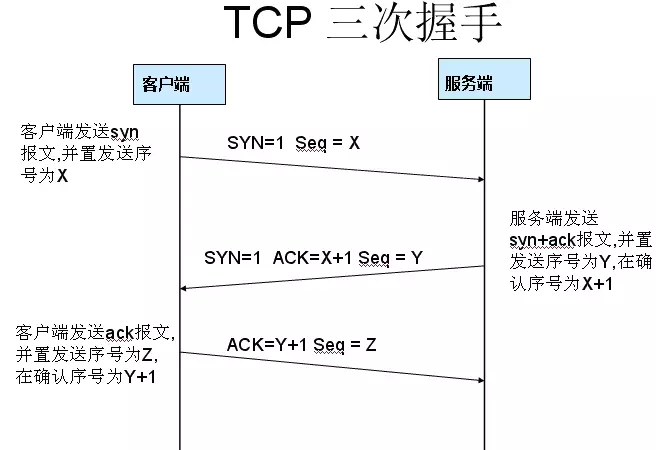
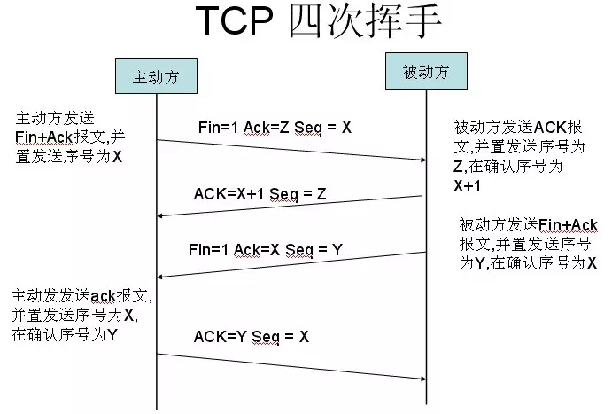

# 面试中的JavaScript之设计模式、HTTP

## 设计模式

设计模式，在面向对象软件设计过程中针对特定问题的简洁而优雅的解决方案。

### 简单工厂模式

抽取类相同的属性和方法封装到对象上

```javascript
let UserFactory = function (role, opt) {
  function User(opt) {
    this.name = opt.name;
    this.viewPage = opt.viewPage;
  }
  switch (role) {
    case 'superAdmin':
      return new User(opt);
      break;
    case 'admin':
      return new User(opt);
      break;
    case 'user':
      return new User(opt);
      break;
    default:
      throw new Error('参数错误, 可选参数:superAdmin、admin、user')
  }
}
let superAdmin = UserFactory('superAdmin', {"name": "zhangsan", "viewPage": "superAdmin"});
```

### 工厂方法模式

创建实例

```javascript
var Factory=function(type, content){
  if(this instanceof Factory){
    var s=new this[type](content);
    return s;
  }else{
    return new Factory(type,content);
  }
};

//工厂原型中设置创建类型数据对象的属性
Factory.prototype={
  constructor: Factory,
  Java: function(content){
    console.log('Java值为',content);
  },
  PHP: function(content){
    console.log('PHP值为',content);
  },
  Python: function(content){
    console.log('Python值为',content);
  }
}
Factory('Python', '我是Python');
```

### 原型模式

设置函数的原型属性，实现继承

```javascript
function Animal (name) {
  this.name = name || 'Animal';
  this.sleep = function(){
    console.log(this.name + '正在睡觉！');
  }
}
Animal.prototype.eat = function(food) {
  console.log(this.name + '正在吃：' + food);
};

function Cat(){ }
Cat.prototype = new Animal();
Cat.prototype.name = 'cat'

var cat = new Cat(); 
console.log(cat.name); // cat
console.log(cat.eat('fish')); // cat正在吃：fish 
console.log(cat.sleep()); // cat正在睡觉！
console.log(cat instanceof Animal); // true 
console.log(cat instanceof Cat); // true 
```

### 单例模式

只允许被实例化一次的类，提供一个命名空间

```javascript
let singleCase = function(name){
  this.name = name;
};
singleCase.prototype.getName = function(){
  return this.name;
}
// 获取实例对象
let getInstance = (function() {
  var instance = null;
  return function(name) {
    if(!instance) { // 闭包
      instance = new singleCase(name);
    }
    return instance;
  }
})();
console.log(getInstance("one") === getInstance("two")) // true
```

### 适配者模式

一种数据结构改成另一种数据结构，将一个接口转换成客户端需要的接口而不需要去修改客户端代码，使得不兼容的代码可以一起工作；主要用于解决两个接口之间不匹配的问题

```javascript
const zhejiangCityOld = (function() {
  return [{
    name: 'hangzhou',
    id: 11,
  },
  {
    name: 'jinhua',
    id: 12
  }]
}());

const adaptor = (function(oldCity) {
  const obj = {}
  for (let city of oldCity) {
    obj[city.name] = city.id
  }
  return obj
})(zhejiangCityOld)
adaptor // {hangzhou: 11, jinhua: 12}
```

### 装饰者模式

不改变原对象的基础上，动态的给对象添加属性或方法

```javascript
let decorator=function(input,fn){
  let input=document.getElementById(input); //获取事件源
  if(typeof input.onclick=='function'){ //若事件源已经绑定事件
    let oldClickFn=input.onclick;  //缓存事件源原有的回调函数
    input.onclick=function(){ //为事件源定义新事件
      oldClickFn(); //事件源原有回调函数
      fn(); //执行事件源新增回调函数
    }
  }else{
    input.onclick=fn;  //未绑定绑定
  }
}
decorator('textInp',function(){
  console.log('文本框执行啦');
})

const wear1 = function() {
  console.log('穿上第一件衣服')
}
const wear2 = function() {
  console.log('穿上第二件衣服')
}
const wear3 = function() {
  console.log('穿上第三件衣服')
}
const after = function(fn, afterFn) {
  const self = this
  return function() {
    fn.apply(self, arguments)
    afterFn.apply(self, arguments)
  }
}
const wear = after(after(wear1, wear2), wear3)
wear()
```

### 桥接模式

将抽象部分与它的实现部分分离，使它们都可以独立地变化

```javascript
class Speed { // 运动模块
  constructor(x, y) {
    this.x = x
    this.y = y
  }
  run() {  console.log(`运动起来 ${this.x} + ${this.y}`)  }
}

class Color { // 着色模块
  constructor(cl) {
    this.color = cl
  }
  draw() {  console.log(`绘制颜色 ${this.color}`)  }
}

class Speak {
  constructor(wd) {
    this.word = wd
  }
  say() {  console.log(`说话 ${this.word}`)  }
}

class Ball { // 创建球类，可以着色和运动
  constructor(x, y, cl) {
    this.speed = new Speed(x, y)
    this.color = new Color(cl)
  }
  init() {
    this.speed.run()
    this.color.draw()
  }
}

class Man { // 人类，可以运动和说话
  constructor(x, y, wd) {
    this.speed = new Speed(x, y)
    this.speak = new Speak(wd)
  }
  init() {
    this.speed.run()
    this.speak.say()
  }
}
const man = new Man(1, 2, 'hehe?')
man.init()

 Object.prototype.addMethod = function(name,fn){
  this[name] = fn;
 }
 function Box(x,y,z){ // 创建类并实例化对象（实现层）
  this.x=x;
  this.y=y;
  this.z=z;
}
var box=new Box(20,10,10);
box.addMethod("init",function(){ // 为对象拓展方法（桥接方法）
  console.log("盒子的长度为："+this.x+" , 宽度为："+this.y+" , 高度为："+this.z);
});
box.init();
```

### 观察者模式

解决类与对象，对象与对象之间的耦合

```javascript
let Observer = (function(){
  let _message={};
  return {
  //注册接口,
  //1.作用:将订阅者注册的消息推入到消息队列
  //2.参数:所以要传两个参数,消息类型和处理动作,
  //3.消息不存在重新创建,存在将消息推入到执行方法
  regist: function(type,fn){
    //如果消息不存在,创建
    if(typeof _message[type]==='undefined'){
      _message[type]=[fn];
    }else{
      //将消息推入到消息的执行动作
      _message[type].push(fn);
    }
  },

  //发布信息接口
  //1.作用:观察这发布消息将所有订阅的消息一次执行
  //2.参数:消息类型和动作执行传递参数
  //3.消息类型参数必须校验
  fire: function(type,args){
    //如果消息没有注册,则返回
    if(!_message[type]) return;
    //定义消息信息
    var events={
      type: type, //消息类型
      args: args || {} //消息携带数据
    },
    i=0,
    len=_message[type].length;
    //遍历消息
    for(; i<len; i++){
      //依次执行注册消息
      _message[type][i].call(this,events);
    }
  },

  //移除信息接口
  //1.作用:将订阅者注销消息从消息队列清除
  //2.参数:消息类型和执行的动作
  //3.消息参数校验
  remove: function(type,fn){
    //如果消息动作队列存在
    if(_message[type] instanceof Array){
      //从最后一个消息动作序遍历
      var i=_message[type].length-1;
      for(; i>=0; i--){
        //如果存在该动作在消息队列中移除
        _message[type][i]===fn&&_message[type].splice(i,1);
      }
      }
    }
  }
})()
Observer.regist('test',function(e){
  console.log(e.type,e.args.msg);
})
Observer.fire('test',{msg:'传递参数1'});
Observer.fire('test',{msg:'传递参数2'});
Observer.fire('test',{msg:'传递参数3'});
```

### 状态模式

一个对象状态改变会导致行为变化，解决复杂的if判断

```javascript
const weakLight = function(light) {
  this.light = light
}

weakLight.prototype.press = function() {
  console.log('打开强光')
  this.light.setState(this.light.strongLight)
}

const strongLight = function(light) {
  this.light = light
}

strongLight.prototype.press = function() {
  console.log('关灯')
  this.light.setState(this.light.offLight)
}

const offLight = function(light) {
  this.light = light
}

offLight.prototype.press = function() {
  console.log('打开弱光')
  this.light.setState(this.light.weakLight)
}

const Light = function() {
  this.weakLight = new weakLight(this)
  this.strongLight = new strongLight(this)
  this.offLight = new offLight(this)
  this.currentState = this.offLight // 初始状态
}

Light.prototype.init = function() {
  const btn = document.createElement('button')
  btn.innerHTML = '按钮'
  document.body.append(btn)
  const self = this
  btn.addEventListener('click', function() {
    self.currentState.press()
  })
}

Light.prototype.setState = function(state) { // 改变当前状态
  this.currentState = state
}
const light = new Light()
light.init() // 打开弱光  打开强光  关灯
```

### 策略模式

定义了一系列家族算法，并对每一种算法单独封装起来，让算法之间可以相互替换，独立于使用算法的客户，根据不同参数可以命中不同的策略。

```javascript
const S = function(salary) {
  return salary * 4
}

const A = function(salary) {
  return salary * 3
}

const B = function(salary) {
  return salary * 2
}

const calculateBonus = function(func, salary) {
  return func(salary)
}
calculateBonus(A, 10000)
```

### 中介者模式

设置一个中间层，处理对象之间的交互，对象和对象之间借助第三方中介者进行通信

```javascript
const player = function(name) {
  this.name = name
  playerMiddle.add(name)
}
player.prototype.win = function() {
  playerMiddle.win(this.name)
}
player.prototype.lose = function() {
  playerMiddle.lose(this.name)
}

const playerMiddle = (function() { // 将就用下这个 demo, 这个函数当成中介者
  const players = [], winArr = [], loseArr = []
  return {
    add: function(name) {
      players.push(name)
    },
    win: function(name) {
      winArr.push(name)
      if (winArr.length + loseArr.length === players.length) {
        this.show()
      }
    },
    lose: function(name) {
      loseArr.push(name)
      if (winArr.length + loseArr.length === players.length) {
        this.show()
      }
    },
    show: function() {
      for (let winner of winArr) {
        console.log(winner + '挑战成功;')
      }
      for (let loser of loseArr) {
        console.log(loser + '挑战失败;')
      }
    },
  }
}())

const a = new player('A 选手')
const b = new player('B 选手')
const c = new player('C 选手')

a.win() // A 选手挑战成功;
b.win() // B 选手挑战成功;
c.lose() // C 选手挑战失败;
```

## HTTP

超文本传输协议（英文：HyperText Transfer Protocol，缩写：HTTP）是一种用于分布式、协作式和超媒体信息系统的应用层协议。HTTP是万维网的数据通信的基础。
设计HTTP最初的目的是为了提供一种发布和接收HTML页面的方法。通过HTTP或者HTTPS协议请求的资源由统一资源标识符（Uniform Resource Identifiers，URI）来标识。是一个基于TCP实现的应用层协议。

特点：

- 支持客户/服务器模式：可以连接客户端和服务端；
- 简单快速：请求只需传送请求方法，路径和请求主体；
- 灵活：传输数据类型灵活；
- 无连接：请求结束立即断开；可以通过自身属性 Keep-Alive
- 无状态：无法记住上一次请求；HTTP 协议本身无法解决这个状态，只有通过 cookie 和 session 将状态做贮存，常见的场景是登录状态保持

### 请求过程

HTTP(S) 请求地址 → DNS 解析 → 三次握手 → 发送请求 → 四次挥手





参考文章：

- [一个前端眼中的斐波那契数列](https://juejin.im/entry/5ab452b56fb9a028d3755376)
- [JavaScript 排序，不只是冒泡](https://juejin.im/entry/59250db844d904006cefa11f)
- [JavaScript 数据结构与算法之美 - 冒泡排序、插入排序、选择排序](https://juejin.im/post/5d341a89f265da1bac405369)
- [MDN JavaScript教程](https://developer.mozilla.org/zh-CN/docs/Web/JavaScript)
- [JavaScript 中常见设计模式整理](https://juejin.im/post/5afe6430518825428630bc4d)
- [JS 桥接模式](https://segmentfault.com/a/1190000012547750)
- [【前端进阶之路】没有入门设计模式？那看这篇就够了！](https://juejin.im/post/5d1af3fce51d45773f2e8f9d#heading-11)
- [HTTP和HTTPS详解](https://juejin.im/post/5af557a3f265da0b9265a498)
- [JS 原生面经从初级到高级【近1.5W字】](https://juejin.im/post/5daeefc8e51d4524f007fb15?utm_source=gold_browser_extension#heading-130)