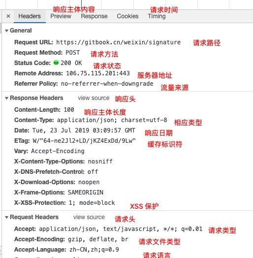

# 面试中的JavaScript之设计模式、HTTP

## 设计模式

设计模式，在面向对象软件设计过程中针对特定问题的简洁而优雅的解决方案。

### 简单工厂模式

抽取类相同的属性和方法封装到对象上

```javascript
let UserFactory = function (role, opt) {
  function User(opt) {
    this.name = opt.name;
    this.viewPage = opt.viewPage;
  }
  switch (role) {
    case 'superAdmin':
      return new User(opt);
      break;
    case 'admin':
      return new User(opt);
      break;
    case 'user':
      return new User(opt);
      break;
    default:
      throw new Error('参数错误, 可选参数:superAdmin、admin、user')
  }
}
let superAdmin = UserFactory('superAdmin', {"name": "zhangsan", "viewPage": "superAdmin"});
```

### 工厂方法模式

创建实例

```javascript
var Factory=function(type, content){
  if(this instanceof Factory){
    var s=new this[type](content);
    return s;
  }else{
    return new Factory(type,content);
  }
};

//工厂原型中设置创建类型数据对象的属性
Factory.prototype={
  constructor: Factory,
  Java: function(content){
    console.log('Java值为',content);
  },
  PHP: function(content){
    console.log('PHP值为',content);
  },
  Python: function(content){
    console.log('Python值为',content);
  }
}
Factory('Python', '我是Python');
```

### 原型模式

设置函数的原型属性，实现继承

```javascript
function Animal (name) {
  this.name = name || 'Animal';
  this.sleep = function(){
    console.log(this.name + '正在睡觉！');
  }
}
Animal.prototype.eat = function(food) {
  console.log(this.name + '正在吃：' + food);
};

function Cat(){ }
Cat.prototype = new Animal();
Cat.prototype.name = 'cat'

var cat = new Cat(); 
console.log(cat.name); // cat
console.log(cat.eat('fish')); // cat正在吃：fish 
console.log(cat.sleep()); // cat正在睡觉！
console.log(cat instanceof Animal); // true 
console.log(cat instanceof Cat); // true 
```

### 单例模式

只允许被实例化一次的类，提供一个命名空间

```javascript
let singleCase = function(name){
  this.name = name;
};
singleCase.prototype.getName = function(){
  return this.name;
}
// 获取实例对象
let getInstance = (function() {
  var instance = null;
  return function(name) {
    if(!instance) { // 闭包
      instance = new singleCase(name);
    }
    return instance;
  }
})();
console.log(getInstance("one") === getInstance("two")) // true
```

### 适配者模式

一种数据结构改成另一种数据结构，将一个接口转换成客户端需要的接口而不需要去修改客户端代码，使得不兼容的代码可以一起工作；主要用于解决两个接口之间不匹配的问题

```javascript
const zhejiangCityOld = (function() {
  return [{
    name: 'hangzhou',
    id: 11,
  },
  {
    name: 'jinhua',
    id: 12
  }]
}());

const adaptor = (function(oldCity) {
  const obj = {}
  for (let city of oldCity) {
    obj[city.name] = city.id
  }
  return obj
})(zhejiangCityOld)
adaptor // {hangzhou: 11, jinhua: 12}
```

### 装饰者模式

不改变原对象的基础上，动态的给对象添加属性或方法

```javascript
let decorator=function(input,fn){
  let input=document.getElementById(input); //获取事件源
  if(typeof input.onclick=='function'){ //若事件源已经绑定事件
    let oldClickFn=input.onclick;  //缓存事件源原有的回调函数
    input.onclick=function(){ //为事件源定义新事件
      oldClickFn(); //事件源原有回调函数
      fn(); //执行事件源新增回调函数
    }
  }else{
    input.onclick=fn;  //未绑定绑定
  }
}
decorator('textInp',function(){
  console.log('文本框执行啦');
})

const wear1 = function() {
  console.log('穿上第一件衣服')
}
const wear2 = function() {
  console.log('穿上第二件衣服')
}
const wear3 = function() {
  console.log('穿上第三件衣服')
}
const after = function(fn, afterFn) {
  const self = this
  return function() {
    fn.apply(self, arguments)
    afterFn.apply(self, arguments)
  }
}
const wear = after(after(wear1, wear2), wear3)
wear()
```

### 桥接模式

将抽象部分与它的实现部分分离，使它们都可以独立地变化

```javascript
class Speed { // 运动模块
  constructor(x, y) {
    this.x = x
    this.y = y
  }
  run() {  console.log(`运动起来 ${this.x} + ${this.y}`)  }
}

class Color { // 着色模块
  constructor(cl) {
    this.color = cl
  }
  draw() {  console.log(`绘制颜色 ${this.color}`)  }
}

class Speak {
  constructor(wd) {
    this.word = wd
  }
  say() {  console.log(`说话 ${this.word}`)  }
}

class Ball { // 创建球类，可以着色和运动
  constructor(x, y, cl) {
    this.speed = new Speed(x, y)
    this.color = new Color(cl)
  }
  init() {
    this.speed.run()
    this.color.draw()
  }
}

class Man { // 人类，可以运动和说话
  constructor(x, y, wd) {
    this.speed = new Speed(x, y)
    this.speak = new Speak(wd)
  }
  init() {
    this.speed.run()
    this.speak.say()
  }
}
const man = new Man(1, 2, 'hehe?')
man.init()

 Object.prototype.addMethod = function(name,fn){
  this[name] = fn;
 }
 function Box(x,y,z){ // 创建类并实例化对象（实现层）
  this.x=x;
  this.y=y;
  this.z=z;
}
var box=new Box(20,10,10);
box.addMethod("init",function(){ // 为对象拓展方法（桥接方法）
  console.log("盒子的长度为："+this.x+" , 宽度为："+this.y+" , 高度为："+this.z);
});
box.init();
```

### 观察者模式

解决类与对象，对象与对象之间的耦合

```javascript
let Observer = (function(){
  let _message={};
  return {
  //注册接口,
  //1.作用:将订阅者注册的消息推入到消息队列
  //2.参数:所以要传两个参数,消息类型和处理动作,
  //3.消息不存在重新创建,存在将消息推入到执行方法
  regist: function(type,fn){
    //如果消息不存在,创建
    if(typeof _message[type]==='undefined'){
      _message[type]=[fn];
    }else{
      //将消息推入到消息的执行动作
      _message[type].push(fn);
    }
  },

  //发布信息接口
  //1.作用:观察这发布消息将所有订阅的消息一次执行
  //2.参数:消息类型和动作执行传递参数
  //3.消息类型参数必须校验
  fire: function(type,args){
    //如果消息没有注册,则返回
    if(!_message[type]) return;
    //定义消息信息
    var events={
      type: type, //消息类型
      args: args || {} //消息携带数据
    },
    i=0,
    len=_message[type].length;
    //遍历消息
    for(; i<len; i++){
      //依次执行注册消息
      _message[type][i].call(this,events);
    }
  },

  //移除信息接口
  //1.作用:将订阅者注销消息从消息队列清除
  //2.参数:消息类型和执行的动作
  //3.消息参数校验
  remove: function(type,fn){
    //如果消息动作队列存在
    if(_message[type] instanceof Array){
      //从最后一个消息动作序遍历
      var i=_message[type].length-1;
      for(; i>=0; i--){
        //如果存在该动作在消息队列中移除
        _message[type][i]===fn&&_message[type].splice(i,1);
      }
      }
    }
  }
})()
Observer.regist('test',function(e){
  console.log(e.type,e.args.msg);
})
Observer.fire('test',{msg:'传递参数1'});
Observer.fire('test',{msg:'传递参数2'});
Observer.fire('test',{msg:'传递参数3'});
```

### 状态模式

一个对象状态改变会导致行为变化，解决复杂的if判断

```javascript
const weakLight = function(light) {
  this.light = light
}

weakLight.prototype.press = function() {
  console.log('打开强光')
  this.light.setState(this.light.strongLight)
}

const strongLight = function(light) {
  this.light = light
}

strongLight.prototype.press = function() {
  console.log('关灯')
  this.light.setState(this.light.offLight)
}

const offLight = function(light) {
  this.light = light
}

offLight.prototype.press = function() {
  console.log('打开弱光')
  this.light.setState(this.light.weakLight)
}

const Light = function() {
  this.weakLight = new weakLight(this)
  this.strongLight = new strongLight(this)
  this.offLight = new offLight(this)
  this.currentState = this.offLight // 初始状态
}

Light.prototype.init = function() {
  const btn = document.createElement('button')
  btn.innerHTML = '按钮'
  document.body.append(btn)
  const self = this
  btn.addEventListener('click', function() {
    self.currentState.press()
  })
}

Light.prototype.setState = function(state) { // 改变当前状态
  this.currentState = state
}
const light = new Light()
light.init() // 打开弱光  打开强光  关灯
```

### 策略模式

定义了一系列家族算法，并对每一种算法单独封装起来，让算法之间可以相互替换，独立于使用算法的客户，根据不同参数可以命中不同的策略。

```javascript
const S = function(salary) {
  return salary * 4
}

const A = function(salary) {
  return salary * 3
}

const B = function(salary) {
  return salary * 2
}

const calculateBonus = function(func, salary) {
  return func(salary)
}
calculateBonus(A, 10000)
```

### 中介者模式

设置一个中间层，处理对象之间的交互，对象和对象之间借助第三方中介者进行通信

```javascript
const player = function(name) {
  this.name = name
  playerMiddle.add(name)
}
player.prototype.win = function() {
  playerMiddle.win(this.name)
}
player.prototype.lose = function() {
  playerMiddle.lose(this.name)
}

const playerMiddle = (function() { // 将就用下这个 demo, 这个函数当成中介者
  const players = [], winArr = [], loseArr = []
  return {
    add: function(name) {
      players.push(name)
    },
    win: function(name) {
      winArr.push(name)
      if (winArr.length + loseArr.length === players.length) {
        this.show()
      }
    },
    lose: function(name) {
      loseArr.push(name)
      if (winArr.length + loseArr.length === players.length) {
        this.show()
      }
    },
    show: function() {
      for (let winner of winArr) {
        console.log(winner + '挑战成功;')
      }
      for (let loser of loseArr) {
        console.log(loser + '挑战失败;')
      }
    },
  }
}())

const a = new player('A 选手')
const b = new player('B 选手')
const c = new player('C 选手')

a.win() // A 选手挑战成功;
b.win() // B 选手挑战成功;
c.lose() // C 选手挑战失败;
```

## HTTP

超文本传输协议（英文：HyperText Transfer Protocol，缩写：HTTP）是一种用于分布式、协作式和超媒体信息系统的应用层协议。HTTP是万维网的数据通信的基础。
设计HTTP最初的目的是为了提供一种发布和接收HTML页面的方法。通过HTTP或者HTTPS协议请求的资源由统一资源标识符（Uniform Resource Identifiers，URI）来标识。是一个基于TCP实现的应用层协议。

特点：

- 支持客户/服务器模式：可以连接客户端和服务端；
- 简单快速：请求只需传送请求方法，路径和请求主体；
- 灵活：传输数据类型灵活；
- 无连接：请求结束立即断开；可以通过自身属性 Keep-Alive
- 无状态：无法记住上一次请求；HTTP 协议本身无法解决这个状态，只有通过 cookie 和 session 将状态做贮存，常见的场景是登录状态保持

### 请求过程

HTTP(S) 请求地址 → DNS 解析 → 三次握手 → 发送请求 → 四次挥手


### OSI七层参考模型

OSI（Open System Interconnect），即开放式系统互联。 一般都叫OSI参考模型，是ISO组织在1985年研究的网络互联模型。该体系结构标准定义了网络互联的七层框架（物理层、数据链路层、网络层、传输层、会话层、表示层和应用层），即OSI开放系统互连参考模型。


### HTTP 0.9~3.0 对比

#### HTTP 0.9 - 单行协议

HTTP/0.9 极其简单：请求由单行指令构成，以唯一可用方法GET开头，其后跟目标资源的路径（一旦连接到服务器，协议、服务器、端口号这些都不是必须的）。响应也极其简单的：只包含响应文档本身。

跟后来的版本不同，HTTP/0.9 的响应内容并不包含HTTP头，这意味着只有HTML文件可以传送，无法传输其他类型的文件；也没有状态码或错误代码：一旦出现问题，一个特殊的包含问题描述信息的HTML文件将被发回，供人们查看。

只允许客户端发送 GET 这一种请求；且不支持请求头，协议只支持纯文本；无状态性，每个访问独立处理，完成断开；无状态码。

#### HTTP 1.0

特点：

- 协议版本信息现在会随着每个请求发送（HTTP/1.0被追加到了GET行）
- 状态码会在响应开始时发送，使浏览器能了解请求执行成功或失败，并相应调整行为（如更新或使用本地缓存）
- 引入了HTTP头的概念，无论是对于请求还是响应，允许传输元数据，使协议变得非常灵活，更具扩展性
- 在新HTTP头的帮助下，具备了传输除纯文本HTML文件以外其他类型文档的能力（感谢Content-Type头）

有身份认证，三次握手； 请求与响应支持头域。

请求头内容：

- Accept：客户端可接受的 MIME 类型
- Accept-Encoding：客户端支持的数据压缩格式，数据可解码的格式
- Accept-Language：客户端可接受语言
- Connection：请求完成后，是否保持连接，值 keep-alive 是长连接
- Host：主机和端口
- Pragma：是否缓存,指定 no-cache 返回刷新
- Referer：客户端是从哪个资源来访问服务器的（防盗链），页面路由
- If-Modified-Since：资源的缓存时间

响应头内容：

- Connection：值 keep-alive 是长连接
- Content-Type：返回文档类型，常见的值有 text/plain、text/html、text/json
- Date：消息发送的时间
- Server：服务器名字
- Last-Modified：值为时间s，返回的最后修改时间
- Expires：缓存过期时间，b 和 s 时间做对比

expires 是响应头内容，返回一个固定的时间，缺陷是时间到了服务器要重新设置；请求头中如果有 If-Modified-Since，服务器会将时间与 last-modified 对比，相同返回 304；支持 GET、HEAD、POST 方法；有状态码；支持长连接（但默认还是使用短连接）、缓存机制以及身份认证。

#### HTTP 1.1

特点：

- 连接可以复用，节省了多次打开TCP连接加载网页文档资源的时间
- 增加流水线操作，允许在第一个应答被完全发送之前就发送第二个请求，以降低通信延迟
- 支持响应分块
- 引入额外的缓存控制机制
- 引入内容协商机制，包括语言，编码，类型等，并允许客户端和服务器之间约定以最合适的内容进行交换
- 感谢Host头，能够使不同域名配置在同一个IP地址的服务器上

请求头增加 Cache-Control：

- Cache-Control：指定请求和响应遵循的缓存机制,值有：public(b 和 s 都缓存)，private(b 缓存)，no-cache(不缓存)，no-store(不缓存)，max-age(缓存时间,s 为单位)，min-fresh(最小更新时间)，max-age=3600
- If-None-Match：上次请求响应头返回的 etag 值响应头增加 Cache-Control，表示所有的缓存机制是否可以缓存及哪种类型 etag 返回的哈希值，第二次请求头携带去和服务器值对比

Cache-Control 的 max-age 返回是缓存的相对时间，Cache-Control 优先级比 expires 高，缺点：不能第一时间拿到最新修改文件

#### HTTP 2.0

HTTP/2在HTTP/1.1有几处基本的不同:

- HTTP/2是二进制协议而不是文本协议。不再可读，也不可无障碍的手动创建，改善的优化技术现在可被实施
- 这是一个复用协议。并行的请求能在同一个链接中处理，移除了HTTP/1.x中顺序和阻塞的约束
- 压缩了headers。因为headers在一系列请求中常常是相似的，其移除了重复和传输重复数据的成本
- 其允许服务器在客户端缓存中填充数据，通过一个叫服务器推送的机制来提前请求

采用二进制格式传输；多路复用，将请求数据分成帧乱序发送到 TCP 中，TCP 只能有一个 steam，所以还是会阻塞；报头压缩；服务器推送主动向 B 端发送静态资源，避免往返延迟。

#### HTTP 3.0

基于 QUIC 协议，基于 UDP。

特点：

- 自定义连接机制：TCP 以 IP/端口标识，变化重新连接握手，UDP 是以 64 位 ID 标识，是无连接；
- 自定义重传机制：TCP 使用序号和应答传输，QUIC 是使用递增序号传输； 
- 无阻塞的多路复用：同一条 QUIC 可以创建多个 steam。

#### HTTPS

https（全称：Hyper Text Transfer Protocol over Secure Socket Layer） 是在 http 协议的基础上加了个 SSL；主要包括：握手(凭证交换和验证)和记录协议(数据进行加密)。

HTTP 与 HTTPS 的区别：

- HTTP 是明文传输，HTTPS 通过 SSL\TLS 进行了加密
- HTTP 的端口号是 80，HTTPS 是 443
- HTTPS 需要到 CA 申请证书，一般免费证书很少，需要交费
- HTTP 的连接很简单，是无状态的；TLS / SSL是有状态的；HTTPS 协议是由 SSL+HTTP 协议构建的，可进行加密传输、身份认证的网络协议，比 HTTP 协议安全

#### 缓存

分类：

- 按协议分：协议层缓存和非 http 协议缓存
	- 协议层缓存：利用 http 协议头属性值设置
	- 非协议层缓存：利用 meta 标签的 http-equiv 属性值 Expires，set-cookie
- 按缓存分：强缓存和协商缓存
	- 强缓存：利用 cache-control 和 expires 设置，直接返回一个过期时间，所以在缓存期间不请求，If-modify-since
	- 协商缓存：响应头返回 etag 或 last-modified 的哈希值，第二次请求头 If-none-match 或 IF-modify-since 携带上次哈希值，一致则返回 304

etag 优先级高于 last-modified；etag 精度高，last-modified 精度是 s，1s 内 etag 修改多少次都会被记录； last-modified 性能好，etag 要得到 hash 值。

浏览器读取缓存流程：会先判断强缓存；再判断协商缓存 etag(last-modified)是否存在；存在利用属性 If-None-match(If-Modified-since)携带值；请求服务器,服务器对比 etag(last-modified)，生效返回 304。

F5 刷新会忽略强缓存不会忽略协商缓存，ctrl+f5 都失效

#### 状态码

当浏览者访问一个网页时，浏览者的浏览器会向网页所在服务器发出请求。当浏览器接收并显示网页前，此网页所在的服务器会返回一个包含HTTP状态码的信息头（server header）用以响应浏览器的请求。HTTP状态码的英文为HTTP Status Code。

HTTP状态码分类：

- `1xx`：表示临时响应并需要请求者继续执行操作的状态码
	- 100：	继续。客户端应继续其请求
	- 101：切换协议。服务器根据客户端的请求切换协议。只能切换到更高级的协议，例如，切换到HTTP的新版本协议
- `2xx`：成功，操作被成功接收并处理
	- 200：	请求成功。一般用于GET与POST请求
	- 201已创建、202已接受、203非授权信息、204无内容、205重置内容、206部分内容
- `3xx`：重定向，需要进一步的操作以完成请求
	- 300多种选择、301永久移动、302临时移动、303查看其它地址
	- 304：未修改。所请求的资源未修改，服务器返回此状态码时，不会返回任何资源
	- 305使用代理、307临时重定向
- `4xx`：客户端错误，请求包含语法错误或无法完成请求
	- 400错误请求，客户端请求的语法错误、401未授权，请求要求用户的身份认证、403禁止，服务器理解请求客户端的请求，但是拒绝执行此请求
	- 404未找到，服务器找不到请求的网页
	- 405方法禁用，禁用请求中指定的方法、406不接受、407需要代理授权、408请求超时、409冲突、410已删除、411需要有效长度、412未满足前提条件、413请求实体过大
	- 414请求的URI过长、415不支持媒体类型、416请求范围不符合要求、417未满足期望值
- `5xx`：服务器错误，服务器在处理请求的过程中发生了错误
	- 500服务器内部错误、501服务器不支持请求的功能，无法完成请求、502错误网关、503服务器不可用、504网关超时、505HTTP版本不受支持



## WebSockets

WebSockets 是一种先进的技术。它可以在用户的浏览器和服务器之间打开交互式通信会话。使用此API，您可以向服务器发送消息并接收事件驱动的响应，而无需通过轮询服务器的方式以获得响应。

WebSocket 使得客户端和服务器之间的数据交换变得更加简单，允许服务端主动向客户端推送数据。在 WebSocket API 中，浏览器和服务器只需要完成一次握手，两者之间就直接可以创建持久性的连接，并进行双向数据传输。

在 WebSocket API 中，浏览器和服务器只需要做一个握手的动作，然后，浏览器和服务器之间就形成了一条快速通道。两者之间就直接可以数据互相传送。

Ajax 轮询是在特定的的时间间隔（如每1秒），由浏览器对服务器发出HTTP请求，然后由服务器返回最新的数据给客户端的浏览器。缺点，即浏览器需要不断的向服务器发出请求，然而HTTP请求可能包含较长的头部，其中真正有效的数据可能只是很小的一部分，显然这样会浪费很多的带宽等资源。

主要接口：

- WebSocket：用于连接WebSocket服务器的主要接口，之后可以在这个连接上发送 和接受数据
- CloseEvent：连接关闭时WebSocket对象发送的事件
- MessageEvent：当从服务器获取到消息的时候WebSocket对象触发的事件

### WebSocket

Websocket 使用 ws 或 wss 的统一资源标志符，类似于 HTTPS，其中 wss 表示在 TLS 之上的 Websocket。如：`ws://example.com/wsapi`、`wss://secure.example.com/`。

Websocket 使用和 HTTP 相同的 TCP 端口，可以绕过大多数防火墙的限制。默认情况下，Websocket 协议使用 80 端口；运行在 TLS 之上时，默认使用 443 端口。

Socket 是传输控制层协议，WebSocket 是应用层协议。

```javascript
// url 要连接的URL；这应该是WebSocket服务器将响应的URL
// protocols 一个协议字符串或者一个包含协议字符串的数组；这些字符串用于指定子协议，这样单个服务器可以实现多个WebSocket子协议
var aWebSocket = new WebSocket(url [, protocols]); // 返回一个 WebSocket 对象
```

属性：

- WebSocket.bufferedAmount：未发送至服务器的字节数
- WebSocket.extensions：服务器选择的扩展
- WebSocket.onclose：用于指定连接关闭后的回调函数
- WebSocket.onerror：用于指定连接失败后的回调函数
- WebSocket.onmessage：用于指定当从服务器接受到信息时的回调函数
- WebSocket.onopen：用于指定连接成功后的回调函数
- WebSocket.protocol（只读）：服务器选择的下属协议
- WebSocket.readyState（只读）：当前的链接状态
- WebSocket.url（只读）：WebSocket 的绝对路径

```javascript
var bufferedAmount = aWebSocket.bufferedAmount;
var extensions = aWebSocket.extensions;
aWebSocket.onclose = function(event) {
  console.log("WebSocket is closed now.");
};
aWebSocket.onerror = function(event) {
  console.error("WebSocket error observed:", event);
};
aWebSocket.onmessage = function(event) {
  console.debug("WebSocket message received:", event);
};
aWebSocket.onopen = function(event) {
  console.log("WebSocket is open now.");
};
var protocol = aWebSocket.protocol;
var readyState = aWebSocket.readyState; // 0 - 正在链接中，1 - 已经链接并且可以通讯，2 - 连接正在关闭，3 - 连接已关闭或者没有链接成功
var url = aWebSocket.url;
```

方法：

- WebSocket.close([code[, reason]])：关闭当前链接；code如果没有传这个参数，默认使用1005；reason 连接关闭的原因
- WebSocket.send(data)：向服务器发送数据，可发送的类型：USVString、ArrayBuffer、Blob、ArrayBufferView

```javascript
function WebSocketTest() {
  if ("WebSocket" in window) {
    alert("您的浏览器支持 WebSocket!");
    // 打开一个 web socket
    var ws = new WebSocket("ws://localhost:9998/echo");
    ws.onopen = function() {
      // Web Socket 已连接上，使用 send() 方法发送数据
      ws.send("发送数据");
      alert("数据发送中...");
    };
    ws.onmessage = function (evt) { 
      var received_msg = evt.data;
      alert("数据已接收...");
    };
    ws.onclose = function() { 
      // 关闭 websocket
      alert("连接已关闭..."); 
    };
  } else {
    // 浏览器不支持 WebSocket
    alert("您的浏览器不支持 WebSocket!");
  }
}

const socket = new WebSocket('ws://localhost:8080');
socket.addEventListener('open', function (event) {
    socket.send('Hello Server!');
});
socket.addEventListener('message', function (event) {
    console.log('Message from server ', event.data);
});
```

参考文章：

- [一个前端眼中的斐波那契数列](https://juejin.im/entry/5ab452b56fb9a028d3755376)
- [JavaScript 排序，不只是冒泡](https://juejin.im/entry/59250db844d904006cefa11f)
- [JavaScript 数据结构与算法之美 - 冒泡排序、插入排序、选择排序](https://juejin.im/post/5d341a89f265da1bac405369)
- [MDN JavaScript教程](https://developer.mozilla.org/zh-CN/docs/Web/JavaScript)
- [JavaScript 中常见设计模式整理](https://juejin.im/post/5afe6430518825428630bc4d)
- [JS 桥接模式](https://segmentfault.com/a/1190000012547750)
- [【前端进阶之路】没有入门设计模式？那看这篇就够了！](https://juejin.im/post/5d1af3fce51d45773f2e8f9d#heading-11)
- [HTTP和HTTPS详解](https://juejin.im/post/5af557a3f265da0b9265a498)
- [JS 原生面经从初级到高级【近1.5W字】](https://juejin.im/post/5daeefc8e51d4524f007fb15?utm_source=gold_browser_extension#heading-130)
- [OSI七层参考模型详解](https://blog.csdn.net/weixin_41944347/article/details/88709570)
- [HTTP协议详细介绍](https://www.cnblogs.com/haiyan123/p/7777924.html)
- [谈谈 HTTPS](https://juejin.im/post/59e4c02151882578d02f4aca)
- [HTTP 状态码（HTTP Status Code）](https://juejin.im/entry/586b5b7dac502e12d62b4f33)