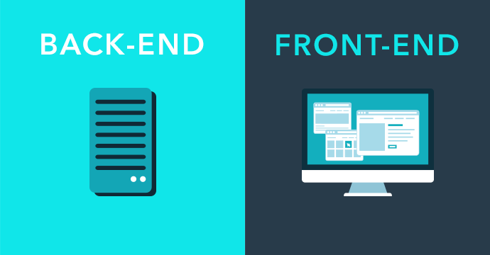
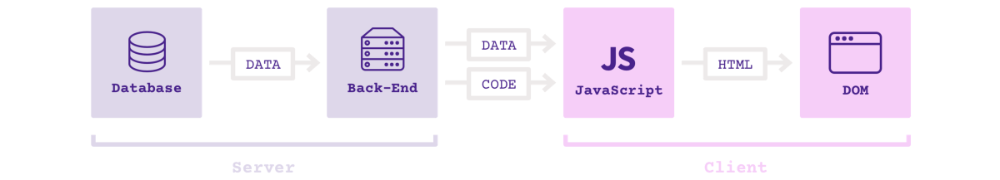
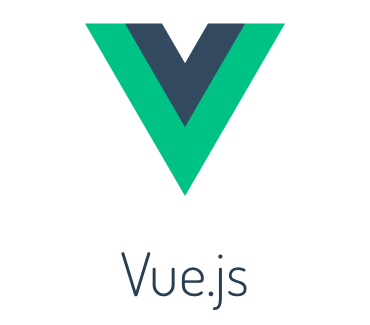

# 前端开发的历史

## 前端和后端

前端（英语：front-end）和后端（英语：back-end）是描述进程开始和结束的通用词汇。前端作用于采集输入信息，后端进行处理。计算机程序的界面样式，视觉呈现属于前端。

- web 前端：针对浏览器的开发，代码在浏览器运行
- web 后端：针对服务器的开发，代码在服务器运行



## 前后端不分的时代

互联网发展的早期，前后端开发是一体的，前端代码是后端代码的一部分。

1. 后端收到浏览器的请求
2. 生成静态页面
3. 发送到浏览器

## 后端 MVC 的开发模式

那时的网站开发，采用的是后端 MVC 模式。MVC模式（Model–view–controller）是软件工程中的一种软件架构模式，把软件系统分为三个基本部分：模型（Model）、视图（View）和控制器（Controller）。

- 模型（Model） - 程序员编写程序应有的功能（实现算法等等）、数据库专家进行数据管理和数据库设计(可以实现具体的功能)；提供/保存数据
- 视图（View） - 界面设计人员进行图形界面设计；展示数据，提供用户界面
- 控制器（Controller）- 负责转发请求，对请求进行处理；数据处理，实现业务逻辑

前端只是后端 MVC 的 V。
通过`JavaScript`所实现的基于 MVC 模型，需要注意的是：MVC 不是一种技术，而是一种理念:

```javascript
/** 模擬 Model, View, Controller */
var M = {}, V = {}, C = {};

/** Model 負責存放資料 */
M.data = "hello world";

/** View 負責將資料輸出到螢幕上 */
V.render = (M) => { alert(M.data); }

/** Controller 作為一個 M 和 V 的橋樑 */
C.handleOnload = () => { V.render(M); }

/** 在網頁讀取的時候呼叫 Controller */
window.onload = C.handleOnload;
```

以 PHP 框架 Laravel 为例。


## 前端工程师的角色

那时的前端工程师，实际上是模板工程师，负责编写页面模板。后端代码读取模板，替换变量，渲染出页面。

典型的 PHP 模板:

```php
<html>
  <head><title>Car {{ $car->id }}</title></head>
  <body>
    <h1>Car {{ $car->id }}</h1>
    <ul>
      <li>Make: {{ $car->make }}</li>
      <li>Model: {{ $car->model }}</li>
      <li>Produced on: {{ $car->produced_on }}</li>
    </ul>
  </body>
</html>
```

## HTML、Cookie、CSS、JS

1991年10月HTML标签，一个非正式CERN文件首次公开18个HTML标签，2014年10月28日，HTML 5作为W3C推荐标准发布

Cookie（复数形态Cookies），又称为“小甜饼”。类型为“小型文本文件”，指某些网站为了辨别用户身份而储存在用户本地终端（Client Side）上的数据（通常经过加密）。由网景公司的前雇员卢·蒙特利在1993年3月发明。

1994年，哈肯·维姆·莱和伯特·波斯合作设计CSS。层叠样式表（英语：Cascading Style Sheets，缩写：CSS；又称串样式列表、级联样式表、串接样式表、阶层式样式表）是一种用来为结构化文档（如HTML文档或XML应用）添加样式（字体、间距和颜色等）的计算机语言，由W3C定义和维护。当前最新版本是CSS2.1，为W3C的推荐标准。CSS3现在已被大部分现代浏览器支持，而下一版的CSS4仍在开发中。

JavaScript（通常缩写为JS）是一种高级的、解释型的编程语言。JavaScript是一门基于原型、函数先行的语言，是一门多范式的语言，它支持面向对象编程，命令式编程，以及函数式编程。它提供语法来操控文本、数组、日期以及正则表达式等，不支持I/O，比如网络、存储和图形等，但这些都可以由它的宿主环境提供支持。它已经由ECMA（欧洲电脑制造商协会）通过ECMAScript实现语言的标准化。JavaScript最初开发于1996年，被使用于Netscape Navigator网页浏览器。

## Ajax

AJAX即“Asynchronous JavaScript and XML”（异步的JavaScript与XML技术），指的是一套综合了多项技术的浏览器端网页开发技术。Ajax的概念由杰西·詹姆士·贾瑞特所提出。

1995年，JAVA语言的第一版发布，随之发布的的Java applets（JAVA小程序）首次实现了异步加载。浏览器通过运行嵌入网页中的Java applets与服务器交换数据，不必刷新网页。1996年，Internet Explorer将iframe元素加入到HTML，支持局部刷新网页。1998年前后，Outlook Web Access小组写成了允许客户端脚本发送HTTP请求（XMLHTTP）的第一个组件。2004年：Gmail；2005年：Google 地图。

前端不再是后端的模板，可以独立得到各种数据。

## Web 2.0

Web 1.0 最早的概念包括常更新的静态HTML页面。而.com时代的成功则是依靠一个更加动态的Web（指代“Web 1.5”），其中CMS（内容管理系统）可以从不断变化的内容数据库中即时生成动态HTML页面。

Web 2.0是一种新的互联网方式，通过网络应用（Web Applications）促进网络上人与人间的信息交换和协同合作，其模式更加以用户为中心。典型的Web 2.0站点有：网络社区、网络应用程序、社交网站、博客、Wiki等等。动态网页，富交互，前端数据处理。

Ajax 技术促成了 Web 2.0 的诞生。

从那时起，前端变得复杂了，对前端工程师的要求越来越高。

## 前端 MVC 框架

前端通过 Ajax 得到数据，因此也有了处理数据的需求。前端代码变得也需要保存数据、处理数据、生成视图，这导致了前端 MVC 框架的诞生。

2010年，Backbone.js。Backbone.js是一套JavaScript框架与RESTful JSON的应用程序接口。也是一套大致上符合MVC架构的编程范型。常被用来开发单页的互联网应用程序，以及用来维护网络应用程序的各种部分（例如多用户与服务端）的同步。Backbone.js是由Jeremy Ashkenas所开发，他同时也是CoffeeScript的开发者。


Backbone 将前端代码分成两个基本部分。

- Model：管理数据
- View：数据的展现


## 前端 Controller

Backbone 只有 M 和 V，没有 C。因为，前端 Controller 与后端不同。

- 不需要，也不应该处理业务逻辑
- 只需要处理 UI 逻辑，响应用户的一举一动

所以，前端 Controller 相对比较简单。Backbone 没有 C，只用事件来处理 UI 逻辑。

```javascript
 var AppView = Backbone.View.extend({
    // ...
    events: {
      "keypress #new-todo":  "createOnEnter",
      "click #clear-completed": "clearCompleted",
      "click #toggle-all": "toggleAllComplete"
  },
});
```

## Router

前端还有一种天然的方法，可以切换视图，那就是 URL。通过 URL 切换视图，这就是 Router（路由）的作用。以 Backbone 为例。


```javascript
App.Router = Backbone.Router.extend({
  routes: {
    '': 'index',
    'show': 'show'
    },
  index: function () {
    $(document.body).append("调用了 Index 路由");
  },
  show: function () {
    $(document.body).append("调用了 Show 路由");
  },
});
```

## MVVM 模式

另一些框架提出 MVVM 模式，用 View Model 代替 Controller。

MVVM（Model–view–viewmodel）是一种软件架构模式。MVVM有助于将图形用户界面的开发与业务逻辑或后端逻辑（数据模型）的开发分离开来，这是通过标记语言或GUI代码实现的。

- Model
- View
- View-Model：简化的 Controller，唯一作用就是为 View 提供处理好的数据，不含其他逻辑。

本质：view 绑定 view-model，视图与数据模型强耦合。数据的变化实时反映在 view 上，不需要手动处理。


## SPA

前端可以做到：

- 读写数据
- 切换视图
- 用户交互

这意味着，网页其实是一个应用程序。`SPA = Single-page application`

2010年后，前端工程师从开发页面，变成了开发“前端应用”（跑在浏览器里面的应用程序）。

传统的架构：


单页应用的架构（多了一个前端 MVC 层）：



## Angular

Google 公司推出的 Angular 是最流行的 MVVM 前端框架。它的风格属于 HTML 语言的增强，核心概念是双向绑定。


```html
<div ng-app="">
  <p>
    姓名 :
    <input
      type="text"
      ng-model="name"
      placeholder="在这里输入您的大名"
    >
  </p>
  <h1>你好，{{name}}</h1>
</div>
```

## Vue

Vue.js 是现在很热门的一种前端 MVVM 框架。它的基本思想与 Angular 类似，但是用法更简单，而且引入了响应式编程的概念。



```html
<div id="journal">
  <input type="text" v-model="message">
  <div>{{message}}</div>
</div>
<script>
var journal = new Vue({
  el: '#journal',
  data: {
    message: 'Your first entry'
  }
});
</script>
```

## 前后端分离

- Ajax -> 前端应用兴起
- 智能手机 -> 多终端支持

这两个原因，导致前端开发方式发生根本的变化。前端不再是后端 MVC 中的 V，而是单独的一层。

## REST 接口

表现层状态转换（英语：Representational State Transfer，缩写：REST）是Roy Thomas Fielding博士于2000年在他的博士论文中提出来的一种万维网软件架构风格，目的是便于不同软件/程序在网络（例如互联网）中互相传递信息。

前后端分离以后，它们之间通过接口通信。
后端暴露出接口，前端消费后端提供的数据。
后端接口一般是 REST 形式，前后端的通信协议一般是 HTTP。

```
GET http://www.store.com/products  // 列举所有商品

GET http://www.store.com/products/12345  // 呈现某一件商品

POST http://www.store.com/orders  // 下单购买
<purchase-order>
  <item> ... </item>
</purchase-order>
```

## Node

2009年，Node 项目诞生，它是服务器上的 JavaScript 运行环境。`Node = JavaScript + 操作系统 API`


Node 的意义:

- JavaScript 成为服务器脚本语言，与 Python 和 Ruby 一样
- JavaScript 成为唯一的浏览器和服务器都支持的语言
- 前端工程师可以编写后端程序了

前端开发模式的根本改变:

- Node 环境下开发
- 大量使用服务器端工具
- 引入持续集成等软件工程的标准流程
- 开发完成后，编译成浏览器可以运行的脚本，放上 CDN

## 全栈工程师

前端工程师正在转变为全栈工程师

- 一个人负责开发前端和后端
- 从数据库到 UI 的所有开发

## 软件行业的发展动力

历史演变：前后端不分 -> 前后端分离 -> 全栈工程师

动力：更加产业化、大规模地生产软件

- 效率更高
- 成本更低

通用性好、能够快速产出的技术最终会赢，单个程序员的生产力要求越来越高。

## H5

为什么 H5 技术会赢得移动端？

- 开发速度快：Native 需要重新编译才能看到结果，H5 是即时输出
- 开发成本低：Native 需要两个开发团队，H5 只要一个
- 快速发布：安卓 Native 新版本需要24小时，iOS 需要 3 ～ 4 天，H5 可以随时更新

Hybrid App，Hybrid技术指的是利用Web开发技术，调用Native相关的API，实现移动与Web二者的有机结合。

## 历史概览

1991 年 HTML 诞生了
1993 年 cookie 的诞生
1998 年 ajax 的诞生
2005 年 “web工程师” 的诞生
2006 年 jQuery 的诞生
2009 年 Node 的诞生
2012 年 MVVM 的时代拉开序幕
2014年 html5 css3 的诞生
2015年6月，ECMAScript 6.0发布

参考资料： 

1. [前端和后端](https://zh.wikipedia.org/wiki/%E5%89%8D%E7%AB%AF%E5%92%8C%E5%90%8E%E7%AB%AF)
2. [MVC](https://zh.wikipedia.org/wiki/MVC)
3. [Cookie](https://zh.wikipedia.org/wiki/Cookie)
4. [HTML](https://zh.wikipedia.org/wiki/HTML)
5. [层叠样式表](https://zh.wikipedia.org/wiki/%E5%B1%82%E5%8F%A0%E6%A0%B7%E5%BC%8F%E8%A1%A8)
6. [JavaScript](https://zh.wikipedia.org/wiki/JavaScript)
7. [Web_2.0](https://zh.wikipedia.org/wiki/Web_2.0)
8. [Backbone.js](https://zh.wikipedia.org/wiki/Backbone.js)
9. [MVVM](https://zh.wikipedia.org/wiki/MVVM)
10. [表现层状态转换](https://zh.wikipedia.org/wiki/%E8%A1%A8%E7%8E%B0%E5%B1%82%E7%8A%B6%E6%80%81%E8%BD%AC%E6%8D%A2)
11. [前端开发的历史和趋势](https://github.com/ruanyf/jstraining/blob/master/docs/history.md)
12. [回顾前端历史，明晰前端未来](https://juejin.im/post/5d500ec46fb9a06afc2532da)
