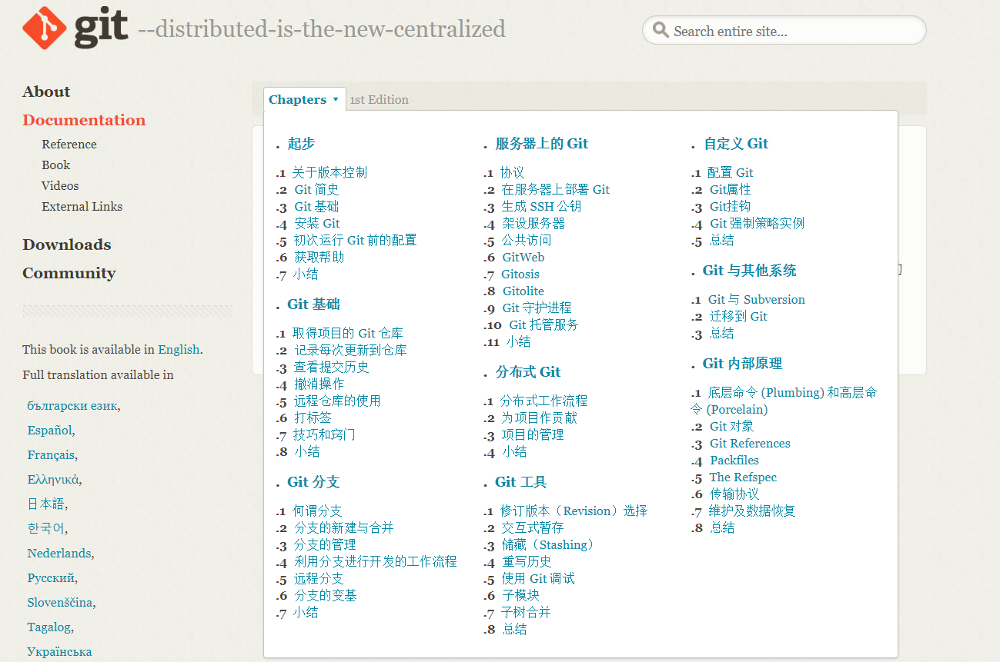
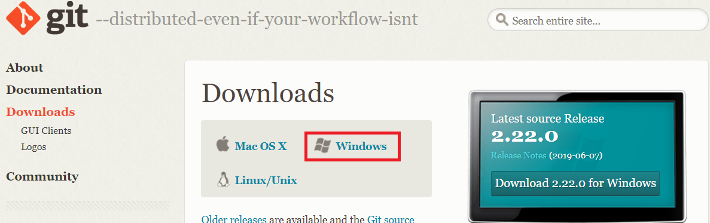
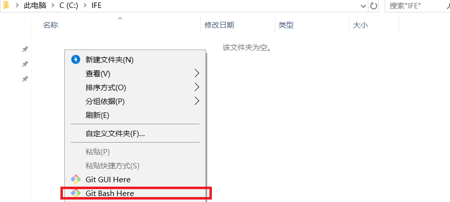
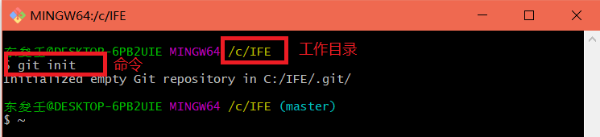
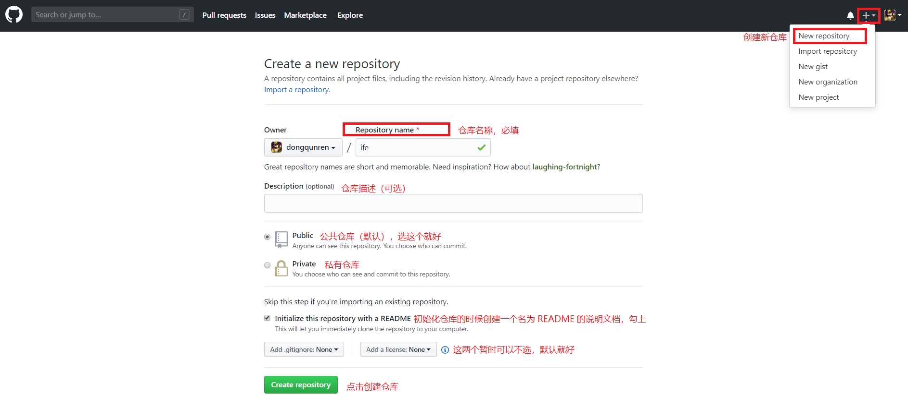
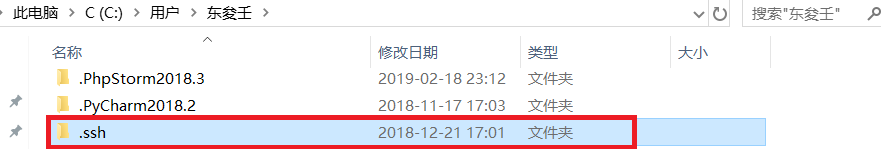
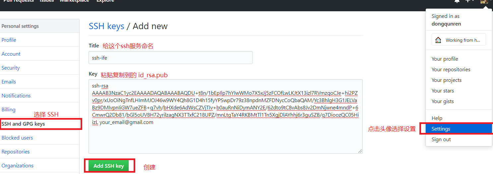

# git 简明使用

基本的 Git 工作流程如下：
1. 在工作目录中修改某些文件。
2. 对修改后的文件进行快照，然后保存到暂存区域。
3. 提交更新，将保存在暂存区域的文件快照永久转储到 Git 目录中。



[官方文档](https://git-scm.com/book/zh/v1/%E8%B5%B7%E6%AD%A5)

## 下载安装

1.打开 [官网](https://git-scm.com/downloads) 下载对应版本，我的电脑是 Windows，所以选择 Windows 的版本。



2.安装，傻瓜式安装就可以，一直快进。。。


3.安装完成后，你在文件资源管理器里，或者桌面上右键，可以看到包含 Git 的两个选项。

4.现在需要创建一个工作目录，以后都在这个目录中操作。比如在 C: 盘下 创建一个名为 IFE 的文件夹，当作工作目录。



创建好了文件夹还没有完，需要告诉git这里变成了工作目录，这是鼠标右键选择“Git Bash Here”打开控制台，然后输入 `git init`就进行了初始化工作目录，创建工作目录完成。



## 连接 github

1.注册并登录 github 账号，然后在 github 上创建一个仓库。



2.在本地创建 ssh key，通过 ssh 服务可以关联本地仓库和远程仓库，作用可以更方便提交。
```
$ ssh-keygen -t rsa -C "your_email@gmail.com"
```
your_email@gmail.com 是注册 github 时的邮箱，输入命令回车后会要求确认路径和输入密码，我们这使用默认的一路回车就行，成功的话会在：C:/Users/东夋壬/ 下生成.ssh文件夹（隐藏的文件夹），进去，打开 id_rsa.pub（公钥），复制里面的key。



回到github上，进入 Settings，左边选择 SSH and GPG keys，，Add SSH Key，Title 随便填，粘贴之前生成的key。



验证是否成功：
```
$ ssh -T git@github.com
Hi dongqunren! You've successfully authenticated, but GitHub does not provide shell access.  // 表示成功了
```

3.接下来我们要做的就是把本地仓库传到github上去，在此之前还需要设置username和email，因为github每次commit都会记录他们。
```
$ git config --global user.name "your name"
$ git config --global user.email "your_email@youremail.com"
```

4.进入要上传的仓库，右键git bash，添加远程地址：
```
$ git remote add origin git@github.com:yourName/yourRepo.git
```
后面的 yourName 和 yourRepo 表示你在 github 的用户名和刚才新建的仓库，origin 就是远程库的名字 。

5.把本地库的所有内容推送到远程库上：
```
$ git push -u origin master
```

## 常用语法

### 初次运行 Git 前的配置

（1）用户信息：每次 Git 提交时都会引用这两条信息，说明是谁提交了更新
```
$ git config --global user.name "John Doe"
$ git config --global user.email johndoe@example.com
```
（2）查看配置信息：
```
$ git config --list
$ git config user.name   // 查阅某个环境变量的设定
```
（3）.获取帮助：`<verb>`表示命令
```
$ git help <verb>
$ git <verb> --help
$ man git-<verb>
```

### 取得项目的 Git 仓库

（1）在工作目录中初始化新仓库：初始化后，在当前目录下会出现一个名为 .git 的目录,所有 Git 需要的数据和资源都存放在这个目录中。
```
$ git init
```
（2）如果当前目录下有几个文件想要纳入版本控制，需要先用 git add 命令告诉 Git 开始对这些文件进行跟踪，然后提交：
```
$ git add *.c
$ git add README
$ git commit -m 'initial project version'
```
（3）从现有仓库克隆：git clone [url]
```
$ git clone git://github.com/schacon/grit.git
```
这会在当前目录下创建一个名为grit的目录，其中包含一个 .git 的目录，用于保存下载下来的所有版本记录，然后从中取出最新版本的文件拷贝。
如果希望在克隆的时候，自己定义要新建的项目目录名称，可以在上面的命令末尾指定新的名字：
```
$ git clone git://github.com/schacon/grit.git mygrit
```
Git 支持许多数据传输协议。之前的例子使用的是 git:// 协议，不过你也可以用 http(s):// 或者 user@server:/path.git 表示的 SSH 传输协议。

### 记录每次更新到仓库

（1）检查当前文件状态
```
$ git status
On branch master
No commits yet
nothing to commit (create/copy files and use "git add" to track)
```
这说明所有已跟踪文件在上次提交后都未被更改过。此外，上面的信息还表明，当前目录下没有出现任何处于未跟踪的新文件，否则 Git 会在这里列出来。最后，该命令还显示了当前所在的分支是 master，这是默认的分支名称，实际是可以修改的

（2）现在让我们用 vim 创建一个新文件 README，保存退出后运行 git status 会看到该文件出现在未跟踪文件列表中：
```
$ vim README    # 使用 vim 命令创建一个 README 的文件
$ git status    # 再使用查看状态命令，发现有了变化，untracked表示未跟踪的
On branch master
No commits yet
Untracked files:
  (use "git add <file>..." to include in what will be committed)
        README
nothing added to commit but untracked files present (use "git add" to track)
```

（3）跟踪新文件
```
$ git add README   # 在 git add 后面可以指明要跟踪的文件或目录路径。
$ git status
On branch master
No commits yet
Changes to be committed:  
  (use "git rm --cached <file>..." to unstage)
        new file:   README
```
只要在 “Changes to be committed” 这行下面的，就说明是已暂存状态。如果此时提交，那么该文件此时此刻的版本将被留存在历史记录中。其实 git add 的潜台词就是把目标文件快照放入暂存区域，也就是 add file into staged area，同时未曾跟踪过的文件标记为需要跟踪。

（4）忽略某些文件：创建一个名为 .gitignore 的文件，列出要忽略的文件模式。
```
$ cat .gitignore   # 查看文件里的内容
*.[oa]     # 忽略所有以 .o 或 .a 结尾的文件
*~       # 忽略所有以波浪符（~）结尾的文件
```
文件 .gitignore 的格式规范如下：
-  所有空行或者以注释符号 ＃ 开头的行都会被 Git 忽略。
-  可以使用标准的 glob 模式匹配，glob 模式是指 shell 所使用的简化了的正则表达式
-  匹配模式最后跟反斜杠（/）说明要忽略的是目录。
-  要忽略指定模式以外的文件或目录，可以在模式前加上惊叹号（!）取反。

```
# 此为注释 – 将被 Git 忽略
*.a        # 忽略所有 .a 结尾的文件
!lib.a      # 但 lib.a 除外
/TODO       # 仅仅忽略项目根目录下的 TODO 文件，不包括 subdir/TODO
build/      # 忽略 build/ 目录下的所有文件
doc/*.txt    # 会忽略 doc/notes.txt 但不包括 doc/server/arch.txt
doc/**/*.txt  # 忽略 doc/ 目录下所有扩展名为 txt 的文件
```

（5）查看已暂存和未暂存的更新
```
$ git diff  # 修改已 git add 的文件，使用此命令可以看到修改的地方
```
若要看已经暂存起来的文件和上次提交时的快照之间的差异，可以用 git diff --cached 命令。
```
$ git diff --cached
$ git diff --staged   # Git1.6.1 及更高版本 使用
``` 

（6）提交更新：每次准备提交前，先用 git status 看下，是不是都已暂存起来了。
```
$ git commit    # 这种方式会启动文本编辑器以便输入本次提交的说明
$ git commit -v  # 会把修改差异的每一行都包含到注释中来
```
退出编辑器时，Git 会丢掉注释行，将说明内容和本次更新提交到仓库。
另外也可以用 -m 参数后跟 提交说明 的方式，在一行命令中提交更新：
```
$ git commit -m "Story 1: add README and .gitignore"
```

（7）跳过使用暂存区域：自动把所有已经跟踪过的文件暂存起来一并提交，从而跳过 git add 步骤。
```
$ git commit -a -m 'added new benchmarks'
```

（8）移除文件：是从暂存区域移除，然后提交。
-  首先删除本地文件
```
$ rm .gitignore    # 首先删除本地文件
$ git status      # 查看状态
On branch master
Changes not staged for commit:
  (use "git add/rm <file>..." to update what will be committed)
  (use "git checkout -- <file>..." to discard changes in working directory)
        deleted:    .gitignore
no changes added to commit (use "git add" and/or "git commit -a")
```
-  然后再运行 git rm 记录此次移除文件的操作
```
$ git rm .gitignore
rm '.gitignore'
$ git status
On branch master
Changes to be committed:
  (use "git reset HEAD <file>..." to unstage)
        deleted:    .gitignore
```

另外一种情况是，仅是从跟踪清单中删除，文件仍然希望保留在当前工作目录中。比如一些大型日志文件或者一堆 .a 编译文件，不小心纳入仓库后，要移除跟踪但不删除文件，以便稍后在 .gitignore 文件中补上，用 --cached 选项即可：
```
$ git rm --cached readme.txt
```

（9）移动文件
```
$ git mv README README.txt   # 修改文件名
$ git status
On branch master
Changes to be committed:
  (use "git reset HEAD <file>..." to unstage)
        renamed:    README -> README.txt
```
运行 git mv 就相当于运行了下面三条命令：
```
$ mv README README.txt
$ git rm README
$ git add README.txt
```

### 查看提交历史

（1）查看提交历史： git log 会按提交时间列出所有的更新，最近的更新排在最上面。
```
$ git log
commit 674b271b24898a7924bb014f916c3c082959f1cc (HEAD -> master)
Author: dongqunren <chenjunrenyx@163.com>
Date:   Thu Jul 4 10:54:33 2019 +0800
    Story 1: add README and .gitignore   # commit时附加的信息
```
`git log` 有许多选项，常用 `-p` 选项展开显示每次提交的内容差异，用 `-2` 则仅显示最近的两次更新：
```
$ git log -p -2
```
某些时候，单词层面的对比，比行层面的对比，更加容易观察。Git 提供了 `--word-diff` 选项。
```
$ git log --word-diff
# 在进行单词层面的对比的时候，你可能希望上下文（ context ）行数从默认的 3 行，减为 1 行，那么可以使用 -U1 选项
$ git log -U1 --word-diff
```
另外，`git log` 还提供了许多摘要选项可以用，比如 `--stat`，仅显示简要的增改行数统计：
```
$ git log --stat
commit 674b271b24898a7924bb014f916c3c082959f1cc (HEAD -> master)
Author: dongqunren <chenjunrenyx@163.com>
Date:   Thu Jul 4 10:54:33 2019 +0800
    Story 1: add README and .gitignore
 .gitignore |  2 ++
 README     | 13 +++++++++++++
 2 files changed, 15 insertions(+)
```
 还有个常用的 --pretty 选项，可以指定使用完全不同于默认格式的方式展示提交历史。比如用 oneline 将每个提交放在一行显示，这在提交数很大时非常有用。另外还有 short，full 和 fuller 可以用，展示的信息或多或少有些不同。[官方文档](https://git-scm.com/book/zh/v1/Git-%E5%9F%BA%E7%A1%80-%E6%9F%A5%E7%9C%8B%E6%8F%90%E4%BA%A4%E5%8E%86%E5%8F%B2)
 ```
 $ git log --pretty=oneline
674b271b24898a7924bb014f916c3c082959f1cc (HEAD -> master) Story 1: add README and .gitignore
#  format，可以定制要显示的记录格式，
$ git log --pretty=format:"%h - %an, %ar : %s"
674b271 - dongqunren, 36 minutes ago : Story 1: add README and .gitignore
#  用 oneline 或 format 时结合 --graph 选项，可以看到开头多出一些 ASCII 字符串表示的简单图形
$ git log --pretty=format:"%h %s" --graph
 ```
 （2）限制输出长度
 ```
 $ git log --since=2.weeks  # --since, --after仅显示指定时间之后的提交
 ```
 
 ### 撤消操作
 
 （1）修改最后一次提交
 ```
 $ git commit --amend    # 使用 --amend 选项重新提交
 ```
 （2）取消已经暂存的文件：`git reset HEAD <file>...`
```
# git add . 后 git status
$ git reset HEAD benchmarks.rb
```
（3）取消对文件的修改：类似`ctrl + z`
```
$ git checkout -- benchmarks.rb
$ git status
```

### 远程仓库的使用

（1）查看当前的远程库
```
$ git clone git://github.com/schacon/ticgit.git  # 克隆远程的仓库ticgit
$ cd ticgit  # 切换到该仓库目录下
$ git remote  # 查看远程仓库名称，默认是 origin
$ git remote -v  # 查看远程仓库名称，并显示对应的克隆地址
```
（2）添加远程仓库： `git remote add [shortname] [url]`
```
$ git remote
origin
$ git remote add pb git://github.com/paulboone/ticgit.git
$ git remote -v
origin  git://github.com/schacon/ticgit.git
pb  git://github.com/paulboone/ticgit.git  # pb 是添加时设置的名称

$ git fetch pb  # 要抓取远程仓库有的，但本地仓库没有的信息
```
（3）从远程仓库抓取数据：fetch 命令只是将远端的数据拉到本地仓库，并不自动合并到当前工作分支
```
$ git fetch [remote-name]
```
如果设置了某个分支用于跟踪某个远端仓库的分支，可以使用 `git pull` 命令自动抓取数据下来，然后将远端分支自动合并到本地仓库中当前分支。默认情况下 `git clone` 命令本质上就是自动创建了本地的 `master` 分支用于跟踪远程仓库中的 `master` 分支（假设远程仓库确实有 `master` 分支）。

（4）推送数据到远程仓库：` git push [remote-name] [branch-name]`
```
$ git push origin master
```
（5）查看远程仓库信息：`git remote show [remote-name] `
```
$ git remote show origin  
# 如果是在 master 分支，就可以用 git pull 命令抓取数据合并到本地
```
（6）远程仓库的删除和重命名： 对远程仓库的重命名，也会使对应的分支名称发生变化
```
$ git remote rename pb paul  # 把 pb 改成 paul
$ git remote
origin
paul
```
碰到远端仓库服务器迁移，或者原来的克隆镜像不再使用，又或者某个参与者不再贡献代码，那么需要移除对应的远端仓库：
```
$ git remote rm paul
$ git remote
origin
```

### 打标签

（1）列显已有的标签
```
$ git tag
v0.1
v1.3  # 显示的标签按字母顺序排列，所以标签的先后并不表示重要程度的轻重
$ git tag -l 'v1.4.2.*'  # 指查看  1.4.2 系列的版本
```
（2）新建标签
```
$ git tag -a v1.4 -m 'my version 1.4'    # 含附注的标签
$ git show v1.4    # 查看相应标签的版本信息
$ git tag -s v1.5 -m 'my signed 1.5 tag'  # 签署标签
$ git tag v1.4   # 轻量级标签，一个 -a，-s 或 -m 选项都不用
$ git tag -v v1.4.2.1    # 验证标签，git tag -v [tag-name] ，需要有签署者的公钥

$ git tag -a v1.2 9fceb02  # 后期加注标签，9fceb02 是 log 中的校验和
$ git push origin v1.5   # 分享标签，把标签传送到远端服务器上
$ git push origin --tags  # 一次推送所有本地新增的标签上去
```

### 技巧和窍门

（1）Git 命令别名
```
$ git config --global alias.co checkout  # co 是 checkout 的别名
$ git config --global alias.br branch
$ git config --global alias.ci commit
$ git config --global alias.st status
$ git config --global alias.last 'log -1 HEAD'
```

## 分支

Git 保存的不是文件差异或者变化量，而只是一系列文件快照。

在 Git 中提交时，会保存一个提交（commit）对象，该对象包含一个指向暂存内容快照的指针，包含本次提交的作者等相关附属信息，包含零个或多个指向该提交对象的父对象指针：首次提交是没有直接祖先的，普通提交有一个祖先，由两个或多个分支合并产生的提交则有多个祖先。

（1）创建分支
```
$ git branch testing
```
（2）切换到其他分支
```
$ git checkout testing   # HEAD 指向 testing 分支
```
（3）新建并切换分支
```
$ git checkout -b iss53
```
（4）合并分支
```
$ git checkout master   # 奇幻到 master 分支
$ git merge hotfix    # 将 hotfix 分支与 master 分支合并
```
（5）在合并分支之后， hotfix 已经完成了历史使命，删除分支
```
$ git branch -d hotfix
```

### 分支的管理

git branch 命令如果不加任何参数，它会给出当前所有分支的清单：
```
$ git branch
  iss53
* master    # * 字符：它表示当前所在的分支。
  testing
```
要查看各个分支最后一个提交对象的信息，运行 git branch -v：
```
$ git branch -v
  iss53   93b412c fix javascript issue
* master  7a98805 Merge branch 'iss53'
  testing 782fd34 add scott to the author list in the readmes
```
要从该清单中筛选出你已经（或尚未）与当前分支合并的分支，可以用 --merged 和 --no-merged 选项（Git 1.5.6 以上版本）。
```
$ git branch --merged
  iss53
* master
```
可以用 git branch --no-merged 查看尚未合并的工作：
```
$ git branch --no-merged
  testing
```

### 远程分支

同步远程服务器上的数据到本地。找到 origin 是哪个服务器（如 git.ourcompany.com），从上面获取你尚未拥有的数据，更新你本地的数据库，然后把 origin/master 的指针移到它最新的位置上。
```
$ git fetch origin   # git fetch 命令会更新 remote 索引
```
推送本地分支：  `git push (远程仓库名) (分支名)`：
```
$ git push origin serverfix
$ git push origin serverfix:serverfix  # 相同的功能
```
跟踪远程分支：
```
$ git checkout --track origin/serverfix  # 追踪分支
$ git checkout -b sf origin/serverfix   # 为本地分支设定不同于远程分支的名字
```
删除远程分支：
```
$ git push origin :serverfix  # 在服务器上删除 serverfix 分支
```

### 补充

（1）更新与合并
```
$ git pull    # 更新你的本地仓库至最新改动
$ git merge <branch>   # 要合并其他分支到你的当前分支
$ git diff <source_branch> <target_branch>   # 出现冲突（conflicts）,查看差异手动更改
$ git add <filename>  # 改完之后，将它们标记为合并成功
```